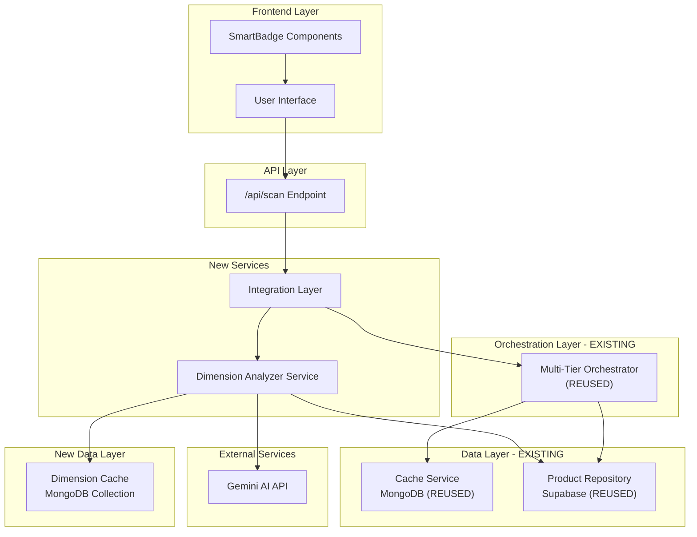
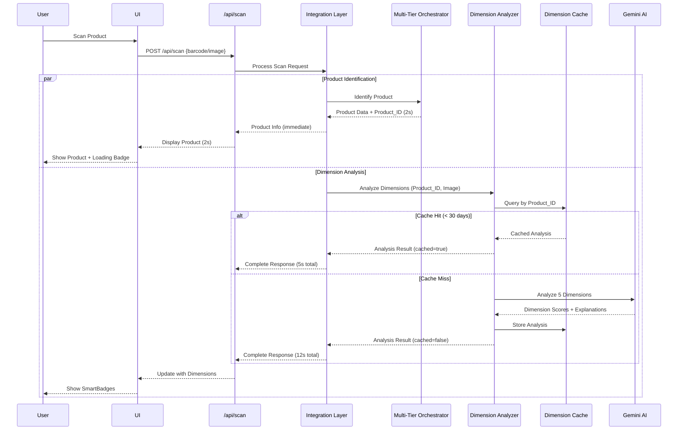
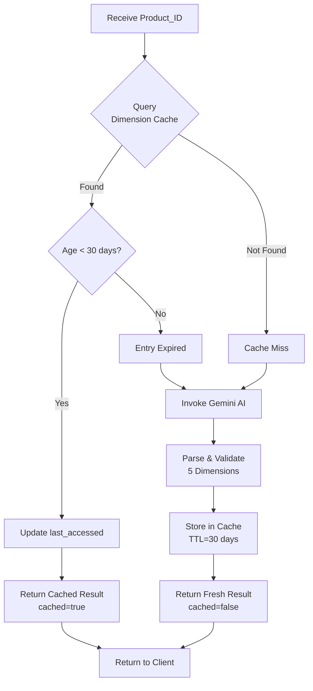
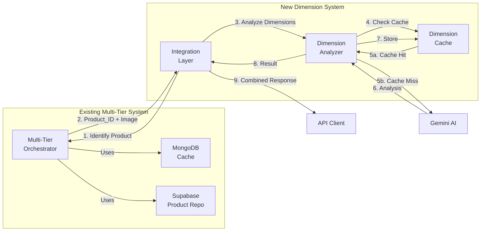

# Design Document: Integrated Product Scan and Dimension Analysis System

## Overview

The integrated product scan and dimension analysis system extends the existing multi-tier product identification infrastructure (see `.kiro/specs/multi-tier-product-identification/`) with AI-powered dimension analysis capabilities. The system analyzes products across five key dimensions: Health, Processing and Preservatives, Allergens, Responsibly Produced, and Environmental Impact.

The architecture prioritizes performance and cost optimization through:

1. **Leveraging Existing Infrastructure**: Reuses the multi-tier orchestrator, MongoDB cache service, Supabase product repository, and all transaction/retry logic from the multi-tier specification.

2. **Progressive UI Updates**: Returns product identification results immediately (within 2 seconds for cached products) while dimension analysis continues asynchronously, providing a responsive user experience.

3. **Aggressive Caching**: Implements a 30-day TTL cache for dimension analysis results, minimizing expensive AI API calls and achieving sub-5-second total response times for cached results.

4. **Single AI Call**: Analyzes all five dimensions simultaneously in one Gemini AI request, reducing API costs and latency.

5. **Tier-Based Access Control**: Free tier users receive one dimension (Health), premium users receive all five, with full analysis cached for future premium access.

The system maintains the existing `/api/scan` endpoint, extending it with dimension analysis while preserving backward compatibility. SmartBadge UI components display dimension scores with color-coded indicators (red: 0-33, yellow: 34-66, green: 67-100) and detailed explanations.

## Architecture

### System Components



### Overall System Flow




### Cache Lookup Strategy



### Data Flow Between Components



### Component Responsibilities

**Integration Layer (NEW)**
- Coordinates product identification and dimension analysis
- Manages parallel execution of both operations
- Applies tier-based access control filtering
- Combines results into unified API response
- Handles progressive response delivery (product first, then dimensions)
- Tracks metrics for both operations

**Dimension Analyzer Service (NEW)**
- Implements cache-first lookup strategy
- Validates cache TTL (30 days)
- Constructs Gemini AI prompts for 5-dimension analysis
- Parses and validates AI responses
- Stores fresh analysis in Dimension Cache
- Handles AI errors and partial results
- Updates access timestamps for cache entries

**Dimension Cache (NEW - MongoDB Collection)**
- Stores dimension analysis indexed by Product_ID
- Implements 30-day TTL expiration
- Tracks creation and last_accessed timestamps
- Supports atomic updates for access tracking
- Provides fast lookups (<50ms target)
- Handles cache invalidation on product updates

**Multi-Tier Orchestrator (EXISTING - REUSED)**
- Performs 4-tier product identification
- Returns Product_ID and product data
- Uses existing MongoDB cache and Supabase repository
- Provides transaction support and retry logic
- All existing functionality preserved

**SmartBadge Component (NEW - Frontend)**
- Displays dimension scores with color coding
- Shows loading states during analysis
- Displays locked indicators for free tier users
- Provides tap interaction for detailed explanations
- Handles missing or incomplete dimension data

## Components and Interfaces

### API Contracts

#### Extended Scan API

```typescript
// Extended request format (backward compatible)
interface ScanRequest {
  // Existing fields from multi-tier spec
  barcode?: string;
  image?: ImageData;
  imageHash?: string;
  userId: string;
  sessionId: string;
  
  // New optional fields
  skipDimensionAnalysis?: boolean;  // Skip dimension analysis
  pollToken?: string;                // For polling dimension completion
}

// Extended response format
interface ScanResponse {
  // Existing fields from multi-tier spec
  success: boolean;
  product?: ProductData;
  tier: 1 | 2 | 3 | 4;
  confidenceScore: number;
  processingTimeMs: number;
  cached: boolean;
  
  // New dimension analysis fields
  dimensionAnalysis?: DimensionAnalysisResult;
  dimensionStatus: 'completed' | 'processing' | 'failed' | 'skipped';
  dimensionCached?: boolean;
  userTier: 'free' | 'premium';
  availableDimensions: string[];
  upgradePrompt?: string;
  
  error?: ErrorDetails;
}

// Dimension analysis result
interface DimensionAnalysisResult {
  productId: string;
  dimensions: {
    health: DimensionScore;
    processing: DimensionScore;
    allergens: DimensionScore;
    responsiblyProduced: DimensionScore;
    environmentalImpact: DimensionScore;
  };
  overallConfidence: number;
  analyzedAt: Date;
  cached: boolean;
}

interface DimensionScore {
  score: number;              // 0-100
  explanation: string;        // Max 100 words
  keyFactors: string[];
  available: boolean;         // Based on user tier
  locked: boolean;            // For free tier users
}

// Main endpoint (extended)
POST /api/scan
Request: ScanRequest
Response: ScanResponse
```


#### Dimension Analyzer API

```typescript
interface AnalyzeDimensionsRequest {
  productId: string;
  productData: ProductData;
  image: ImageData;
  userTier: 'free' | 'premium';
}

interface AnalyzeDimensionsResponse {
  success: boolean;
  analysis?: DimensionAnalysisResult;
  cached: boolean;
  processingTimeMs: number;
  error?: ErrorDetails;
}

// Internal service method
POST /internal/analyze-dimensions
Request: AnalyzeDimensionsRequest
Response: AnalyzeDimensionsResponse
```

#### Dimension Cache API

```typescript
interface DimensionCacheEntry {
  _id: ObjectId;
  productId: string;
  dimensions: {
    health: DimensionScore;
    processing: DimensionScore;
    allergens: DimensionScore;
    responsiblyProduced: DimensionScore;
    environmentalImpact: DimensionScore;
  };
  overallConfidence: number;
  createdAt: Date;
  lastAccessedAt: Date;
  expiresAt: Date;              // createdAt + 30 days
  accessCount: number;
}

interface CacheLookupRequest {
  productId: string;
}

interface CacheLookupResponse {
  found: boolean;
  entry?: DimensionCacheEntry;
  expired: boolean;
}

// Cache operations
GET /internal/dimension-cache/:productId
Response: CacheLookupResponse

POST /internal/dimension-cache
Request: DimensionCacheEntry
Response: { success: boolean }

DELETE /internal/dimension-cache/:productId
Response: { success: boolean }

POST /internal/dimension-cache/bulk-invalidate
Request: { category?: string, productIds?: string[] }
Response: { success: boolean, count: number }
```

### Integration Patterns

#### Integration Layer Implementation

```typescript
class IntegrationLayer {
  constructor(
    private multiTierOrchestrator: ScanOrchestratorMultiTier,
    private dimensionAnalyzer: DimensionAnalyzer,
    private metricsService: MetricsService
  ) {}
  
  async processScan(request: ScanRequest): Promise<ScanResponse> {
    const startTime = Date.now();
    
    // Step 1: Product identification (existing multi-tier logic)
    const identificationResult = await this.multiTierOrchestrator.scan({
      barcode: request.barcode,
      image: request.image,
      imageHash: request.imageHash,
      userId: request.userId,
      sessionId: request.sessionId
    });
    
    if (!identificationResult.success) {
      return {
        ...identificationResult,
        dimensionStatus: 'skipped',
        userTier: await this.getUserTier(request.userId),
        availableDimensions: []
      };
    }
    
    // Step 2: Determine user tier
    const userTier = await this.getUserTier(request.userId);
    
    // Step 3: Skip dimension analysis if requested
    if (request.skipDimensionAnalysis) {
      return {
        ...identificationResult,
        dimensionStatus: 'skipped',
        userTier,
        availableDimensions: this.getAvailableDimensions(userTier)
      };
    }
    
    // Step 4: Dimension analysis (parallel with product identification response)
    try {
      const dimensionResult = await this.dimensionAnalyzer.analyze({
        productId: identificationResult.product!.id,
        productData: identificationResult.product!,
        image: request.image!,
        userTier
      });
      
      // Apply tier-based filtering
      const filteredAnalysis = this.filterByTier(
        dimensionResult.analysis!,
        userTier
      );
      
      // Track metrics
      await this.metricsService.logDimensionAnalysis({
        productId: identificationResult.product!.id,
        userTier,
        cached: dimensionResult.cached,
        processingTimeMs: dimensionResult.processingTimeMs
      });
      
      return {
        ...identificationResult,
        dimensionAnalysis: filteredAnalysis,
        dimensionStatus: 'completed',
        dimensionCached: dimensionResult.cached,
        userTier,
        availableDimensions: this.getAvailableDimensions(userTier),
        upgradePrompt: userTier === 'free' ? 
          'Upgrade to Premium to see all 5 dimensions' : undefined
      };
      
    } catch (error) {
      // Graceful degradation: return product info even if dimension analysis fails
      console.error('Dimension analysis failed:', error);
      
      return {
        ...identificationResult,
        dimensionStatus: 'failed',
        userTier,
        availableDimensions: this.getAvailableDimensions(userTier),
        error: {
          code: 'DIMENSION_ANALYSIS_FAILED',
          message: 'Product identified, but dimension analysis unavailable',
          tier: identificationResult.tier,
          retryable: true
        }
      };
    }
  }
  
  private filterByTier(
    analysis: DimensionAnalysisResult,
    userTier: 'free' | 'premium'
  ): DimensionAnalysisResult {
    if (userTier === 'premium') {
      return analysis;
    }
    
    // Free tier: only Health dimension
    return {
      ...analysis,
      dimensions: {
        health: { ...analysis.dimensions.health, available: true, locked: false },
        processing: { ...analysis.dimensions.processing, available: false, locked: true },
        allergens: { ...analysis.dimensions.allergens, available: false, locked: true },
        responsiblyProduced: { ...analysis.dimensions.responsiblyProduced, available: false, locked: true },
        environmentalImpact: { ...analysis.dimensions.environmentalImpact, available: false, locked: true }
      }
    };
  }
  
  private getAvailableDimensions(userTier: 'free' | 'premium'): string[] {
    return userTier === 'premium' 
      ? ['health', 'processing', 'allergens', 'responsiblyProduced', 'environmentalImpact']
      : ['health'];
  }
  
  private async getUserTier(userId: string): Promise<'free' | 'premium'> {
    // Query user subscription from auth context or database
    // Implementation depends on auth system
    return 'free'; // Placeholder
  }
}
```


#### Dimension Analyzer Implementation

```typescript
class DimensionAnalyzer {
  constructor(
    private dimensionCache: DimensionCacheService,
    private geminiClient: GeminiClient,
    private productRepo: ProductRepository
  ) {}
  
  async analyze(request: AnalyzeDimensionsRequest): Promise<AnalyzeDimensionsResponse> {
    const startTime = Date.now();
    
    // Step 1: Check cache first
    const cacheResult = await this.dimensionCache.lookup(request.productId);
    
    if (cacheResult.found && !cacheResult.expired) {
      // Update access timestamp
      await this.dimensionCache.updateAccess(request.productId);
      
      return {
        success: true,
        analysis: this.entryToResult(cacheResult.entry!),
        cached: true,
        processingTimeMs: Date.now() - startTime
      };
    }
    
    // Step 2: Cache miss or expired - perform fresh analysis
    try {
      const aiResult = await this.performFreshAnalysis(
        request.productData,
        request.image
      );
      
      // Step 3: Store in cache
      await this.dimensionCache.store({
        productId: request.productId,
        dimensions: aiResult.dimensions,
        overallConfidence: aiResult.overallConfidence,
        createdAt: new Date(),
        lastAccessedAt: new Date(),
        expiresAt: new Date(Date.now() + 30 * 24 * 60 * 60 * 1000), // 30 days
        accessCount: 1
      });
      
      return {
        success: true,
        analysis: aiResult,
        cached: false,
        processingTimeMs: Date.now() - startTime
      };
      
    } catch (error) {
      console.error('Fresh dimension analysis failed:', error);
      
      return {
        success: false,
        processingTimeMs: Date.now() - startTime,
        error: {
          code: 'AI_ANALYSIS_FAILED',
          message: 'Failed to analyze product dimensions',
          tier: 0,
          retryable: true
        }
      };
    }
  }
  
  private async performFreshAnalysis(
    productData: ProductData,
    image: ImageData
  ): Promise<DimensionAnalysisResult> {
    // Construct prompt for Gemini AI
    const prompt = this.buildAnalysisPrompt(productData);
    
    // Call Gemini AI
    const aiResponse = await this.geminiClient.analyzeProduct(image, prompt);
    
    // Parse and validate response
    const parsedResult = this.parseAIResponse(aiResponse);
    this.validateDimensionScores(parsedResult);
    
    return {
      productId: productData.id,
      dimensions: parsedResult.dimensions,
      overallConfidence: parsedResult.overallConfidence,
      analyzedAt: new Date(),
      cached: false
    };
  }
  
  private buildAnalysisPrompt(productData: ProductData): string {
    return `Analyze this product across 5 dimensions and return results in JSON format.

Product Context:
- Name: ${productData.name}
- Brand: ${productData.brand}
- Category: ${productData.category}

Analyze the following dimensions (score 0-100 for each):

1. Health: Nutritional value, beneficial ingredients, health impact
2. Processing and Preservatives: Level of processing, artificial additives, preservatives
3. Allergens: Common allergens present, cross-contamination risks
4. Responsibly Produced: Ethical sourcing, fair trade, labor practices
5. Environmental Impact: Packaging sustainability, carbon footprint, eco-friendliness

For each dimension, provide:
- score (0-100, where 100 is best)
- explanation (max 100 words)
- keyFactors (array of 2-4 key points)

Also provide an overallConfidence score (0.0-1.0) for the analysis.

Return JSON in this exact format:
{
  "dimensions": {
    "health": { "score": 0-100, "explanation": "...", "keyFactors": ["..."] },
    "processing": { "score": 0-100, "explanation": "...", "keyFactors": ["..."] },
    "allergens": { "score": 0-100, "explanation": "...", "keyFactors": ["..."] },
    "responsiblyProduced": { "score": 0-100, "explanation": "...", "keyFactors": ["..."] },
    "environmentalImpact": { "score": 0-100, "explanation": "...", "keyFactors": ["..."] }
  },
  "overallConfidence": 0.0-1.0
}`;
  }
  
  private parseAIResponse(response: string): any {
    try {
      const parsed = JSON.parse(response);
      
      // Validate structure
      if (!parsed.dimensions || !parsed.overallConfidence) {
        throw new Error('Invalid response structure');
      }
      
      return parsed;
    } catch (error) {
      throw new Error(`Failed to parse AI response: ${error.message}`);
    }
  }
  
  private validateDimensionScores(result: any): void {
    const requiredDimensions = [
      'health', 'processing', 'allergens', 
      'responsiblyProduced', 'environmentalImpact'
    ];
    
    for (const dim of requiredDimensions) {
      if (!result.dimensions[dim]) {
        throw new Error(`Missing dimension: ${dim}`);
      }
      
      const score = result.dimensions[dim].score;
      if (typeof score !== 'number' || score < 0 || score > 100) {
        throw new Error(`Invalid score for ${dim}: ${score}`);
      }
      
      // Add default fields
      result.dimensions[dim].available = true;
      result.dimensions[dim].locked = false;
    }
    
    // Validate overall confidence
    if (result.overallConfidence < 0 || result.overallConfidence > 1) {
      throw new Error(`Invalid confidence: ${result.overallConfidence}`);
    }
  }
  
  private entryToResult(entry: DimensionCacheEntry): DimensionAnalysisResult {
    return {
      productId: entry.productId,
      dimensions: entry.dimensions,
      overallConfidence: entry.overallConfidence,
      analyzedAt: entry.createdAt,
      cached: true
    };
  }
}
```


#### Gemini AI Client Extension

```typescript
class GeminiClient {
  private apiKey: string;
  private baseUrl: string = 'https://generativelanguage.googleapis.com/v1';
  
  async analyzeProduct(image: ImageData, prompt: string): Promise<string> {
    const response = await fetch(
      `${this.baseUrl}/models/gemini-pro-vision:generateContent`,
      {
        method: 'POST',
        headers: {
          'Content-Type': 'application/json',
          'x-goog-api-key': this.apiKey
        },
        body: JSON.stringify({
          contents: [{
            parts: [
              { text: prompt },
              { 
                inline_data: { 
                  mime_type: 'image/jpeg', 
                  data: image.base64 
                } 
              }
            ]
          }],
          generationConfig: {
            temperature: 0.2,  // Lower temperature for more consistent scoring
            topP: 0.8,
            topK: 40,
            maxOutputTokens: 2048
          }
        })
      }
    );
    
    if (!response.ok) {
      throw new Error(`Gemini API error: ${response.status} ${response.statusText}`);
    }
    
    const data = await response.json();
    
    if (!data.candidates || data.candidates.length === 0) {
      throw new Error('No candidates in Gemini response');
    }
    
    return data.candidates[0].content.parts[0].text;
  }
}
```

#### Dimension Cache Service Implementation

```typescript
class DimensionCacheService {
  private collection: Collection<DimensionCacheEntry>;
  
  constructor(mongoClient: MongoClient) {
    this.collection = mongoClient
      .db('product_scan')
      .collection<DimensionCacheEntry>('dimension_analysis');
    
    // Ensure indexes
    this.ensureIndexes();
  }
  
  private async ensureIndexes() {
    await this.collection.createIndex(
      { productId: 1 }, 
      { unique: true }
    );
    
    await this.collection.createIndex(
      { expiresAt: 1 }, 
      { expireAfterSeconds: 0 }
    );
    
    await this.collection.createIndex(
      { lastAccessedAt: 1 }
    );
  }
  
  async lookup(productId: string): Promise<CacheLookupResponse> {
    const entry = await this.collection.findOne({ productId });
    
    if (!entry) {
      return { found: false, expired: false };
    }
    
    const now = new Date();
    const expired = entry.expiresAt < now;
    
    return {
      found: true,
      entry,
      expired
    };
  }
  
  async store(entry: Omit<DimensionCacheEntry, '_id'>): Promise<void> {
    await this.collection.updateOne(
      { productId: entry.productId },
      { $set: entry },
      { upsert: true }
    );
  }
  
  async updateAccess(productId: string): Promise<void> {
    await this.collection.updateOne(
      { productId },
      { 
        $set: { lastAccessedAt: new Date() },
        $inc: { accessCount: 1 }
      }
    );
  }
  
  async invalidate(productId: string): Promise<void> {
    await this.collection.deleteOne({ productId });
  }
  
  async bulkInvalidate(filter: { 
    category?: string, 
    productIds?: string[] 
  }): Promise<number> {
    let query: any = {};
    
    if (filter.productIds) {
      query.productId = { $in: filter.productIds };
    }
    
    // For category-based invalidation, we need to join with products
    // This is a simplified version - actual implementation may vary
    if (filter.category) {
      // Query product repo for product IDs in category
      // Then delete those from cache
      // Implementation depends on product repo interface
    }
    
    const result = await this.collection.deleteMany(query);
    return result.deletedCount;
  }
}
```

## Data Models

### Dimension Analysis Model (MongoDB)

```typescript
interface DimensionCacheEntry {
  _id: ObjectId;
  productId: string;                    // Links to Product Repository
  dimensions: {
    health: DimensionScore;
    processing: DimensionScore;
    allergens: DimensionScore;
    responsiblyProduced: DimensionScore;
    environmentalImpact: DimensionScore;
  };
  overallConfidence: number;            // 0.0 to 1.0
  createdAt: Date;                      // Analysis timestamp
  lastAccessedAt: Date;                 // For access tracking
  expiresAt: Date;                      // createdAt + 30 days
  accessCount: number;                  // Usage metrics
}

interface DimensionScore {
  score: number;                        // 0-100
  explanation: string;                  // Max 100 words
  keyFactors: string[];                 // 2-4 key points
  available: boolean;                   // Based on user tier
  locked: boolean;                      // For free tier users
}

// MongoDB Collection Schema
db.dimension_analysis.createIndex({ productId: 1 }, { unique: true });
db.dimension_analysis.createIndex({ expiresAt: 1 }, { expireAfterSeconds: 0 });
db.dimension_analysis.createIndex({ lastAccessedAt: 1 });
```

### Extended Scan Log Model (Supabase)

```sql
-- Extend existing scan_logs table with dimension analysis fields
ALTER TABLE scan_logs ADD COLUMN dimension_analysis_cached BOOLEAN;
ALTER TABLE scan_logs ADD COLUMN dimension_analysis_time_ms INTEGER;
ALTER TABLE scan_logs ADD COLUMN dimension_analysis_status VARCHAR(50);
ALTER TABLE scan_logs ADD COLUMN user_tier VARCHAR(20);

CREATE INDEX idx_dimension_status ON scan_logs(dimension_analysis_status);
CREATE INDEX idx_user_tier ON scan_logs(user_tier);
```

### Dimension Metrics Model (Time-Series)

```typescript
interface DimensionAnalysisMetrics {
  timestamp: Date;
  productId: string;
  userTier: 'free' | 'premium';
  cached: boolean;
  processingTimeMs: number;
  success: boolean;
  errorCode?: string;
  apiCost?: number;                     // Cost of Gemini AI call
}

interface AggregatedDimensionMetrics {
  period: 'hour' | 'day' | 'week';
  startTime: Date;
  endTime: Date;
  totalAnalyses: number;
  cacheHitRate: number;
  avgProcessingTime: number;
  totalApiCost: number;
  byTier: {
    free: { count: number, cacheHitRate: number };
    premium: { count: number, cacheHitRate: number };
  };
  dimensionViews: {
    health: number;
    processing: number;
    allergens: number;
    responsiblyProduced: number;
    environmentalImpact: number;
  };
}
```


## Correctness Properties

*A property is a characteristic or behavior that should hold true across all valid executions of a system—essentially, a formal statement about what the system should do. Properties serve as the bridge between human-readable specifications and machine-verifiable correctness guarantees.*

### Property Reflection

After analyzing all acceptance criteria, I identified the following redundancies and consolidations:

**Redundancy Analysis:**
- Properties 2.1 and 7.1 both test cache-first behavior → Consolidated into Property 1
- Properties 2.4, 4.3, 10.6 all test timestamp storage → Consolidated into Property 8
- Properties 3.7, 4.2, 10.5 all test explanation completeness → Consolidated into Property 9
- Properties 4.1, 4.4, 4.5, 4.6 all test Analysis_Result structure → Consolidated into Property 10
- Properties 7.5, 7.6, 14.1-14.7 all test metrics logging → Consolidated into Property 24
- Properties 12.1-12.7 all test prompt construction → Consolidated into Property 19
- Properties 15.1, 15.4 both test serialization round-trip → Consolidated into Property 26

**Final Property Set:** 27 unique, non-redundant properties

### Property 1: Cache-First Dimension Lookup

*For any* Product_ID received by the Dimension Analyzer, the Dimension Cache SHALL be queried before invoking Gemini AI.

**Validates: Requirements 2.1, 7.1**

### Property 2: Input Pass-Through to Multi-Tier Orchestrator

*For any* scan request with barcode or image data, the Integration Layer SHALL pass that exact data to the Multi-Tier Orchestrator without modification.

**Validates: Requirements 1.2**

### Property 3: Dimension Analysis Trigger

*For any* Product_ID returned by the Multi-Tier Orchestrator, the Integration Layer SHALL invoke the Dimension Analyzer with that Product_ID.

**Validates: Requirements 1.4**

### Property 4: Progressive Response Delivery

*For any* scan request, the Integration Layer SHALL return product identification results before dimension analysis completes.

**Validates: Requirements 1.5, 8.4**

### Property 5: Loading State Inclusion

*For any* scan response where dimension analysis is in progress, the response SHALL include dimensionStatus='processing'.

**Validates: Requirements 1.6, 9.6**

### Property 6: Cache TTL Validation

*For any* cached dimension analysis entry, if the entry age is less than 30 days, the Dimension Analyzer SHALL return the cached result; otherwise, it SHALL perform fresh analysis.

**Validates: Requirements 2.2**

### Property 7: Cached Result Flag

*For any* dimension analysis result returned from cache, the response SHALL include cached=true.

**Validates: Requirements 2.6**

### Property 8: Timestamp Storage

*For any* dimension analysis stored in cache, the entry SHALL include both createdAt and lastAccessedAt timestamps.

**Validates: Requirements 2.4, 4.3, 10.6**

### Property 9: Explanation Completeness

*For any* dimension analysis result, all five dimensions SHALL include non-empty explanation text.

**Validates: Requirements 3.7, 4.2, 10.5**

### Property 10: Analysis Result Structure

*For any* dimension analysis result, the result SHALL include exactly five dimension scores (health, processing, allergens, responsiblyProduced, environmentalImpact), a Product_ID, an overallConfidence value, and keyFactors for each dimension.

**Validates: Requirements 3.2, 4.1, 4.2, 4.4, 4.5, 4.6**

### Property 11: AI Invocation on Cache Miss

*For any* Product_ID not found in cache or with expired cache entry, the Dimension Analyzer SHALL invoke Gemini AI.

**Validates: Requirements 3.1**

### Property 12: AI Response Parsing

*For any* valid Gemini AI response, the Dimension Analyzer SHALL parse the response into a structured Analysis_Result.

**Validates: Requirements 3.3**

### Property 13: Score Range Validation

*For any* dimension analysis result, all five dimension scores SHALL be within the range 0-100 inclusive.

**Validates: Requirements 3.4, 15.3**

### Property 14: Cache Storage After Fresh Analysis

*For any* fresh dimension analysis completed successfully, the Dimension Analyzer SHALL store the result in the Dimension Cache indexed by Product_ID.

**Validates: Requirements 3.5**

### Property 15: Free Tier Single Dimension

*For any* user on Free Tier, the Integration Layer SHALL return analysis for exactly one dimension (Health).

**Validates: Requirements 5.1, 5.4**

### Property 16: Premium Tier All Dimensions

*For any* user on Premium Tier, the Integration Layer SHALL return analysis for all five dimensions.

**Validates: Requirements 5.2**

### Property 17: Tier Extraction from Auth Context

*For any* scan request, the Integration Layer SHALL determine user tier from the authentication context.

**Validates: Requirements 5.3**

### Property 18: Tier Information in Response

*For any* scan response, the response SHALL include userTier and availableDimensions fields.

**Validates: Requirements 5.5**

### Property 19: Upgrade Prompt for Free Tier

*For any* Free Tier user receiving limited dimension results, the response SHALL include an upgrade prompt.

**Validates: Requirements 5.6**

### Property 20: Full Analysis Caching Regardless of Tier

*For any* dimension analysis performed, the full five-dimension analysis SHALL be cached regardless of the requesting user's tier.

**Validates: Requirements 5.7**

### Property 21: Image Reuse Between Operations

*For any* scan request with an image, the same image data SHALL be used for both product identification and dimension analysis without additional API calls.

**Validates: Requirements 7.2**

### Property 22: Single AI Call for All Dimensions

*For any* fresh dimension analysis, the Dimension Analyzer SHALL make exactly one Gemini AI call to analyze all five dimensions simultaneously.

**Validates: Requirements 7.3**

### Property 23: Cache Effectiveness for Duplicate Scans

*For any* product scanned multiple times, subsequent scans SHALL use the cached dimension analysis without invoking Gemini AI (within TTL period).

**Validates: Requirements 7.7**

### Property 24: Metrics Logging

*For any* dimension analysis operation, the system SHALL log cache hit/miss status, processing time, user tier, API costs, and dimension view counts.

**Validates: Requirements 7.5, 7.6, 14.1, 14.2, 14.3, 14.4, 14.5, 14.6**

### Property 25: Combined Response Format

*For any* successful scan, the response SHALL include both product identification data and dimension analysis data (or status).

**Validates: Requirements 8.2**

### Property 26: Skip Parameter Handling

*For any* scan request with skipDimensionAnalysis=true, the Integration Layer SHALL not invoke the Dimension Analyzer.

**Validates: Requirements 8.3**

### Property 27: Polling Support

*For any* scan request with a pollToken, the Integration Layer SHALL return the current status of dimension analysis for that token.

**Validates: Requirements 8.5**

### Property 28: Metadata Inclusion in Response

*For any* scan response, the response SHALL include both identification tier (from multi-tier orchestrator) and dimension cache status.

**Validates: Requirements 8.6**

### Property 29: Backward Compatibility

*For any* scan request using the legacy format (without new dimension fields), the API SHALL process the request successfully and return product identification results.

**Validates: Requirements 8.7**

### Property 30: SmartBadge Data Format

*For any* dimension analysis result, the data format SHALL include score, explanation, keyFactors, available, and locked fields for each dimension.

**Validates: Requirements 9.1**

### Property 31: Color Coding Calculation

*For any* dimension score, the color indicator SHALL be red for scores 0-33, yellow for scores 34-66, and green for scores 67-100.

**Validates: Requirements 9.2**

### Property 32: Explanation Retrieval

*For any* dimension in the analysis result, tapping the SmartBadge SHALL return the explanation text for that specific dimension.

**Validates: Requirements 9.4**

### Property 33: Locked Indicator for Free Tier

*For any* Free Tier user viewing dimension results, unavailable dimensions SHALL have locked=true.

**Validates: Requirements 9.5**

### Property 34: Graceful Handling of Partial Data

*For any* dimension analysis with missing or incomplete data, the SmartBadge SHALL display available dimensions without errors.

**Validates: Requirements 9.7**

### Property 35: Numerical Score Storage

*For any* dimension analysis stored in cache, all five dimension scores SHALL be stored as numerical values (not strings).

**Validates: Requirements 10.4**

### Property 36: Atomic Access Updates

*For any* concurrent cache access operations on the same Product_ID, the lastAccessedAt and accessCount updates SHALL be atomic.

**Validates: Requirements 10.7**

### Property 37: Graceful Degradation on Analysis Failure

*For any* dimension analysis failure, the Integration Layer SHALL still return product identification results with dimensionStatus='failed'.

**Validates: Requirements 11.1**

### Property 38: Error Logging and Partial Results

*For any* Gemini AI error, the Dimension Analyzer SHALL log the error and return a partial result if possible.

**Validates: Requirements 11.2**

### Property 39: Cache Unavailability Fallback

*For any* Dimension Cache unavailability, the Dimension Analyzer SHALL proceed with fresh analysis without failing the request.

**Validates: Requirements 11.3**

### Property 40: Timeout Retry Option

*For any* dimension analysis timeout, the response SHALL include dimensionStatus='failed' and error.retryable=true.

**Validates: Requirements 11.4**

### Property 41: AI Response Validation

*For any* Gemini AI response, the Dimension Analyzer SHALL validate the response structure and reject malformed data.

**Validates: Requirements 11.5, 12.7**

### Property 42: Missing Dimension Marking

*For any* AI response with fewer than five dimensions, the Dimension Analyzer SHALL mark missing dimensions as available=false.

**Validates: Requirements 11.6**

### Property 43: User-Friendly Error Messages

*For any* dimension analysis error, the response SHALL include a user-friendly error message in the error.message field.

**Validates: Requirements 11.7**

### Property 44: Structured Prompt Construction

*For any* fresh dimension analysis, the Dimension Analyzer SHALL construct a prompt that includes all five dimensions, product context (name, brand, category), scoring criteria, word limits, JSON format specification, and the product image.

**Validates: Requirements 12.1, 12.2, 12.3, 12.4, 12.5, 12.6**

### Property 45: Cache Invalidation on Product Update

*For any* product update in the Product Repository, the Integration Layer SHALL invalidate the corresponding Dimension Cache entry.

**Validates: Requirements 13.1**

### Property 46: Cache Invalidation on Error Report

*For any* user error report on dimension analysis, the Integration Layer SHALL invalidate the cache entry for that Product_ID.

**Validates: Requirements 13.2**

### Property 47: Manual Cache Invalidation

*For any* manual invalidation request with a Product_ID, the Dimension Cache SHALL remove the entry for that Product_ID.

**Validates: Requirements 13.3**

### Property 48: Bulk Cache Invalidation

*For any* bulk invalidation request with a category or list of Product_IDs, the Dimension Cache SHALL remove all matching entries.

**Validates: Requirements 13.4**

### Property 49: Fresh Analysis After Invalidation

*For any* invalidated cache entry, the next dimension analysis request for that Product_ID SHALL perform fresh analysis.

**Validates: Requirements 13.5**

### Property 50: Invalidation Event Logging

*For any* cache invalidation operation, the system SHALL log the event with Product_ID, reason, and timestamp.

**Validates: Requirements 13.6**

### Property 51: Immediate Cache Removal

*For any* cache invalidation, the entry SHALL be removed immediately without waiting for TTL expiration.

**Validates: Requirements 13.7**

### Property 52: Metrics Endpoint Integration

*For any* request to /api/metrics, the response SHALL include aggregated dimension analysis metrics (cache hit rates, processing times, tier-based counts, API costs, error rates, dimension view counts).

**Validates: Requirements 14.7**

### Property 53: Serialization Round-Trip

*For any* valid Analysis_Result object, serializing to JSON then deserializing SHALL produce an equivalent object with all fields preserved.

**Validates: Requirements 15.1, 15.4**

### Property 54: Deserialization Field Validation

*For any* deserialized Analysis_Result object, the Dimension Analyzer SHALL validate that all required fields are present.

**Validates: Requirements 15.2**

### Property 55: Data Integrity Verification

*For any* Analysis_Result stored in and retrieved from the Dimension Cache, the retrieved data SHALL match the stored data exactly.

**Validates: Requirements 15.5**

### Property 56: Serialization Error Handling

*For any* serialization error during cache storage, the Dimension Analyzer SHALL log the error and retry without data loss.

**Validates: Requirements 15.6**


## Error Handling

### Error Categories

The system handles errors across multiple categories:

1. **Product Identification Errors** (Handled by existing multi-tier system)
   - All tier-specific errors from multi-tier specification
   - Barcode detection failures
   - Image analysis failures
   - Database connection issues

2. **Dimension Analysis Errors**
   - Gemini AI failures (rate limits, service unavailable, invalid responses)
   - Cache unavailability
   - Malformed AI responses
   - Missing dimensions in AI response
   - Score validation failures
   - Timeout during analysis

3. **Cache Errors**
   - MongoDB connection failures
   - Cache lookup timeouts
   - Cache storage failures
   - TTL index issues
   - Atomic update conflicts

4. **Tier-Based Access Errors**
   - Invalid user tier in auth context
   - Missing authentication
   - Tier determination failures

5. **Data Validation Errors**
   - Invalid dimension scores (out of range 0-100)
   - Missing required fields in Analysis_Result
   - Malformed JSON from AI
   - Serialization/deserialization errors

### Error Handling Strategies

**Graceful Degradation**
- If dimension analysis fails, return product identification results with dimensionStatus='failed'
- If cache is unavailable, proceed with fresh AI analysis
- If AI returns partial results, mark missing dimensions as unavailable
- If tier determination fails, default to free tier

**Retry Logic** (Reuses existing multi-tier patterns)
- Database operations: 3 retries with exponential backoff (100ms, 200ms, 400ms)
- Gemini AI rate limits: Exponential backoff up to 30 seconds
- Cache operations: 2 retries with linear backoff (100ms, 200ms)

**Circuit Breaker Pattern** (Extends existing multi-tier implementation)
- Track Gemini AI failure rates for dimension analysis separately
- Open circuit after 5 consecutive failures
- Half-open state after 60 seconds
- Close circuit after 3 successful requests

**Error Reporting**
- Log all dimension analysis errors with context (productId, userId, timestamp)
- Include AI response in error logs for debugging
- Track error rates by error type
- Alert on error rate thresholds (>5% for dimension analysis)

**User Communication**
- Provide clear, actionable error messages
- Distinguish between product identification and dimension analysis errors
- Show retry options for transient failures
- Explain tier limitations clearly

### Error Response Format

```typescript
interface DimensionAnalysisError {
  code: string;              // e.g., "AI_TIMEOUT", "CACHE_UNAVAILABLE"
  message: string;            // User-friendly message
  retryable: boolean;         // Whether retry is recommended
  suggestedAction: string;    // Specific user action
  technicalDetails?: string;  // For debugging (not shown to users)
}

// Example error responses
{
  success: true,
  product: { /* product data */ },
  tier: 1,
  dimensionStatus: 'failed',
  error: {
    code: 'AI_TIMEOUT',
    message: 'Dimension analysis is taking longer than expected',
    retryable: true,
    suggestedAction: 'Please try again in a moment'
  }
}

{
  success: true,
  product: { /* product data */ },
  tier: 2,
  dimensionStatus: 'failed',
  error: {
    code: 'AI_MALFORMED_RESPONSE',
    message: 'Unable to analyze product dimensions',
    retryable: true,
    suggestedAction: 'Please try scanning again'
  }
}
```

### Cache Invalidation Error Handling

```typescript
// Invalidation failures should not block operations
async invalidateCache(productId: string): Promise<void> {
  try {
    await this.dimensionCache.invalidate(productId);
    await this.metricsService.logInvalidation(productId, 'success');
  } catch (error) {
    // Log but don't throw - invalidation is best-effort
    console.error('Cache invalidation failed:', error);
    await this.metricsService.logInvalidation(productId, 'failed');
  }
}
```

## Testing Strategy

### Dual Testing Approach

The system requires both unit testing and property-based testing for comprehensive coverage:

**Unit Tests** focus on:
- Specific examples of dimension analysis responses
- Edge cases (empty cache, expired cache, malformed AI responses)
- Integration points (Gemini AI calls, cache operations, multi-tier orchestrator)
- Error conditions (AI failures, cache unavailability, timeout scenarios)
- Tier-based filtering logic (free vs premium)
- SmartBadge color coding calculations
- Cache TTL expiration scenarios

**Property-Based Tests** focus on:
- Universal properties that hold for all inputs
- Comprehensive input coverage through randomization
- Cache behavior with random access patterns
- Tier-based access control across random user tiers
- Serialization round-trips with random Analysis_Result objects
- Score validation across random score values

### Property-Based Testing Configuration

**Framework**: Use `fast-check` for TypeScript/JavaScript property-based testing

**Configuration**:
- Minimum 100 iterations per property test
- Each test must reference its design document property
- Tag format: `Feature: integrated-product-scan-analysis, Property {number}: {property_text}`

**Example Property Test Structure**:

```typescript
import fc from 'fast-check';

// Feature: integrated-product-scan-analysis, Property 1: Cache-First Dimension Lookup
describe('Property 1: Cache-First Dimension Lookup', () => {
  it('should query cache before invoking Gemini AI for any Product_ID', async () => {
    fc.assert(
      fc.property(
        fc.uuid(), // Random Product_ID
        async (productId) => {
          const dimensionAnalyzer = new DimensionAnalyzer(
            mockCache,
            mockGeminiClient,
            mockProductRepo
          );
          
          const cacheSpy = jest.spyOn(mockCache, 'lookup');
          const aiSpy = jest.spyOn(mockGeminiClient, 'analyzeProduct');
          
          await dimensionAnalyzer.analyze({
            productId,
            productData: mockProductData,
            image: mockImage,
            userTier: 'premium'
          });
          
          // Cache should be queried first
          expect(cacheSpy).toHaveBeenCalledBefore(aiSpy);
        }
      ),
      { numRuns: 100 }
    );
  });
});

// Feature: integrated-product-scan-analysis, Property 13: Score Range Validation
describe('Property 13: Score Range Validation', () => {
  it('should validate all dimension scores are within 0-100 for any analysis result', () => {
    fc.assert(
      fc.property(
        fc.record({
          health: fc.integer({ min: -100, max: 200 }),
          processing: fc.integer({ min: -100, max: 200 }),
          allergens: fc.integer({ min: -100, max: 200 }),
          responsiblyProduced: fc.integer({ min: -100, max: 200 }),
          environmentalImpact: fc.integer({ min: -100, max: 200 })
        }),
        (scores) => {
          const dimensionAnalyzer = new DimensionAnalyzer(
            mockCache,
            mockGeminiClient,
            mockProductRepo
          );
          
          const mockAIResponse = {
            dimensions: {
              health: { score: scores.health, explanation: 'test', keyFactors: [] },
              processing: { score: scores.processing, explanation: 'test', keyFactors: [] },
              allergens: { score: scores.allergens, explanation: 'test', keyFactors: [] },
              responsiblyProduced: { score: scores.responsiblyProduced, explanation: 'test', keyFactors: [] },
              environmentalImpact: { score: scores.environmentalImpact, explanation: 'test', keyFactors: [] }
            },
            overallConfidence: 0.8
          };
          
          const allScoresValid = Object.values(scores).every(s => s >= 0 && s <= 100);
          
          if (allScoresValid) {
            expect(() => dimensionAnalyzer.validateDimensionScores(mockAIResponse))
              .not.toThrow();
          } else {
            expect(() => dimensionAnalyzer.validateDimensionScores(mockAIResponse))
              .toThrow();
          }
        }
      ),
      { numRuns: 100 }
    );
  });
});

// Feature: integrated-product-scan-analysis, Property 53: Serialization Round-Trip
describe('Property 53: Serialization Round-Trip', () => {
  it('should preserve all data through JSON serialization for any Analysis_Result', () => {
    fc.assert(
      fc.property(
        fc.record({
          productId: fc.uuid(),
          health: fc.integer({ min: 0, max: 100 }),
          processing: fc.integer({ min: 0, max: 100 }),
          allergens: fc.integer({ min: 0, max: 100 }),
          responsiblyProduced: fc.integer({ min: 0, max: 100 }),
          environmentalImpact: fc.integer({ min: 0, max: 100 }),
          overallConfidence: fc.float({ min: 0, max: 1 })
        }),
        (data) => {
          const original: DimensionAnalysisResult = {
            productId: data.productId,
            dimensions: {
              health: { score: data.health, explanation: 'test', keyFactors: ['a'], available: true, locked: false },
              processing: { score: data.processing, explanation: 'test', keyFactors: ['b'], available: true, locked: false },
              allergens: { score: data.allergens, explanation: 'test', keyFactors: ['c'], available: true, locked: false },
              responsiblyProduced: { score: data.responsiblyProduced, explanation: 'test', keyFactors: ['d'], available: true, locked: false },
              environmentalImpact: { score: data.environmentalImpact, explanation: 'test', keyFactors: ['e'], available: true, locked: false }
            },
            overallConfidence: data.overallConfidence,
            analyzedAt: new Date(),
            cached: false
          };
          
          const serialized = JSON.stringify(original);
          const deserialized = JSON.parse(serialized);
          
          expect(deserialized.productId).toBe(original.productId);
          expect(deserialized.dimensions.health.score).toBe(original.dimensions.health.score);
          expect(deserialized.overallConfidence).toBe(original.overallConfidence);
        }
      ),
      { numRuns: 100 }
    );
  });
});
```


### Unit Test Examples

**Cache TTL Validation** (Requirement 2.2):
```typescript
describe('Cache TTL Validation', () => {
  it('should return cached result when entry is less than 30 days old', async () => {
    const twentyDaysAgo = new Date(Date.now() - 20 * 24 * 60 * 60 * 1000);
    const mockCacheEntry = {
      productId: 'test-product-id',
      dimensions: mockDimensions,
      overallConfidence: 0.9,
      createdAt: twentyDaysAgo,
      lastAccessedAt: twentyDaysAgo,
      expiresAt: new Date(twentyDaysAgo.getTime() + 30 * 24 * 60 * 60 * 1000),
      accessCount: 5
    };
    
    mockCache.lookup.mockResolvedValue({ found: true, entry: mockCacheEntry, expired: false });
    
    const result = await dimensionAnalyzer.analyze({
      productId: 'test-product-id',
      productData: mockProductData,
      image: mockImage,
      userTier: 'premium'
    });
    
    expect(result.cached).toBe(true);
    expect(mockGeminiClient.analyzeProduct).not.toHaveBeenCalled();
  });
  
  it('should perform fresh analysis when entry is older than 30 days', async () => {
    const fortyDaysAgo = new Date(Date.now() - 40 * 24 * 60 * 60 * 1000);
    const mockCacheEntry = {
      productId: 'test-product-id',
      dimensions: mockDimensions,
      overallConfidence: 0.9,
      createdAt: fortyDaysAgo,
      lastAccessedAt: fortyDaysAgo,
      expiresAt: new Date(fortyDaysAgo.getTime() + 30 * 24 * 60 * 60 * 1000),
      accessCount: 5
    };
    
    mockCache.lookup.mockResolvedValue({ found: true, entry: mockCacheEntry, expired: true });
    mockGeminiClient.analyzeProduct.mockResolvedValue(JSON.stringify(mockAIResponse));
    
    const result = await dimensionAnalyzer.analyze({
      productId: 'test-product-id',
      productData: mockProductData,
      image: mockImage,
      userTier: 'premium'
    });
    
    expect(result.cached).toBe(false);
    expect(mockGeminiClient.analyzeProduct).toHaveBeenCalled();
  });
});
```

**Tier-Based Filtering** (Requirements 5.1, 5.2):
```typescript
describe('Tier-Based Filtering', () => {
  it('should return only Health dimension for free tier users', async () => {
    const integrationLayer = new IntegrationLayer(
      mockMultiTierOrch,
      mockDimensionAnalyzer,
      mockMetricsService
    );
    
    mockMultiTierOrch.scan.mockResolvedValue({
      success: true,
      product: mockProductData,
      tier: 1,
      confidenceScore: 1.0,
      processingTimeMs: 100,
      cached: true
    });
    
    mockDimensionAnalyzer.analyze.mockResolvedValue({
      success: true,
      analysis: mockFullAnalysis,
      cached: true,
      processingTimeMs: 50
    });
    
    const result = await integrationLayer.processScan({
      barcode: '123456789',
      userId: 'free-user',
      sessionId: 'session-1'
    });
    
    expect(result.dimensionAnalysis!.dimensions.health.available).toBe(true);
    expect(result.dimensionAnalysis!.dimensions.health.locked).toBe(false);
    expect(result.dimensionAnalysis!.dimensions.processing.available).toBe(false);
    expect(result.dimensionAnalysis!.dimensions.processing.locked).toBe(true);
    expect(result.upgradePrompt).toBeDefined();
  });
  
  it('should return all five dimensions for premium tier users', async () => {
    const integrationLayer = new IntegrationLayer(
      mockMultiTierOrch,
      mockDimensionAnalyzer,
      mockMetricsService
    );
    
    mockMultiTierOrch.scan.mockResolvedValue({
      success: true,
      product: mockProductData,
      tier: 1,
      confidenceScore: 1.0,
      processingTimeMs: 100,
      cached: true
    });
    
    mockDimensionAnalyzer.analyze.mockResolvedValue({
      success: true,
      analysis: mockFullAnalysis,
      cached: true,
      processingTimeMs: 50
    });
    
    jest.spyOn(integrationLayer as any, 'getUserTier').mockResolvedValue('premium');
    
    const result = await integrationLayer.processScan({
      barcode: '123456789',
      userId: 'premium-user',
      sessionId: 'session-1'
    });
    
    const dimensions = result.dimensionAnalysis!.dimensions;
    expect(dimensions.health.available).toBe(true);
    expect(dimensions.processing.available).toBe(true);
    expect(dimensions.allergens.available).toBe(true);
    expect(dimensions.responsiblyProduced.available).toBe(true);
    expect(dimensions.environmentalImpact.available).toBe(true);
    expect(result.upgradePrompt).toBeUndefined();
  });
});
```

**Graceful Degradation** (Requirement 11.1):
```typescript
describe('Graceful Degradation', () => {
  it('should return product info even when dimension analysis fails', async () => {
    const integrationLayer = new IntegrationLayer(
      mockMultiTierOrch,
      mockDimensionAnalyzer,
      mockMetricsService
    );
    
    mockMultiTierOrch.scan.mockResolvedValue({
      success: true,
      product: mockProductData,
      tier: 1,
      confidenceScore: 1.0,
      processingTimeMs: 100,
      cached: true
    });
    
    mockDimensionAnalyzer.analyze.mockRejectedValue(new Error('AI service unavailable'));
    
    const result = await integrationLayer.processScan({
      barcode: '123456789',
      userId: 'test-user',
      sessionId: 'session-1'
    });
    
    expect(result.success).toBe(true);
    expect(result.product).toBeDefined();
    expect(result.dimensionStatus).toBe('failed');
    expect(result.error).toBeDefined();
    expect(result.error!.retryable).toBe(true);
  });
});
```

**SmartBadge Color Coding** (Requirement 9.2):
```typescript
describe('SmartBadge Color Coding', () => {
  it('should return red for scores 0-33', () => {
    expect(getColorForScore(0)).toBe('red');
    expect(getColorForScore(15)).toBe('red');
    expect(getColorForScore(33)).toBe('red');
  });
  
  it('should return yellow for scores 34-66', () => {
    expect(getColorForScore(34)).toBe('yellow');
    expect(getColorForScore(50)).toBe('yellow');
    expect(getColorForScore(66)).toBe('yellow');
  });
  
  it('should return green for scores 67-100', () => {
    expect(getColorForScore(67)).toBe('green');
    expect(getColorForScore(85)).toBe('green');
    expect(getColorForScore(100)).toBe('green');
  });
});
```

**Cache Invalidation** (Requirements 13.1, 13.2):
```typescript
describe('Cache Invalidation', () => {
  it('should invalidate cache when product is updated', async () => {
    const integrationLayer = new IntegrationLayer(
      mockMultiTierOrch,
      mockDimensionAnalyzer,
      mockMetricsService
    );
    
    const invalidateSpy = jest.spyOn(mockDimensionCache, 'invalidate');
    
    await integrationLayer.handleProductUpdate('product-123');
    
    expect(invalidateSpy).toHaveBeenCalledWith('product-123');
  });
  
  it('should invalidate cache when user reports error', async () => {
    const integrationLayer = new IntegrationLayer(
      mockMultiTierOrch,
      mockDimensionAnalyzer,
      mockMetricsService
    );
    
    const invalidateSpy = jest.spyOn(mockDimensionCache, 'invalidate');
    
    await integrationLayer.handleErrorReport({
      productId: 'product-123',
      userId: 'user-1',
      feedback: 'Incorrect dimension analysis'
    });
    
    expect(invalidateSpy).toHaveBeenCalledWith('product-123');
  });
});
```

**Prompt Construction** (Requirements 12.1-12.6):
```typescript
describe('Prompt Construction', () => {
  it('should include all five dimensions in prompt', () => {
    const dimensionAnalyzer = new DimensionAnalyzer(
      mockCache,
      mockGeminiClient,
      mockProductRepo
    );
    
    const prompt = (dimensionAnalyzer as any).buildAnalysisPrompt(mockProductData);
    
    expect(prompt).toContain('Health');
    expect(prompt).toContain('Processing and Preservatives');
    expect(prompt).toContain('Allergens');
    expect(prompt).toContain('Responsibly Produced');
    expect(prompt).toContain('Environmental Impact');
  });
  
  it('should include product context in prompt', () => {
    const dimensionAnalyzer = new DimensionAnalyzer(
      mockCache,
      mockGeminiClient,
      mockProductRepo
    );
    
    const productData = {
      id: 'test-id',
      name: 'Test Product',
      brand: 'Test Brand',
      category: 'Test Category'
    };
    
    const prompt = (dimensionAnalyzer as any).buildAnalysisPrompt(productData);
    
    expect(prompt).toContain('Test Product');
    expect(prompt).toContain('Test Brand');
    expect(prompt).toContain('Test Category');
  });
  
  it('should request JSON format in prompt', () => {
    const dimensionAnalyzer = new DimensionAnalyzer(
      mockCache,
      mockGeminiClient,
      mockProductRepo
    );
    
    const prompt = (dimensionAnalyzer as any).buildAnalysisPrompt(mockProductData);
    
    expect(prompt).toContain('JSON');
    expect(prompt).toContain('format');
  });
  
  it('should specify word limit for explanations', () => {
    const dimensionAnalyzer = new DimensionAnalyzer(
      mockCache,
      mockGeminiClient,
      mockProductRepo
    );
    
    const prompt = (dimensionAnalyzer as any).buildAnalysisPrompt(mockProductData);
    
    expect(prompt).toContain('100 words');
  });
});
```

### Test Coverage Goals

- Unit test coverage: >80% for all new service code (Integration Layer, Dimension Analyzer)
- Property test coverage: 100% of identified correctness properties (56 properties)
- Integration test coverage: All Gemini AI integration points, cache operations
- E2E test coverage: Complete user flows for free and premium tiers

### Performance Testing

- Load testing: 1000 concurrent scan requests with dimension analysis
- Cache hit rate testing: Verify >80% cache hit rate after warm-up period
- Latency testing: Verify cached results <5s, fresh analysis <12s
- Cost testing: Track Gemini AI costs per 1000 scans

### Testing Tools

- **Unit Testing**: Jest
- **Property-Based Testing**: fast-check
- **Integration Testing**: Supertest
- **E2E Testing**: Playwright
- **Performance Testing**: k6
- **Mocking**: jest.mock, MSW (Mock Service Worker)

## Performance Optimizations

### Parallel Processing

The Integration Layer executes product identification and dimension analysis in parallel where possible:

```typescript
// Product info is returned immediately
// Dimension analysis continues asynchronously
const [identificationResult] = await Promise.allSettled([
  this.multiTierOrchestrator.scan(request),
  // Dimension analysis starts but doesn't block product response
]);
```

### Progressive UI Updates

1. **Phase 1 (0-2s)**: Display product information with loading badges
2. **Phase 2 (2-5s for cached, 2-12s for fresh)**: Update with dimension scores

### Cache-First Strategy

- Always check Dimension Cache before calling Gemini AI
- 30-day TTL maximizes cache hit rates
- Update lastAccessedAt on every cache hit for usage tracking
- Target: >80% cache hit rate after warm-up period

### Single AI Call Optimization

- Analyze all 5 dimensions in one Gemini AI request
- Reduces API costs by 80% compared to 5 separate calls
- Reduces latency by eliminating 4 round-trips

### Image Reuse

- Product image from identification is reused for dimension analysis
- No additional image uploads or processing
- Reduces bandwidth and processing time

## Migration and Deployment

### Database Migrations

```sql
-- Create dimension_analysis collection in MongoDB
-- (Handled by application code with createIndex calls)

-- Extend scan_logs table in Supabase
ALTER TABLE scan_logs ADD COLUMN dimension_analysis_cached BOOLEAN;
ALTER TABLE scan_logs ADD COLUMN dimension_analysis_time_ms INTEGER;
ALTER TABLE scan_logs ADD COLUMN dimension_analysis_status VARCHAR(50);
ALTER TABLE scan_logs ADD COLUMN user_tier VARCHAR(20);

CREATE INDEX idx_dimension_status ON scan_logs(dimension_analysis_status);
CREATE INDEX idx_user_tier ON scan_logs(user_tier);
```

### Backward Compatibility

The extended `/api/scan` endpoint maintains full backward compatibility:

- Existing clients without dimension fields receive product identification only
- New dimension fields are optional in requests
- Responses include new fields only when dimension analysis is performed
- Legacy response format is preserved for existing fields

### Rollout Strategy

1. **Phase 1**: Deploy dimension analysis infrastructure (cache, analyzer service)
2. **Phase 2**: Enable dimension analysis for premium users only
3. **Phase 3**: Enable Health dimension for free users
4. **Phase 4**: Monitor cache hit rates and costs, optimize as needed

### Monitoring and Alerts

- Alert on dimension analysis error rate >5%
- Alert on cache hit rate <70%
- Alert on average processing time >15s
- Alert on Gemini AI costs exceeding budget
- Dashboard showing tier-based usage, cache performance, dimension view counts
