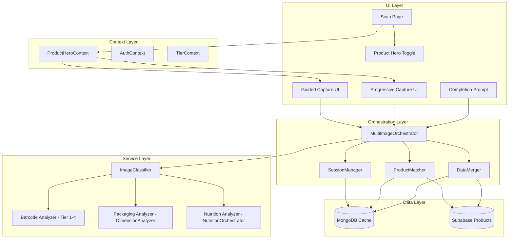
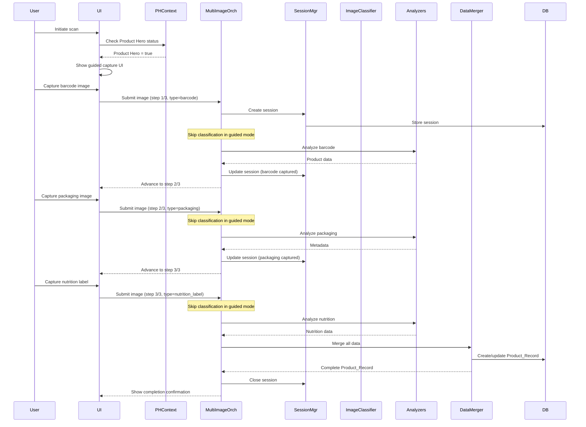
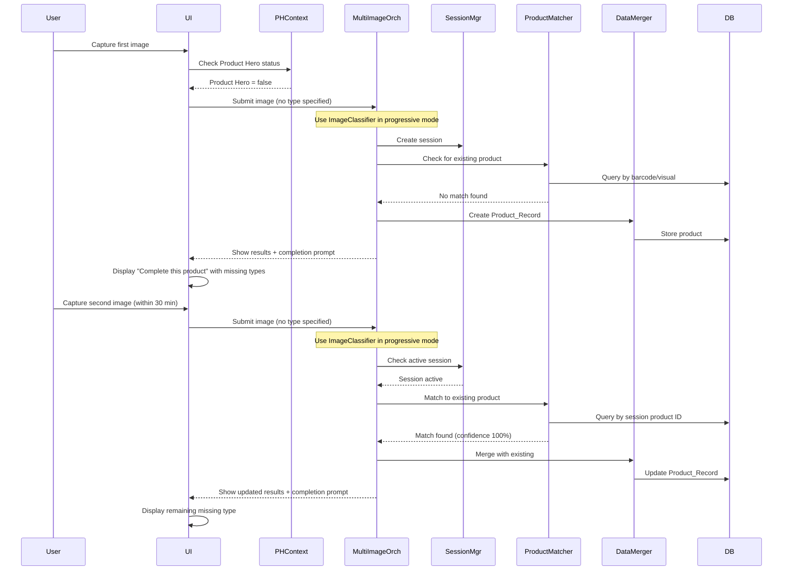

# Multi-Image Product Capture - Design Document

## Overview

The multi-image product capture system enables users to build comprehensive product profiles by capturing and analyzing multiple images (barcode, packaging, and nutritional label). The system supports two distinct workflows:

1. **Product Hero Mode (Guided)**: Power users with the Product_Hero flag enabled follow a sequential guided workflow that prompts them to capture all three image types in order (barcode → packaging → nutrition label).

2. **Progressive Capture Mode**: Casual users can capture images incrementally over time, with the system intelligently matching subsequent images to existing products and prompting users to complete their product profiles.

### Key Design Principles

- **Workflow Flexibility**: Support both guided and progressive capture patterns without code duplication
- **Intelligent Matching**: Use barcode as primary key, fall back to visual similarity + product name matching (85% confidence threshold)
- **Session Management**: 30-minute capture sessions stored in MongoDB to track multi-image submissions
- **Data Merging**: Combine data from three sources (barcode, packaging, nutrition) into single product record
- **Graceful Degradation**: Handle session expiration and partial data gracefully
- **Reuse Existing Infrastructure**: Leverage existing ImageClassifier, analyzers, and orchestrators

### System Context

This feature extends the existing single-image product scanning system by:
- Adding ProductHeroContext (similar to TierContext) for role management
- Extending MongoDB cache with multi_image_sessions collection
- Enhancing products table with captured_images array and completeness_status
- Creating new UI components for guided capture and completion prompts
- Implementing ProductMatcher and DataMerger services for intelligent data consolidation

## Architecture

### High-Level Architecture



### Component Responsibilities

**UI Layer**:
- Product Hero Toggle: Development sandbox toggle for enabling/disabling Product Hero mode
- Guided Capture UI: Sequential capture interface with progress indicator (1/3, 2/3, 3/3)
- Progressive Capture UI: Single capture with results and completion prompts
- Completion Prompt: Suggests missing image types with actionable capture buttons

**Context Layer**:
- ProductHeroContext: Manages Product Hero flag from Supabase Auth metadata and dev override from localStorage
- Integrates with existing AuthContext and TierContext

**Orchestration Layer**:
- MultiImageOrchestrator: Coordinates multi-image capture workflow, delegates to existing analyzers
- SessionManager: Manages 30-minute capture sessions in MongoDB
- ProductMatcher: Determines if new images belong to existing products (barcode primary, visual+name fallback)
- DataMerger: Combines data from multiple images into single Product_Record

**Service Layer**:
- Uses ImageClassifier for image type detection in progressive mode only
- In guided mode, skips classification and trusts user-provided image type
- Reuses existing Tier 1-4 pipeline for barcode analysis
- Reuses existing DimensionAnalyzer for packaging analysis
- Reuses existing NutritionOrchestrator for nutrition label analysis

**Data Layer**:
- MongoDB: Stores capture sessions (multi_image_sessions collection) and caches results
- Supabase: Stores products with extended schema (captured_images array, completeness_status)

### Data Flow

#### Guided Capture Flow (Product Hero Mode)



#### Progressive Capture Flow



## Components and Interfaces

### ProductHeroContext

Manages Product Hero role flag and development override toggle.

```typescript
interface ProductHeroContextValue {
  // Product Hero status (from profile or dev override)
  isProductHero: boolean;
  
  // Development override toggle state
  devOverride: boolean | null; // null = use profile flag
  
  // Set development override (persists to localStorage)
  setDevOverride: (enabled: boolean | null) => void;
  
  // Profile flag from Supabase Auth metadata
  profileFlag: boolean;
}
```

**Implementation Notes**:
- Similar pattern to TierContext
- Reads `product_hero` flag from Supabase Auth user metadata
- Stores dev override in localStorage with key `ai-grocery-scanner:product-hero-override`
- Computed `isProductHero = devOverride ?? profileFlag`
- Displays current status in UI header

### SessionManager

Manages capture sessions in MongoDB with 30-minute TTL.

```typescript
interface CaptureSession {
  sessionId: string;
  userId: string;
  productId: string | null; // Set after first image processed
  capturedImageTypes: ImageType[]; // ['barcode', 'packaging', 'nutrition_label']
  imageHashes: Array<{
    hash: string;
    imageType: ImageType;
    timestamp: Date;
  }>;
  createdAt: Date;
  lastUpdatedAt: Date;
  expiresAt: Date; // createdAt + 30 minutes, updated on each image
}

interface SessionManager {
  // Create new session
  createSession(userId: string): Promise<CaptureSession>;
  
  // Get active session for user and product
  getActiveSession(userId: string, productId?: string): Promise<CaptureSession | null>;
  
  // Update session with new image
  updateSession(
    sessionId: string,
    imageHash: string,
    imageType: ImageType,
    productId?: string
  ): Promise<CaptureSession>;
  
  // Close session (mark complete)
  closeSession(sessionId: string): Promise<void>;
  
  // Restore active sessions on app restart
  restoreActiveSessions(userId: string): Promise<CaptureSession[]>;
  
  // Clean up expired sessions
  cleanupExpiredSessions(): Promise<number>; // Returns count of removed sessions
}
```

**Implementation Notes**:
- Stores sessions in MongoDB `multi_image_sessions` collection
- TTL index on `expiresAt` field for automatic cleanup
- Updates `expiresAt` to `now() + 30 minutes` on each image capture
- Supports multiple concurrent sessions per user (different products)

### ProductMatcher

Determines if a new image belongs to an existing product.

```typescript
interface MatchResult {
  matched: boolean;
  productId?: string;
  confidence: number; // 0.0 to 1.0
  matchMethod: 'barcode' | 'visual_similarity' | 'product_name' | 'session';
}

interface ProductMatcher {
  // Match image to existing product
  matchProduct(
    imageData: ImageData,
    imageType: ImageType,
    metadata: ImageMetadata,
    activeSession?: CaptureSession
  ): Promise<MatchResult>;
  
  // Match by barcode (primary key)
  matchByBarcode(barcode: string): Promise<MatchResult>;
  
  // Match by visual similarity + product name
  matchByVisualAndName(
    imageHash: string,
    productName: string,
    brand?: string
  ): Promise<MatchResult>;
}
```

**Matching Strategy**:
1. **Session Context**: If active session exists with productId, return that product (confidence 1.0)
2. **Barcode Primary**: If image contains barcode, query by barcode value (confidence 1.0 if found)
3. **Visual + Name Fallback**: Use image hash + product name + brand for similarity search (confidence based on similarity score)
4. **Threshold**: Only return match if confidence >= 0.85 (85%)
5. **No Match**: Return `matched: false` to trigger new product creation

**Implementation Notes**:
- Reuses existing `ProductRepositoryMultiTier.findByBarcode()` for barcode matching
- Reuses existing `ProductRepositoryMultiTier.searchByMetadata()` for visual+name matching
- Checks MongoDB cache first for performance
- Logs match method and confidence for monitoring

### DataMerger

Combines data from multiple images into single Product_Record.

```typescript
interface MergeResult {
  product: ProductData;
  conflicts: Array<{
    field: string;
    values: Array<{
      value: any;
      source: ImageType;
      timestamp: Date;
    }>;
  }>;
  confidenceScore: number;
}

interface DataMerger {
  // Merge data from multiple images
  mergeImages(
    existingProduct: ProductData | null,
    newImageData: ImageAnalysisResult,
    imageType: ImageType
  ): Promise<MergeResult>;
  
  // Validate consistency between overlapping fields
  validateConsistency(
    field: string,
    existingValue: any,
    newValue: any,
    existingSource: ImageType,
    newSource: ImageType
  ): ConsistencyResult;
}

interface ConsistencyResult {
  consistent: boolean;
  confidence: number;
  warning?: string;
}
```

**Merging Strategy**:
1. **Field Priority**:
   - Product identification (barcode, name, brand): Barcode_Analyzer > Packaging_Analyzer > Nutrition_Analyzer
   - Product metadata (size, category, dimensions): Packaging_Analyzer > Barcode_Analyzer
   - Nutritional data (health score, allergens, ingredients): Nutrition_Analyzer only

2. **Conflict Resolution**:
   - Most recent data wins (by timestamp)
   - Store all conflicting values with source for manual review
   - Log consistency warnings for significant conflicts

3. **Image Hash Tracking**:
   - Append to `captured_images` array: `{ imageHash, imageType, timestamp }`
   - Update `captured_image_types` array (unique values only)
   - Set `completeness_status` when all three types captured

**Implementation Notes**:
- Updates Supabase products table and MongoDB cache atomically
- Flags products for review if consistency score < 0.7
- Preserves all image references for audit trail

### MultiImageOrchestrator

Coordinates the multi-image capture workflow.

```typescript
interface MultiImageOrchestrator {
  // Process single image in multi-image workflow
  processImage(
    imageData: ImageData,
    userId: string,
    workflowMode: 'guided' | 'progressive',
    sessionId?: string
  ): Promise<ProcessImageResult>;
  
  // Get completion status for product
  getCompletionStatus(productId: string): Promise<CompletionStatus>;
}

interface ProcessImageResult {
  success: boolean;
  product: ProductData;
  imageType: ImageType;
  sessionId: string;
  completionStatus: CompletionStatus;
  nextStep?: 'barcode' | 'packaging' | 'nutrition_label'; // For guided mode
}

interface CompletionStatus {
  complete: boolean;
  capturedTypes: ImageType[];
  missingTypes: ImageType[];
  progress: number; // 0-100 percentage
}
```

**Workflow Logic**:
- **Guided Mode**: Accepts `expectedImageType` parameter and skips image classification
  - Trusts user intent based on workflow step (barcode → packaging → nutrition)
  - Faster processing (no classification API call)
  - More accurate (no misclassification of barcode as packaging)
  - If analyzer fails (e.g., barcode unreadable), continues with empty data
- **Progressive Mode**: Uses ImageClassifier for automatic image type detection
  - Delegates to ImageClassifier when no `expectedImageType` provided
  - Classifies image type with retry and fallback logic
  - Handles low confidence and unknown types with user-friendly errors
- Routes to appropriate analyzer based on image type
- Uses SessionManager to track progress
- Uses ProductMatcher to link images to products
- Uses DataMerger to combine results
- Returns next step for guided mode or completion prompt data for progressive mode

## Data Models

### Extended Products Table (Supabase)

```sql
-- Extends existing products table
ALTER TABLE products ADD COLUMN IF NOT EXISTS captured_images JSONB DEFAULT '[]';
ALTER TABLE products ADD COLUMN IF NOT EXISTS completeness_status VARCHAR(20) DEFAULT 'incomplete';
ALTER TABLE products ADD COLUMN IF NOT EXISTS captured_image_types TEXT[] DEFAULT '{}';

-- Index for querying by completeness
CREATE INDEX IF NOT EXISTS idx_products_completeness ON products(completeness_status);

-- Index for querying by captured types
CREATE INDEX IF NOT EXISTS idx_products_captured_types ON products USING GIN(captured_image_types);
```

**captured_images structure**:
```json
[
  {
    "imageHash": "abc123...",
    "imageType": "barcode",
    "timestamp": "2024-01-15T10:30:00Z"
  },
  {
    "imageHash": "def456...",
    "imageType": "packaging",
    "timestamp": "2024-01-15T10:32:00Z"
  },
  {
    "imageHash": "ghi789...",
    "imageType": "nutrition_label",
    "timestamp": "2024-01-15T10:35:00Z"
  }
]
```

### Multi-Image Sessions Collection (MongoDB)

```typescript
// Collection: multi_image_sessions
interface MultiImageSessionDocument {
  _id: ObjectId;
  sessionId: string; // UUID
  userId: string; // Supabase Auth user ID
  productId: string | null; // Set after first image
  capturedImageTypes: ('barcode' | 'packaging' | 'nutrition_label')[];
  imageHashes: Array<{
    hash: string;
    imageType: 'barcode' | 'packaging' | 'nutrition_label';
    timestamp: Date;
  }>;
  workflowMode: 'guided' | 'progressive';
  createdAt: Date;
  lastUpdatedAt: Date;
  expiresAt: Date; // TTL index
  status: 'active' | 'completed' | 'expired';
}

// Indexes
// - sessionId (unique)
// - userId + status (for querying active sessions)
// - expiresAt (TTL index for automatic cleanup)
```

### Product Data Type

```typescript
interface ProductData {
  id: string;
  barcode?: string;
  name: string;
  brand: string;
  size?: string;
  category: string;
  imageUrl?: string;
  metadata: Record<string, any>;
  
  // Multi-image specific fields
  capturedImages?: Array<{
    imageHash: string;
    imageType: 'barcode' | 'packaging' | 'nutrition_label';
    timestamp: Date;
  }>;
  capturedImageTypes?: ('barcode' | 'packaging' | 'nutrition_label')[];
  completenessStatus?: 'incomplete' | 'complete';
  
  // Nutritional data (from nutrition label)
  nutritionalFacts?: NutritionalFacts;
  healthScore?: HealthScore;
  ingredients?: IngredientList;
}
```


## Correctness Properties

*A property is a characteristic or behavior that should hold true across all valid executions of a system—essentially, a formal statement about what the system should do. Properties serve as the bridge between human-readable specifications and machine-verifiable correctness guarantees.*

### Property Reflection

After analyzing all acceptance criteria, I identified several opportunities to consolidate redundant properties:

**Consolidations Made**:
1. Properties for Product_Record data structure (8.1-8.7) consolidated into single comprehensive property
2. Properties for workflow routing (14.1-14.3) consolidated into single routing property
3. Properties for image type routing (4.3-4.5) consolidated into single routing property
4. Properties for completion prompt content (7.3-7.4) consolidated into single property
5. Properties for session data structure (3.2, 12.2) consolidated as they test the same fields

**Unique Properties Retained**:
- Each property provides distinct validation value
- No logical redundancy where one property implies another
- Properties cover different aspects: state management, data integrity, workflow logic, UI behavior

### Property 1: Product Hero Flag Persistence

*For any* user with a Product_Hero flag set in Supabase Auth metadata, authenticating and retrieving the flag should return the same value that was stored.

**Validates: Requirements 1.1, 1.2**

### Property 2: Product Hero Context Exposure

*For any* authenticated user, the ProductHeroContext should expose the Product_Hero status to the capture workflow logic.

**Validates: Requirements 1.3**

### Property 3: Development Override Activation

*For any* user, when the development toggle is enabled, Product Hero mode should activate regardless of the user's stored profile flag.

**Validates: Requirements 1.5**

### Property 4: Development Override Fallback

*For any* user, when the development toggle is disabled, the system should use the Product_Hero flag from the user's profile.

**Validates: Requirements 1.6**

### Property 5: Development Toggle Persistence Round-Trip

*For any* toggle state (enabled/disabled), setting the state in localStorage and then retrieving it should produce the same state value.

**Validates: Requirements 1.7**

### Property 6: Product Hero Status Display

*For any* user session, the UI header should display the current Product Hero status (either from profile flag or dev override).

**Validates: Requirements 1.8**

### Property 7: Guided Capture Sequential Prompts

*For any* Product Hero user in guided mode, the system should prompt for images in the order: barcode, then packaging, then nutrition_label.

**Validates: Requirements 2.2**

### Property 8: Guided Capture State Transitions

*For any* Product Hero user in guided mode, capturing an image of type N should advance to the prompt for image type N+1 in the sequence [barcode, packaging, nutrition_label].

**Validates: Requirements 2.3, 2.4**

### Property 9: Complete Product Record Construction

*For any* set of three images (one barcode, one packaging, one nutrition_label), processing all three should construct a Product_Record containing data from all three sources.

**Validates: Requirements 2.5**

### Property 10: Image Linking Consistency

*For any* set of three images captured for the same product, all three images should be linked to the same product identifier in the Product_Record.

**Validates: Requirements 2.6**

### Property 11: Session Creation Uniqueness

*For any* image capture event, the system should create a Capture_Session with a unique session identifier that differs from all other active sessions.

**Validates: Requirements 3.1**

### Property 12: Session Data Completeness

*For any* Capture_Session, it should contain the product identifier (or null), captured Image_Types array, image hashes array, and timestamp fields.

**Validates: Requirements 3.2, 12.2**

### Property 13: Session TTL Expiration

*For any* Capture_Session, if no images are captured for 30 minutes, the session should expire and be removed from storage.

**Validates: Requirements 3.3, 3.4**

### Property 14: Concurrent Session Support

*For any* user, the system should support multiple active Capture_Sessions simultaneously for different products.

**Validates: Requirements 3.5**

### Property 15: Image Classification Determinism

*For any* image, the Image_Classifier should determine a valid Image_Type (barcode, packaging, nutrition_label, or unknown).

**Validates: Requirements 4.1**

### Property 16: Image Type Routing

*For any* classified image, the system should route it to the correct analyzer: barcode images to Barcode_Analyzer, packaging images to Packaging_Analyzer, and nutrition_label images to Nutrition_Analyzer.

**Validates: Requirements 4.2, 4.3, 4.4, 4.5**

### Property 17: Session-Based Product Matching

*For any* image submitted within an active Capture_Session, the Product_Matcher should check if the image belongs to the session's existing product.

**Validates: Requirements 5.1**

### Property 18: Barcode Matching Priority

*For any* barcode image, the Product_Matcher should use the barcode value as the primary matching key before attempting other matching methods.

**Validates: Requirements 5.2**

### Property 19: Visual Similarity Fallback Matching

*For any* packaging or nutrition_label image captured without a barcode, the Product_Matcher should use visual similarity and product name matching.

**Validates: Requirements 5.3**

### Property 20: Confidence Threshold Matching

*For any* product match, if the confidence score is above 85%, the Product_Matcher should return the existing product identifier; otherwise, it should generate a new product identifier.

**Validates: Requirements 5.4, 5.5**

### Property 21: Multi-Image Data Merging

*For any* set of multiple images for the same product, the Data_Merger should combine the results into a single Product_Record.

**Validates: Requirements 6.1**

### Property 22: Data Source Priority

*For any* Product_Record, product identification fields should be populated from Barcode_Analyzer results, metadata fields from Packaging_Analyzer results, and nutritional data fields from Nutrition_Analyzer results.

**Validates: Requirements 6.2, 6.3, 6.4**

### Property 23: Conflict Resolution Recency

*For any* conflicting data between images, the Data_Merger should prioritize the most recently captured image data.

**Validates: Requirements 6.5**

### Property 24: Image Reference Preservation

*For any* Product_Record with multiple images, all image hash references should be preserved in the captured_images array.

**Validates: Requirements 6.6**

### Property 25: Completion Prompt Missing Types

*For any* product with captured images, the Completion_Prompt should list exactly the Image_Types that have not yet been captured.

**Validates: Requirements 7.2**

### Property 26: Completion Prompt Actionable Buttons

*For any* missing Image_Type in a product, the Completion_Prompt should provide an actionable button to initiate capture for that specific type.

**Validates: Requirements 7.6**

### Property 27: Product Record Data Structure Completeness

*For any* Product_Record, it should include: product identifier, image hash array with Image_Type labels, product identification fields (barcode, name, brand), metadata fields (size, category), nutritional data fields (health score, allergens, ingredients), timestamps (creation, last update), and completeness indicator.

**Validates: Requirements 8.1, 8.2, 8.3, 8.4, 8.5, 8.6, 8.7**

### Property 28: Image Hash Generation

*For any* captured image, the system should generate a SHA-256 hash of the image data.

**Validates: Requirements 9.1**

### Property 29: Image Hash Storage Triplet

*For any* captured image, the system should store the image hash, Image_Type, and product identifier together in the Product_Record.

**Validates: Requirements 9.2**

### Property 30: Image Hash Association Preservation

*For any* Product_Record merge operation, the associations between image hashes and the Product_Record should be maintained.

**Validates: Requirements 9.3**

### Property 31: Product Record Image Hash Retrieval

*For any* Product_Record retrieved from storage, it should include references to all associated image hashes.

**Validates: Requirements 9.4**

### Property 32: Image Hash Cache Deduplication

*For any* image with a hash that exists in MongoDB cache, the system should return the cached result instead of reprocessing the image.

**Validates: Requirements 9.5**

### Property 33: Cache-First Product Lookup

*For any* image submission, the system should check MongoDB_Cache for existing products with matching identifiers before querying the database.

**Validates: Requirements 10.1**

### Property 34: Cache Hit Update Behavior

*For any* image submission where a matching product is found in MongoDB_Cache, the system should update the existing Product_Record rather than creating a new one.

**Validates: Requirements 10.2**

### Property 35: Barcode Database Lookup

*For any* barcode image submission, the system should check Supabase_Storage for existing products with the same barcode value.

**Validates: Requirements 10.3**

### Property 36: Database Hit Update Behavior

*For any* barcode image where a matching product is found in Supabase_Storage, the system should update the existing Product_Record instead of creating a new one.

**Validates: Requirements 10.4**

### Property 37: New Image Data Merging

*For any* new image data and existing Product_Record, the system should merge the new data with existing data using the Data_Merger.

**Validates: Requirements 10.5**

### Property 38: Barcode Storage

*For any* barcode value extracted from an image, the system should store the raw barcode string in the Product_Record.

**Validates: Requirements 11.1**

### Property 39: Barcode Format Validation

*For any* extracted barcode, the system should validate that it conforms to expected formats (UPC, EAN, or QR code).

**Validates: Requirements 11.2**

### Property 40: Barcode Encoding Round-Trip

*For any* valid barcode value, encoding the barcode to an image format and then decoding should produce the original barcode value.

**Validates: Requirements 11.3**

### Property 41: Barcode Validation Error Handling

*For any* invalid barcode, the system should log the error and prompt the user to recapture the barcode image.

**Validates: Requirements 11.4**

### Property 42: Session State Persistence

*For any* Capture_Session creation or update, the system should persist the session state to MongoDB_Cache.

**Validates: Requirements 12.1**

### Property 43: Session Restoration After Restart

*For any* application restart, the system should restore all active Capture_Sessions from MongoDB_Cache.

**Validates: Requirements 12.3**

### Property 44: Expired Session Removal on Restore

*For any* Capture_Session restoration, the system should verify the expiration timestamp and remove expired sessions.

**Validates: Requirements 12.4**

### Property 45: Restored Session Functionality

*For any* restored Capture_Session, the system should allow users to continue capturing images for that session.

**Validates: Requirements 12.5**

### Property 46: Captured Image Types Array Maintenance

*For any* Product_Record, it should include a captured_image_types array listing all Image_Types that have been captured.

**Validates: Requirements 13.1**

### Property 47: Image Type Array Append

*For any* image added to a Product_Record, the system should append the Image_Type to the captured_image_types array.

**Validates: Requirements 13.2**

### Property 48: Image Type Array Uniqueness

*For any* Product_Record, the captured_image_types array should contain no duplicate Image_Type entries.

**Validates: Requirements 13.3**

### Property 49: Product Completeness Marking

*For any* Product_Record with all three Image_Types (barcode, packaging, nutrition_label) in captured_image_types, the system should mark the product as complete.

**Validates: Requirements 13.4**

### Property 50: Captured Image Types UI Exposure

*For any* Product_Record, the system should expose the captured_image_types data to the UI for displaying completion status.

**Validates: Requirements 13.5**

### Property 51: Workflow Mode Selection

*For any* product scan initiation, the system should check the Product_Hero flag and activate the guided workflow if true, or the progressive workflow if false.

**Validates: Requirements 14.1, 14.2, 14.3**

### Property 52: Workflow Mode Session Consistency

*For any* Capture_Session, the selected workflow mode should remain consistent throughout the session.

**Validates: Requirements 14.4**

### Property 53: Workflow Mode Update for New Sessions

*For any* user whose Product_Hero status changes, the system should apply the new workflow mode to subsequent Capture_Sessions (but not existing ones).

**Validates: Requirements 14.5**

### Property 54: Data Consistency Validation

*For any* Data_Merger operation combining data from multiple images, the system should validate consistency between overlapping fields.

**Validates: Requirements 15.1**

### Property 55: Product Name Conflict Warning

*For any* product name from packaging that differs from the product name in the barcode database, the system should log a consistency warning.

**Validates: Requirements 15.2**

### Property 56: Nutritional Data Conflict Flagging

*For any* nutritional data that conflicts with product category expectations, the system should flag the Product_Record for review.

**Validates: Requirements 15.3**

### Property 57: Conflicting Values Source Preservation

*For any* conflicting values detected during merging, the system should store all conflicting values with their source Image_Type for manual review.

**Validates: Requirements 15.4**

### Property 58: Consistency-Based Confidence Scoring

*For any* merged Product_Record, the system should apply a confidence score based on consistency validation results.

**Validates: Requirements 15.5**


## Error Handling

### Error Categories

#### 1. Session Management Errors

**Session Expired**:
- **Cause**: User attempts to add image to session after 30-minute TTL
- **Handling**: 
  - Display friendly message: "Your capture session has expired. Starting a new session..."
  - Create new session automatically
  - Attempt to match image to existing product using ProductMatcher
  - If match found, continue with existing product; otherwise create new product
- **User Impact**: Minimal - graceful degradation with automatic recovery

**Session Not Found**:
- **Cause**: Session ID reference is invalid or session was manually deleted
- **Handling**:
  - Log error for monitoring
  - Create new session
  - Continue with normal workflow
- **User Impact**: None - transparent recovery

**Multiple Active Sessions**:
- **Cause**: User has multiple products in progress
- **Handling**:
  - Allow concurrent sessions (by design)
  - Use ProductMatcher to determine which session/product the new image belongs to
  - If ambiguous, prompt user to select which product they're capturing
- **User Impact**: Requires user input only if matching is ambiguous

#### 2. Image Classification Errors

**Note**: Image classification is only used in **progressive mode**. In **guided mode**, the system trusts the user-provided image type and skips classification entirely.

**Classification Confidence Too Low** (Progressive Mode Only):
- **Cause**: Image is unclear, blurry, or ambiguous
- **Handling**:
  - Return `type: 'unknown'` from ImageClassifier
  - Display message: "Unable to determine image type. Please ensure the image is clear and try again."
  - Provide option to manually select image type
  - Allow retry with same or new image
- **User Impact**: Requires recapture or manual selection

**Classification Service Unavailable** (Progressive Mode Only):
- **Cause**: Gemini API rate limit or service outage
- **Handling**:
  - Retry with exponential backoff (3 attempts)
  - If all retries fail, fall back to manual image type selection
  - Cache the manual selection for future reference
- **User Impact**: Slight delay or manual intervention required

**Misclassification Prevention** (Guided Mode):
- **Benefit**: By skipping classification in guided mode, we prevent misclassification issues
  - Example: Barcode images won't be incorrectly classified as packaging
  - Faster processing (saves 2-3 seconds per image)
  - More reliable workflow based on user intent

#### 3. Product Matching Errors

**No Match Found Below Threshold**:
- **Cause**: Confidence score < 85% for all potential matches
- **Handling**:
  - Create new product (by design)
  - Log the attempted matches and confidence scores for analysis
  - Continue with normal workflow
- **User Impact**: None - expected behavior

**Ambiguous Match**:
- **Cause**: Multiple products with confidence scores > 85%
- **Handling**:
  - Select highest confidence match
  - Log warning for monitoring
  - If confidence scores are very close (within 5%), prompt user to confirm match
- **User Impact**: May require user confirmation

**Barcode Mismatch**:
- **Cause**: Barcode from new image doesn't match barcode in existing product
- **Handling**:
  - Log consistency error
  - Flag product for review
  - Use most recent barcode value
  - Display warning to user: "Barcode mismatch detected. Product flagged for review."
- **User Impact**: Warning displayed, product flagged

#### 4. Data Merging Errors

**Conflicting Product Names**:
- **Cause**: Name from packaging differs significantly from name in barcode database
- **Handling**:
  - Log consistency warning
  - Store both values with sources
  - Use barcode database name as primary (higher trust)
  - Display info message: "Product name variations detected"
- **User Impact**: Informational only

**Conflicting Nutritional Data**:
- **Cause**: Nutrition data doesn't match product category (e.g., "healthy" score for candy)
- **Handling**:
  - Flag product for review
  - Store all values with sources
  - Apply lower confidence score
  - Display warning: "Nutritional data may need verification"
- **User Impact**: Warning displayed, lower confidence

**Database Update Failure**:
- **Cause**: Supabase connection error or constraint violation
- **Handling**:
  - Retry with exponential backoff (3 attempts)
  - If all retries fail, store in MongoDB cache as pending
  - Background job retries database update later
  - Display message: "Product saved locally, will sync when connection is restored"
- **User Impact**: Delayed persistence, but data not lost

**Cache Update Failure**:
- **Cause**: MongoDB connection error
- **Handling**:
  - Log error but continue (cache is optimization, not critical)
  - Product still saved to Supabase
  - Next lookup will be slower but functional
- **User Impact**: None - transparent degradation

#### 5. Analyzer Errors

**Barcode Analyzer Failure**:
- **Cause**: Barcode unreadable, API failure, or unsupported format
- **Handling**:
  - Return error with specific code
  - Prompt user to recapture barcode image
  - Offer manual barcode entry option
  - Continue with other image types if available
- **User Impact**: Requires recapture or manual entry

**Packaging Analyzer Failure**:
- **Cause**: Image too blurry, text unreadable, or API failure
- **Handling**:
  - Return partial results if any data extracted
  - Log error for monitoring
  - Continue with other image types
  - Product can still be created with available data
- **User Impact**: Reduced data quality, but workflow continues

**Nutrition Analyzer Failure**:
- **Cause**: Label not visible, format not recognized, or API failure
- **Handling**:
  - Return error with specific code
  - Prompt user to recapture nutrition label
  - Continue with other image types
  - Mark nutritional data as incomplete
- **User Impact**: Requires recapture for complete data

#### 6. Workflow Errors

**Invalid State Transition**:
- **Cause**: User attempts to capture out of sequence in guided mode
- **Handling**:
  - Reject the image with clear message
  - Display expected image type
  - Maintain current state
- **User Impact**: Clear guidance on next step

**Duplicate Image Type**:
- **Cause**: User captures same image type twice
- **Handling**:
  - In guided mode: Reject with message "Already captured [type]. Please capture [next type]."
  - In progressive mode: Update existing image data with new capture (most recent wins)
  - Log the duplicate for monitoring
- **User Impact**: Clear feedback, data updated

### Error Recovery Strategies

#### Retry Logic
- **Exponential Backoff**: 1s, 2s, 4s delays for API calls
- **Max Retries**: 3 attempts for transient failures
- **Circuit Breaker**: Disable failing service temporarily after 5 consecutive failures

#### Graceful Degradation
- **Cache Failures**: Continue without cache, direct database access
- **Classification Failures**: Fall back to manual image type selection
- **Matching Failures**: Create new product rather than blocking user

#### Data Consistency
- **Atomic Updates**: Use transactions where possible (Supabase + MongoDB)
- **Rollback Support**: Revert cache updates if database update fails
- **Consistency Checks**: Validate data integrity before committing
- **Audit Trail**: Log all data conflicts and resolutions

#### User Communication
- **Clear Messages**: Explain what went wrong and what to do next
- **Actionable Options**: Provide retry, skip, or manual entry options
- **Progress Preservation**: Never lose user's captured images
- **Confidence Indicators**: Show data quality and completeness status

### Monitoring and Alerting

**Key Metrics**:
- Session expiration rate
- Image classification failure rate
- Product matching confidence distribution
- Data consistency warning frequency
- Analyzer failure rates by type
- Database/cache update failure rates

**Alerts**:
- High failure rate (> 10%) for any component
- Spike in session expirations (> 20% increase)
- Database update failures (> 5 consecutive)
- Low matching confidence trend (< 70% average)

## Testing Strategy

### Dual Testing Approach

This feature requires both unit tests and property-based tests for comprehensive coverage:

**Unit Tests**: Verify specific examples, edge cases, and error conditions
- Specific UI component rendering
- Integration points between components
- Edge cases (empty data, null values, boundary conditions)
- Error handling paths

**Property-Based Tests**: Verify universal properties across all inputs
- Data integrity properties (round-trips, consistency)
- State transition properties (workflow sequences)
- Matching and merging logic (confidence thresholds)
- Session management (TTL, concurrency)

Together, these approaches provide comprehensive coverage: unit tests catch concrete bugs in specific scenarios, while property tests verify general correctness across the input space.

### Property-Based Testing Configuration

**Library Selection**:
- **JavaScript/TypeScript**: Use `fast-check` (already in dependencies)
- **Minimum Iterations**: 100 runs per property test (due to randomization)
- **Seed Management**: Log seed values for reproducible failures

**Test Tagging Format**:
Each property test must reference its design document property:

```typescript
// Feature: multi-image-product-capture, Property 1: Product Hero Flag Persistence
test('Product Hero flag persistence round-trip', async () => {
  await fc.assert(
    fc.asyncProperty(
      fc.record({
        userId: fc.uuid(),
        productHeroFlag: fc.boolean()
      }),
      async ({ userId, productHeroFlag }) => {
        // Test implementation
      }
    ),
    { numRuns: 100 }
  );
});
```

### Test Organization

```
src/
  lib/
    multi-image/
      __tests__/
        unit/
          ProductHeroContext.test.tsx
          SessionManager.test.ts
          ProductMatcher.test.ts
          DataMerger.test.ts
          MultiImageOrchestrator.test.ts
        property/
          session-management.property.test.ts
          product-matching.property.test.ts
          data-merging.property.test.ts
          workflow-routing.property.test.ts
          data-consistency.property.test.ts
  components/
    __tests__/
      unit/
        ProductHeroToggle.test.tsx
        GuidedCaptureUI.test.tsx
        CompletionPrompt.test.tsx
      property/
        ui-state-transitions.property.test.ts
```

### Unit Test Coverage

#### ProductHeroContext Tests
- ✓ Reads Product_Hero flag from Supabase Auth metadata
- ✓ Applies dev override when enabled
- ✓ Falls back to profile flag when dev override disabled
- ✓ Persists dev override to localStorage
- ✓ Displays current status in UI header
- ✓ Handles missing metadata gracefully

#### SessionManager Tests
- ✓ Creates session with unique ID
- ✓ Stores session in MongoDB
- ✓ Updates session on image capture
- ✓ Extends TTL on each update
- ✓ Removes expired sessions
- ✓ Supports concurrent sessions per user
- ✓ Restores active sessions on restart
- ✓ Handles MongoDB connection errors

#### ProductMatcher Tests
- ✓ Matches by barcode (primary key)
- ✓ Matches by visual similarity + name (fallback)
- ✓ Returns existing product if confidence >= 85%
- ✓ Generates new product ID if confidence < 85%
- ✓ Uses session context for matching
- ✓ Handles ambiguous matches
- ✓ Logs match method and confidence

#### DataMerger Tests
- ✓ Merges data from multiple images
- ✓ Prioritizes barcode data for identification
- ✓ Prioritizes packaging data for metadata
- ✓ Prioritizes nutrition data for nutritional fields
- ✓ Resolves conflicts using most recent data
- ✓ Preserves all image references
- ✓ Detects and logs consistency warnings
- ✓ Flags products for review on low consistency
- ✓ Updates Supabase and MongoDB atomically

#### MultiImageOrchestrator Tests
- ✓ Routes to correct analyzer based on image type
- ✓ Creates session on first image
- ✓ Updates session on subsequent images
- ✓ Uses ProductMatcher to link images
- ✓ Uses DataMerger to combine results
- ✓ Returns next step for guided mode
- ✓ Returns completion status for progressive mode
- ✓ Handles analyzer failures gracefully

#### UI Component Tests
- ✓ ProductHeroToggle renders and toggles state
- ✓ GuidedCaptureUI shows correct step (1/3, 2/3, 3/3)
- ✓ GuidedCaptureUI advances on image capture
- ✓ CompletionPrompt lists missing image types
- ✓ CompletionPrompt provides capture buttons
- ✓ CompletionPrompt shows confirmation when complete

### Property-Based Test Coverage

#### Property 1-8: Product Hero Management
```typescript
// Feature: multi-image-product-capture, Property 1: Product Hero Flag Persistence
// Test: For any user with Product_Hero flag, auth retrieves same value
fc.asyncProperty(
  fc.record({ userId: fc.uuid(), flag: fc.boolean() }),
  async ({ userId, flag }) => {
    await setProductHeroFlag(userId, flag);
    const retrieved = await getProductHeroFlag(userId);
    return retrieved === flag;
  }
);

// Feature: multi-image-product-capture, Property 5: Development Toggle Persistence Round-Trip
// Test: For any toggle state, localStorage round-trip preserves value
fc.property(
  fc.boolean(),
  (state) => {
    localStorage.setItem('product-hero-override', JSON.stringify(state));
    const retrieved = JSON.parse(localStorage.getItem('product-hero-override'));
    return retrieved === state;
  }
);
```

#### Property 11-14: Session Management
```typescript
// Feature: multi-image-product-capture, Property 11: Session Creation Uniqueness
// Test: For any N sessions, all session IDs are unique
fc.asyncProperty(
  fc.array(fc.uuid(), { minLength: 1, maxLength: 10 }),
  async (userIds) => {
    const sessions = await Promise.all(
      userIds.map(userId => sessionManager.createSession(userId))
    );
    const ids = sessions.map(s => s.sessionId);
    return new Set(ids).size === ids.length;
  }
);

// Feature: multi-image-product-capture, Property 13: Session TTL Expiration
// Test: For any session, after 30 min inactivity, session expires
fc.asyncProperty(
  fc.record({ userId: fc.uuid() }),
  async ({ userId }) => {
    const session = await sessionManager.createSession(userId);
    await advanceTime(31 * 60 * 1000); // 31 minutes
    const retrieved = await sessionManager.getActiveSession(userId);
    return retrieved === null;
  }
);
```

#### Property 20: Confidence Threshold Matching
```typescript
// Feature: multi-image-product-capture, Property 20: Confidence Threshold Matching
// Test: For any match, confidence >= 85% returns existing ID, < 85% generates new ID
fc.asyncProperty(
  fc.record({
    imageData: fc.base64String(),
    existingProduct: fc.record({ id: fc.uuid(), name: fc.string() }),
    confidence: fc.float({ min: 0, max: 1 })
  }),
  async ({ imageData, existingProduct, confidence }) => {
    const result = await productMatcher.matchProduct(imageData, 'packaging', {
      productName: existingProduct.name,
      confidence
    });
    
    if (confidence >= 0.85) {
      return result.matched && result.productId === existingProduct.id;
    } else {
      return !result.matched || result.productId !== existingProduct.id;
    }
  }
);
```

#### Property 23: Conflict Resolution Recency
```typescript
// Feature: multi-image-product-capture, Property 23: Conflict Resolution Recency
// Test: For any conflicting data, most recent wins
fc.asyncProperty(
  fc.record({
    oldData: fc.record({ name: fc.string(), timestamp: fc.date() }),
    newData: fc.record({ name: fc.string(), timestamp: fc.date() })
  }).filter(({ oldData, newData }) => 
    oldData.timestamp < newData.timestamp && oldData.name !== newData.name
  ),
  async ({ oldData, newData }) => {
    const merged = await dataMerger.mergeImages(
      { name: oldData.name },
      { name: newData.name },
      'packaging'
    );
    return merged.product.name === newData.name;
  }
);
```

#### Property 28: Image Hash Generation
```typescript
// Feature: multi-image-product-capture, Property 28: Image Hash Generation
// Test: For any image, system generates SHA-256 hash
fc.asyncProperty(
  fc.base64String({ minLength: 100, maxLength: 1000 }),
  async (imageData) => {
    const hash = await hashImage(imageData);
    return hash.length === 64 && /^[a-f0-9]{64}$/.test(hash);
  }
);
```

#### Property 32: Image Hash Cache Deduplication
```typescript
// Feature: multi-image-product-capture, Property 32: Image Hash Cache Deduplication
// Test: For any cached image hash, system returns cached result
fc.asyncProperty(
  fc.record({
    imageData: fc.base64String(),
    productData: fc.record({ id: fc.uuid(), name: fc.string() })
  }),
  async ({ imageData, productData }) => {
    const hash = await hashImage(imageData);
    await cacheService.store(hash, 'imageHash', productData, 1, 1.0);
    
    // Process same image again
    const result = await orchestrator.processImage(imageData, 'user123', 'progressive');
    
    // Should return cached result without reprocessing
    return result.product.id === productData.id;
  }
);
```

#### Property 40: Barcode Encoding Round-Trip
```typescript
// Feature: multi-image-product-capture, Property 40: Barcode Encoding Round-Trip
// Test: For any valid barcode, encode then decode produces original
fc.property(
  fc.oneof(
    fc.string({ minLength: 12, maxLength: 12 }).filter(isValidUPC),
    fc.string({ minLength: 13, maxLength: 13 }).filter(isValidEAN)
  ),
  (barcode) => {
    const encoded = encodeBarcodeToImage(barcode);
    const decoded = decodeBarcodeFromImage(encoded);
    return decoded === barcode;
  }
);
```

#### Property 48: Image Type Array Uniqueness
```typescript
// Feature: multi-image-product-capture, Property 48: Image Type Array Uniqueness
// Test: For any product, captured_image_types contains no duplicates
fc.asyncProperty(
  fc.array(
    fc.constantFrom('barcode', 'packaging', 'nutrition_label'),
    { minLength: 1, maxLength: 10 }
  ),
  async (imageTypes) => {
    const product = await createProductWithImages(imageTypes);
    const types = product.capturedImageTypes;
    return new Set(types).size === types.length;
  }
);
```

### Integration Tests

**End-to-End Workflows**:
1. Guided capture flow (Product Hero)
   - Capture barcode → packaging → nutrition label
   - Verify product created with all data
   - Verify session closed on completion

2. Progressive capture flow
   - Capture single image → see results + prompt
   - Capture second image (within 30 min) → see updated results
   - Capture third image → see completion confirmation

3. Session expiration recovery
   - Capture first image
   - Wait 31 minutes
   - Capture second image
   - Verify new session created and product matched

4. Duplicate prevention
   - Capture barcode for existing product
   - Verify existing product updated, not duplicated

5. Conflict resolution
   - Capture images with conflicting data
   - Verify most recent data wins
   - Verify conflicts logged

### Performance Tests

**Session Management**:
- Session creation: < 100ms
- Session lookup: < 50ms
- Session update: < 100ms
- Concurrent sessions: Support 100+ per user

**Product Matching**:
- Barcode match: < 200ms (cache hit < 50ms)
- Visual + name match: < 500ms
- Confidence calculation: < 100ms

**Data Merging**:
- Merge 3 images: < 300ms
- Consistency validation: < 100ms
- Database + cache update: < 500ms

### Test Data Generators

**For Property-Based Tests**:
```typescript
// Generate valid product data
const productDataArb = fc.record({
  id: fc.uuid(),
  barcode: fc.option(fc.string({ minLength: 12, maxLength: 13 })),
  name: fc.string({ minLength: 3, maxLength: 100 }),
  brand: fc.string({ minLength: 2, maxLength: 50 }),
  size: fc.option(fc.string()),
  category: fc.constantFrom('Food', 'Beverage', 'Snack', 'Dairy'),
});

// Generate image data
const imageDataArb = fc.base64String({ minLength: 100, maxLength: 10000 });

// Generate image type
const imageTypeArb = fc.constantFrom('barcode', 'packaging', 'nutrition_label');

// Generate session data
const sessionDataArb = fc.record({
  sessionId: fc.uuid(),
  userId: fc.uuid(),
  productId: fc.option(fc.uuid()),
  capturedImageTypes: fc.array(imageTypeArb, { maxLength: 3 }),
  createdAt: fc.date(),
});

// Generate confidence score
const confidenceArb = fc.float({ min: 0, max: 1 });
```

### Continuous Integration

**Test Execution**:
- Run all unit tests on every commit
- Run property tests (100 iterations) on every PR
- Run integration tests on merge to main
- Run performance tests nightly

**Coverage Requirements**:
- Unit test coverage: > 80%
- Property test coverage: All 58 properties implemented
- Integration test coverage: All 5 workflows tested
- Critical paths: 100% coverage

**Failure Handling**:
- Property test failures: Log seed for reproduction
- Flaky tests: Quarantine and investigate
- Performance regressions: Block merge if > 20% slower

