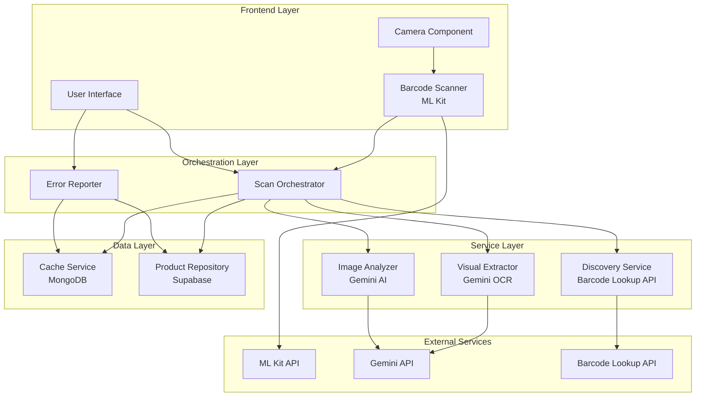
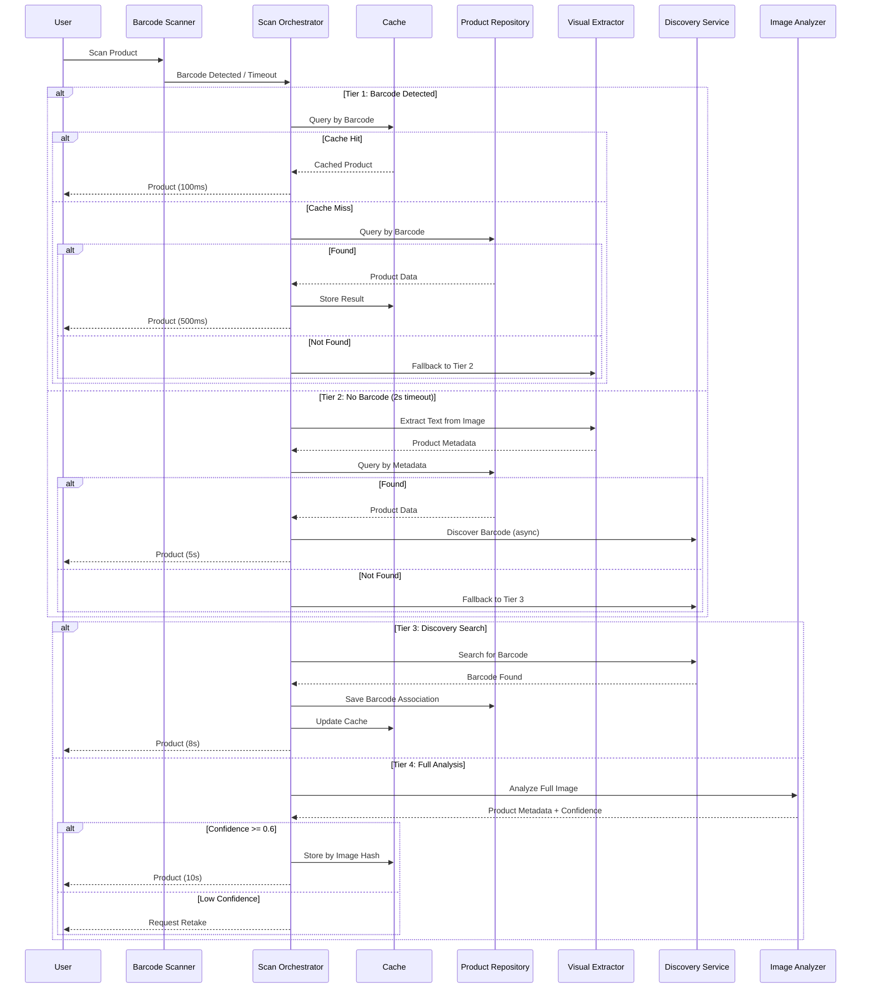

# Design Document: Multi-Tier Product Identification System

## Overview

The multi-tier product identification system implements a progressive fallback strategy to identify products through four distinct tiers, each optimized for different scenarios. The system prioritizes speed and cost-efficiency by attempting faster, cheaper methods first before falling back to more comprehensive but expensive AI analysis.

The four tiers are:

1. **Tier 1 - Direct Barcode Scanning**: Uses ML Kit for real-time barcode detection from camera feed. Fastest and most accurate when barcodes are present and readable.

2. **Tier 2 - Visual Text Extraction**: Uses Gemini OCR to extract text from product labels when barcodes are damaged or missing. Identifies products through text matching.

3. **Tier 3 - Discovery Search**: Queries Barcode Lookup API to find and associate barcodes with products identified through other means. Improves future scan performance.

4. **Tier 4 - Comprehensive Image Analysis**: Uses Gemini AI for full image analysis as a last resort. Most expensive but handles any product image.

The system employs intelligent caching (MongoDB) and database management (Supabase) to minimize redundant processing and API costs. Each tier has defined performance targets and fallback conditions.

## Architecture

### System Components



### Tier Orchestration Flow



### Component Responsibilities

**Barcode Scanner (Frontend)**
- Initialize and manage ML Kit barcode detection
- Process camera frames in real-time
- Provide visual feedback (highlighting, haptics)
- Handle ML Kit failures and fallback to Tier 2
- Support multiple barcode formats (UPC, EAN, Code-128, QR, etc.)

**Scan Orchestrator (Backend)**
- Coordinate tier selection and fallback logic
- Manage cache lookups and updates
- Query Product Repository
- Track performance metrics and tier usage
- Enforce timeout policies per tier
- Calculate and return confidence scores
- Provide progress feedback to users

**Visual Extractor (Service)**
- Interface with Gemini OCR API
- Extract text from product images
- Parse and structure product metadata (name, brand, size)
- Return structured data for repository queries
- Handle OCR errors and low-quality images

**Discovery Service (Service)**
- Query Barcode Lookup API with product metadata
- Validate and select best-matching barcodes
- Save discovered barcodes to Product Repository
- Update cache with barcode associations
- Handle API rate limits and errors
- Cache API responses to minimize costs

**Image Analyzer (Service)**
- Interface with Gemini AI for comprehensive analysis
- Extract product details from full images
- Calculate confidence scores
- Handle low-confidence scenarios
- Return structured product metadata

**Cache Service (Data)**
- Store scan results indexed by barcode and image hash
- Track tier used, timestamp, and confidence scores
- Implement TTL-based expiration (90 days)
- Support fast lookups (<50ms)
- Handle cache invalidation on errors or updates

**Product Repository (Data)**
- Store and query product data in Supabase
- Support queries by barcode and metadata
- Maintain product-barcode associations
- Handle transactional updates
- Flag products for manual review

**Error Reporter (Service)**
- Record incorrect identifications
- Store scan context (image, identified product, feedback)
- Invalidate cache entries
- Flag products for review
- Trigger Tier 4 re-analysis

## Components and Interfaces

### API Contracts

#### Scan Orchestrator API

```typescript
interface ScanRequest {
  barcode?: string;           // From Tier 1
  image?: ImageData;          // For Tier 2, 3, 4
  imageHash?: string;         // For cache lookup
  userId: string;
  sessionId: string;
}

interface ScanResponse {
  success: boolean;
  product?: ProductData;
  tier: 1 | 2 | 3 | 4;
  confidenceScore: number;    // 0.0 to 1.0
  processingTimeMs: number;
  cached: boolean;
  error?: ErrorDetails;
}

interface ProductData {
  id: string;
  barcode?: string;
  name: string;
  brand: string;
  size?: string;
  category: string;
  imageUrl?: string;
  metadata: Record<string, any>;
}

interface ErrorDetails {
  code: string;
  message: string;
  tier: number;
  retryable: boolean;
}

// Main endpoint
POST /api/scan
Request: ScanRequest
Response: ScanResponse
```

#### Visual Extractor API

```typescript
interface ExtractTextRequest {
  image: ImageData;
  imageHash: string;
}

interface ExtractTextResponse {
  success: boolean;
  metadata: ProductMetadata;
  rawText: string;
  processingTimeMs: number;
  error?: ErrorDetails;
}

interface ProductMetadata {
  productName?: string;
  brandName?: string;
  size?: string;
  category?: string;
  keywords: string[];
}

POST /api/extract-text
Request: ExtractTextRequest
Response: ExtractTextResponse
```

#### Discovery Service API

```typescript
interface DiscoverBarcodeRequest {
  productMetadata: ProductMetadata;
  productId: string;
}

interface DiscoverBarcodeResponse {
  success: boolean;
  barcode?: string;
  barcodeFormat?: string;
  confidence: number;
  source: 'barcode_lookup_api';
  processingTimeMs: number;
  error?: ErrorDetails;
}

POST /api/discover-barcode
Request: DiscoverBarcodeRequest
Response: DiscoverBarcodeResponse
```

#### Image Analyzer API

```typescript
interface AnalyzeImageRequest {
  image: ImageData;
  imageHash: string;
}

interface AnalyzeImageResponse {
  success: boolean;
  metadata: ProductMetadata;
  confidence: number;
  visualCharacteristics: {
    colors: string[];
    packaging: string;
    shape: string;
  };
  processingTimeMs: number;
  error?: ErrorDetails;
}

POST /api/analyze-image
Request: AnalyzeImageRequest
Response: AnalyzeImageResponse
```

#### Cache Service API

```typescript
interface CacheEntry {
  key: string;              // barcode or imageHash
  keyType: 'barcode' | 'imageHash';
  productData: ProductData;
  tier: 1 | 2 | 3 | 4;
  confidenceScore: number;
  createdAt: Date;
  lastAccessedAt: Date;
  accessCount: number;
}

interface CacheLookupRequest {
  key: string;
  keyType: 'barcode' | 'imageHash';
}

interface CacheLookupResponse {
  found: boolean;
  entry?: CacheEntry;
}

GET /api/cache/:keyType/:key
Response: CacheLookupResponse

POST /api/cache
Request: CacheEntry
Response: { success: boolean }

DELETE /api/cache/:keyType/:key
Response: { success: boolean }
```

#### Error Reporter API

```typescript
interface ErrorReport {
  scanId: string;
  userId: string;
  incorrectProduct: ProductData;
  actualProduct?: {
    name: string;
    brand: string;
    barcode?: string;
  };
  image: ImageData;
  tier: number;
  confidenceScore: number;
  userFeedback: string;
  timestamp: Date;
}

interface ErrorReportResponse {
  success: boolean;
  reportId: string;
  alternativeProduct?: ProductData;
}

POST /api/report-error
Request: ErrorReport
Response: ErrorReportResponse
```

### Integration Patterns

#### ML Kit Integration (Frontend)

```typescript
// Barcode Scanner Component
class BarcodeScanner {
  private mlKitScanner: MLKitBarcodeScanner;
  private isInitialized: boolean = false;
  
  async initialize() {
    try {
      this.mlKitScanner = await MLKit.vision().barcodeScanner({
        formats: [
          BarcodeFormat.UPC_A,
          BarcodeFormat.UPC_E,
          BarcodeFormat.EAN_8,
          BarcodeFormat.EAN_13,
          BarcodeFormat.CODE_39,
          BarcodeFormat.CODE_93,
          BarcodeFormat.CODE_128,
          BarcodeFormat.ITF,
          BarcodeFormat.QR_CODE
        ]
      });
      this.isInitialized = true;
    } catch (error) {
      console.error('ML Kit initialization failed', error);
      this.fallbackToTier2();
    }
  }
  
  async scanFrame(imageFrame: ImageFrame): Promise<Barcode[]> {
    if (!this.isInitialized) {
      throw new Error('Scanner not initialized');
    }
    return await this.mlKitScanner.detect(imageFrame);
  }
  
  cleanup() {
    this.mlKitScanner?.close();
  }
}
```

#### Gemini API Integration

```typescript
// Gemini Client
class GeminiClient {
  private apiKey: string;
  private baseUrl: string = 'https://generativelanguage.googleapis.com/v1';
  
  async extractText(image: ImageData): Promise<string> {
    const response = await fetch(`${this.baseUrl}/models/gemini-pro-vision:generateContent`, {
      method: 'POST',
      headers: {
        'Content-Type': 'application/json',
        'x-goog-api-key': this.apiKey
      },
      body: JSON.stringify({
        contents: [{
          parts: [
            { text: 'Extract all visible text from this product image. Focus on product name, brand, and size information.' },
            { inline_data: { mime_type: 'image/jpeg', data: image.base64 } }
          ]
        }]
      })
    });
    
    const data = await response.json();
    return data.candidates[0].content.parts[0].text;
  }
  
  async analyzeProduct(image: ImageData): Promise<AnalysisResult> {
    const response = await fetch(`${this.baseUrl}/models/gemini-pro-vision:generateContent`, {
      method: 'POST',
      headers: {
        'Content-Type': 'application/json',
        'x-goog-api-key': this.apiKey
      },
      body: JSON.stringify({
        contents: [{
          parts: [
            { 
              text: `Analyze this product image and provide:
                1. Product name
                2. Brand name
                3. Size/quantity
                4. Category
                5. Visual characteristics (colors, packaging type, shape)
                6. Confidence score (0-1)
                
                Return as JSON.`
            },
            { inline_data: { mime_type: 'image/jpeg', data: image.base64 } }
          ]
        }]
      })
    });
    
    const data = await response.json();
    return JSON.parse(data.candidates[0].content.parts[0].text);
  }
}
```

#### Barcode Lookup API Integration

```typescript
// Barcode Lookup Client
class BarcodeLookupClient {
  private apiKey: string;
  private baseUrl: string = 'https://api.barcodelookup.com/v3';
  private rateLimiter: RateLimiter;
  
  constructor(apiKey: string) {
    this.apiKey = apiKey;
    this.rateLimiter = new RateLimiter({ maxRequests: 100, perMinutes: 1 });
  }
  
  async searchProduct(metadata: ProductMetadata): Promise<BarcodeResult[]> {
    await this.rateLimiter.waitForSlot();
    
    const searchQuery = `${metadata.brandName} ${metadata.productName} ${metadata.size || ''}`.trim();
    
    try {
      const response = await fetch(`${this.baseUrl}/products`, {
        method: 'GET',
        headers: {
          'Authorization': `Bearer ${this.apiKey}`
        },
        params: {
          search: searchQuery,
          formatted: 'y'
        }
      });
      
      if (response.status === 429) {
        // Rate limit hit, implement exponential backoff
        await this.exponentialBackoff();
        return this.searchProduct(metadata);
      }
      
      const data = await response.json();
      return data.products || [];
    } catch (error) {
      console.error('Barcode Lookup API error', error);
      return [];
    }
  }
  
  private async exponentialBackoff(attempt: number = 1) {
    const delay = Math.min(1000 * Math.pow(2, attempt), 30000);
    await new Promise(resolve => setTimeout(resolve, delay));
  }
}
```

## Data Models

### Product Model (Supabase)

```sql
CREATE TABLE products (
  id UUID PRIMARY KEY DEFAULT gen_random_uuid(),
  barcode VARCHAR(50) UNIQUE,
  name VARCHAR(255) NOT NULL,
  brand VARCHAR(255) NOT NULL,
  size VARCHAR(100),
  category VARCHAR(100),
  image_url TEXT,
  metadata JSONB,
  flagged_for_review BOOLEAN DEFAULT FALSE,
  created_at TIMESTAMP DEFAULT NOW(),
  updated_at TIMESTAMP DEFAULT NOW(),
  
  -- Indexes
  INDEX idx_barcode (barcode),
  INDEX idx_name_brand (name, brand),
  INDEX idx_category (category),
  INDEX idx_flagged (flagged_for_review)
);

-- Full-text search index for product metadata
CREATE INDEX idx_product_search ON products 
USING GIN (to_tsvector('english', name || ' ' || brand || ' ' || COALESCE(size, '')));
```

### Cache Entry Model (MongoDB)

```typescript
interface CacheEntryDocument {
  _id: ObjectId;
  key: string;                    // barcode or imageHash
  keyType: 'barcode' | 'imageHash';
  productData: {
    id: string;
    barcode?: string;
    name: string;
    brand: string;
    size?: string;
    category: string;
    imageUrl?: string;
    metadata: Record<string, any>;
  };
  tier: 1 | 2 | 3 | 4;
  confidenceScore: number;
  createdAt: Date;
  lastAccessedAt: Date;
  accessCount: number;
  expiresAt: Date;                // TTL index
}

// MongoDB Indexes
db.cache_entries.createIndex({ key: 1, keyType: 1 }, { unique: true });
db.cache_entries.createIndex({ expiresAt: 1 }, { expireAfterSeconds: 0 });
db.cache_entries.createIndex({ lastAccessedAt: 1 });
```

### Error Report Model (Supabase)

```sql
CREATE TABLE error_reports (
  id UUID PRIMARY KEY DEFAULT gen_random_uuid(),
  scan_id VARCHAR(100),
  user_id UUID NOT NULL,
  incorrect_product_id UUID REFERENCES products(id),
  actual_product_name VARCHAR(255),
  actual_product_brand VARCHAR(255),
  actual_product_barcode VARCHAR(50),
  image_url TEXT NOT NULL,
  tier INTEGER NOT NULL,
  confidence_score DECIMAL(3,2),
  user_feedback TEXT,
  status VARCHAR(50) DEFAULT 'pending',
  created_at TIMESTAMP DEFAULT NOW(),
  resolved_at TIMESTAMP,
  
  INDEX idx_user_id (user_id),
  INDEX idx_incorrect_product (incorrect_product_id),
  INDEX idx_status (status),
  INDEX idx_created_at (created_at)
);
```

### Scan Log Model (Supabase)

```sql
CREATE TABLE scan_logs (
  id UUID PRIMARY KEY DEFAULT gen_random_uuid(),
  user_id UUID NOT NULL,
  session_id VARCHAR(100) NOT NULL,
  tier INTEGER NOT NULL,
  success BOOLEAN NOT NULL,
  product_id UUID REFERENCES products(id),
  barcode VARCHAR(50),
  image_hash VARCHAR(64),
  confidence_score DECIMAL(3,2),
  processing_time_ms INTEGER,
  cached BOOLEAN DEFAULT FALSE,
  error_code VARCHAR(50),
  created_at TIMESTAMP DEFAULT NOW(),
  
  INDEX idx_user_id (user_id),
  INDEX idx_session_id (session_id),
  INDEX idx_tier (tier),
  INDEX idx_created_at (created_at),
  INDEX idx_success (success)
);
```

### Metrics Model (Time-Series)

```typescript
interface ScanMetrics {
  timestamp: Date;
  tier: 1 | 2 | 3 | 4;
  success: boolean;
  processingTimeMs: number;
  cached: boolean;
  confidenceScore?: number;
  errorCode?: string;
  apiCost?: number;
}

interface AggregatedMetrics {
  period: 'hour' | 'day' | 'week';
  startTime: Date;
  endTime: Date;
  tierStats: {
    tier: number;
    totalScans: number;
    successfulScans: number;
    successRate: number;
    avgProcessingTime: number;
    cacheHitRate: number;
    totalApiCost: number;
  }[];
  totalScans: number;
  totalApiCost: number;
  cacheHitRate: number;
}
```


## Correctness Properties

*A property is a characteristic or behavior that should hold true across all valid executions of a system—essentially, a formal statement about what the system should do. Properties serve as the bridge between human-readable specifications and machine-verifiable correctness guarantees.*

### Property 1: Barcode Pass-Through

*For any* detected barcode value, the Barcode Scanner SHALL send that exact value to the Scan Orchestrator without modification.

**Validates: Requirements 1.2**

### Property 2: Cache-First Lookup

*For any* barcode received by the Scan Orchestrator, the Cache Service SHALL be queried before the Product Repository.

**Validates: Requirements 1.3, 10.2**

### Property 3: Cached Result Performance

*For any* barcode that exists in cache, the Scan Orchestrator SHALL return the cached product data within 100ms.

**Validates: Requirements 1.4, 9.1**

### Property 4: Repository Fallback

*For any* barcode not found in cache, the Scan Orchestrator SHALL query the Product Repository.

**Validates: Requirements 1.5**

### Property 5: Repository Result Performance

*For any* product found in the Product Repository, the Scan Orchestrator SHALL return the product data within 500ms.

**Validates: Requirements 1.6, 9.2**

### Property 6: Structured Metadata Output

*For any* text extraction or image analysis operation, the output SHALL be structured as ProductMetadata with defined fields (productName, brandName, size, category, keywords).

**Validates: Requirements 2.4, 4.3**

### Property 7: Repository Query After Extraction

*For any* ProductMetadata extracted by the Visual Extractor, the Scan Orchestrator SHALL query the Product Repository using that metadata.

**Validates: Requirements 2.5**

### Property 8: Confidence Score Inclusion

*For any* product identification response, the response SHALL include both the product data and a Confidence Score between 0.0 and 1.0.

**Validates: Requirements 2.6, 4.4, 13.1**

### Property 9: Tier 2 Performance

*For any* text extraction operation, the Visual Extractor SHALL complete within 3 seconds.

**Validates: Requirements 2.7, 9.3**

### Property 10: Discovery Trigger

*For any* product identified without an associated barcode, the Scan Orchestrator SHALL invoke the Discovery Service.

**Validates: Requirements 3.1**

### Property 11: Discovery API Parameters

*For any* ProductMetadata provided to the Discovery Service, the Barcode Lookup API query SHALL include product name, brand, and size parameters.

**Validates: Requirements 3.2, 8.2**

### Property 12: Barcode Format Validation

*For any* barcode returned by the Barcode Lookup API, the Discovery Service SHALL validate the barcode format before saving.

**Validates: Requirements 3.3**

### Property 13: Discovered Barcode Persistence

*For any* validated barcode discovered by the Discovery Service, the barcode SHALL be saved to both the Product Repository and associated with the product in the Cache Service.

**Validates: Requirements 3.4, 3.5**

### Property 14: Highest Confidence Selection

*For any* set of multiple barcodes returned by the API, the Discovery Service SHALL select the barcode with the highest confidence match.

**Validates: Requirements 3.6**

### Property 15: Tier 3 Performance

*For any* discovery operation, the Discovery Service SHALL complete within 5 seconds.

**Validates: Requirements 3.7, 9.4**

### Property 16: Low Confidence Retake Prompt

*For any* Tier 4 analysis result with a Confidence Score below 0.6, the Scan Orchestrator SHALL prompt the user to retake the image.

**Validates: Requirements 4.5**

### Property 17: Image Hash Caching

*For any* completed image analysis, the Scan Orchestrator SHALL save the result to the Cache Service indexed by the image hash.

**Validates: Requirements 4.6**

### Property 18: Tier 4 Performance

*For any* full image analysis operation, the Image Analyzer SHALL complete within 8 seconds.

**Validates: Requirements 4.7, 9.5**

### Property 19: Error Reporting Availability

*For any* product identification result, the Scan Orchestrator SHALL provide an error reporting option to the user.

**Validates: Requirements 5.1**

### Property 20: Error Context Recording

*For any* error report submitted, the Error Reporter SHALL record the incorrect identification, original image, identified product, and user feedback.

**Validates: Requirements 5.2, 5.3**

### Property 21: Cache Invalidation on Error

*For any* error report on a cached result, the Error Reporter SHALL invalidate the corresponding cache entry.

**Validates: Requirements 5.4**

### Property 22: Product Flagging on Error

*For any* error report, the Error Reporter SHALL flag the associated product record for manual review.

**Validates: Requirements 5.5**

### Property 23: Alternative Identification on Error

*For any* error report, the Scan Orchestrator SHALL invoke Tier 4 analysis to provide an alternative identification.

**Validates: Requirements 5.6**

### Property 24: Error Recording Performance

*For any* error report, the Error Reporter SHALL complete recording within 1 second.

**Validates: Requirements 5.7**

### Property 25: Tier 1 Priority

*For any* scan request, the Scan Orchestrator SHALL attempt Tier 1 identification first before any other tier.

**Validates: Requirements 6.1**

### Property 26: Sequential Tier Fallback

*For any* tier that fails or times out, the Scan Orchestrator SHALL proceed to the next tier in sequence (Tier 1 → Tier 2 → Tier 3 → Tier 4).

**Validates: Requirements 6.2, 6.3, 6.4**

### Property 27: Short-Circuit on Success

*For any* tier that successfully identifies a product, the Scan Orchestrator SHALL return the result immediately without attempting subsequent tiers.

**Validates: Requirements 6.5**

### Property 28: Tier Usage Logging

*For any* successful identification, the Scan Orchestrator SHALL log the tier used, success status, and processing time.

**Validates: Requirements 6.6, 6.7, 14.3**

### Property 29: Result Caching by Key Type

*For any* successful identification, the Cache Service SHALL store the result indexed by barcode (for Tier 1) or image hash (for Tier 2-4).

**Validates: Requirements 7.1, 7.2**

### Property 30: Cache Entry Metadata Completeness

*For any* cache entry created, the entry SHALL include tier used, timestamp, and Confidence Score.

**Validates: Requirements 7.3**

### Property 31: Cache Access Timestamp Update

*For any* cache entry accessed, the Cache Service SHALL update the last_accessed timestamp.

**Validates: Requirements 7.4**

### Property 32: Cache TTL Expiration

*For any* cache entry not accessed for 90 days, the Cache Service SHALL expire and remove the entry.

**Validates: Requirements 7.5**

### Property 33: Cache Invalidation on Product Update

*For any* product updated in the Product Repository, the Cache Service SHALL invalidate all related cache entries.

**Validates: Requirements 7.6**

### Property 34: Cache Lookup Performance

*For any* cache lookup operation, the Cache Service SHALL complete within 50ms.

**Validates: Requirements 7.7**

### Property 35: API Rate Limit Handling

*For any* rate limit response (HTTP 429) from the Barcode Lookup API, the Discovery Service SHALL implement exponential backoff before retrying.

**Validates: Requirements 8.3**

### Property 36: Graceful API Error Handling

*For any* error response from the Barcode Lookup API, the Discovery Service SHALL log the error and continue without failing the scan.

**Validates: Requirements 8.4**

### Property 37: API Response Parsing

*For any* valid response from the Barcode Lookup API, the Discovery Service SHALL parse and extract barcode values.

**Validates: Requirements 8.5**

### Property 38: Barcode Metadata Validation

*For any* barcode returned by the API, the Discovery Service SHALL validate that it matches the product metadata.

**Validates: Requirements 8.6**

### Property 39: API Response Caching

*For any* response from the Barcode Lookup API, the Discovery Service SHALL cache the response to minimize redundant requests.

**Validates: Requirements 8.7**

### Property 40: Multi-Tier Progress Feedback

*For any* scan that requires multiple tiers, the Scan Orchestrator SHALL provide progress feedback to the user during processing.

**Validates: Requirements 9.7**

### Property 41: API Usage Tracking

*For any* API call to Gemini or Barcode Lookup, the Scan Orchestrator SHALL track usage by tier and log cost metrics.

**Validates: Requirements 10.5, 10.6**

### Property 42: Barcode Highlighting

*For any* barcode detected by the Barcode Scanner, the barcode SHALL be highlighted in the camera view.

**Validates: Requirements 11.3**

### Property 43: Haptic Feedback on Detection

*For any* successful barcode detection, the Barcode Scanner SHALL provide haptic feedback.

**Validates: Requirements 11.4**

### Property 44: Dual-Store Consistency

*For any* product saved to the Product Repository, the Scan Orchestrator SHALL update the Cache Service with the same data.

**Validates: Requirements 12.1, 12.2**

### Property 45: Multi-Store Cache Invalidation

*For any* error report or product update, the Scan Orchestrator SHALL invalidate cache entries in both MongoDB and any in-memory caches.

**Validates: Requirements 12.3**

### Property 46: Transactional Multi-Store Updates

*For any* operation updating multiple data stores, the Scan Orchestrator SHALL use transactions to ensure atomicity.

**Validates: Requirements 12.4**

### Property 47: Transaction Rollback on Failure

*For any* failed database update within a transaction, the Scan Orchestrator SHALL roll back all related changes.

**Validates: Requirements 12.5**

### Property 48: Data Consistency Error Logging

*For any* data consistency error, the Scan Orchestrator SHALL log the error with context for monitoring.

**Validates: Requirements 12.6**

### Property 49: Database Operation Retry

*For any* failed database operation, the Scan Orchestrator SHALL retry up to 3 times with exponential backoff.

**Validates: Requirements 12.7**

### Property 50: Tier-Based Confidence Calculation

*For any* product identification, the Confidence Score SHALL be 1.0 for Tier 1 barcode matches, calculated from metadata match quality for Tier 2 and Tier 3, and use the Image Analyzer's value for Tier 4.

**Validates: Requirements 13.2, 13.3, 13.4**

### Property 51: Low Confidence Warning

*For any* identification with Confidence Score below 0.8, the Scan Orchestrator SHALL display a warning to the user.

**Validates: Requirements 13.5**

### Property 52: Response Transparency

*For any* identification response, the response SHALL include the tier used for transparency.

**Validates: Requirements 13.6**

### Property 53: Re-Identification Support

*For any* identification result, the Scan Orchestrator SHALL allow users to request re-identification using a different tier.

**Validates: Requirements 13.7**

### Property 54: Cache Hit/Miss Tracking

*For any* cache access, the Scan Orchestrator SHALL count and log whether it was a cache hit or miss.

**Validates: Requirements 14.4**

### Property 55: Error Type Logging

*For any* error during tier execution, the Scan Orchestrator SHALL log the error rate and error type by tier.

**Validates: Requirements 14.6**

## Error Handling

### Error Categories

The system handles errors across multiple categories:

1. **ML Kit Errors**
   - Initialization failures
   - Camera permission denials
   - Unsupported device capabilities
   - Barcode detection timeouts

2. **API Errors**
   - Gemini API failures (rate limits, service unavailable, invalid responses)
   - Barcode Lookup API failures (rate limits, authentication errors, network timeouts)
   - API quota exhaustion

3. **Database Errors**
   - Supabase connection failures
   - MongoDB connection failures
   - Transaction rollback failures
   - Query timeouts

4. **Cache Errors**
   - Cache miss scenarios
   - Cache invalidation failures
   - TTL expiration edge cases

5. **Data Validation Errors**
   - Invalid barcode formats
   - Malformed product metadata
   - Missing required fields
   - Confidence score out of range

6. **Performance Errors**
   - Tier timeout violations
   - Processing time SLA breaches
   - Memory constraints

### Error Handling Strategies

**Graceful Degradation**
- If ML Kit fails, immediately fallback to Tier 2
- If Gemini OCR fails, fallback to Tier 3
- If Barcode Lookup API fails, fallback to Tier 4
- If all tiers fail, provide clear user feedback with retry option

**Retry Logic**
- Database operations: 3 retries with exponential backoff (100ms, 200ms, 400ms)
- API rate limits: Exponential backoff up to 30 seconds
- Network timeouts: 2 retries with linear backoff (1s, 2s)

**Circuit Breaker Pattern**
- Track API failure rates per service
- Open circuit after 5 consecutive failures
- Half-open state after 60 seconds
- Close circuit after 3 successful requests

**Error Reporting**
- Log all errors with context (tier, timestamp, request ID, user ID)
- Include stack traces for unexpected errors
- Track error rates by category and tier
- Alert on error rate thresholds (>5% for any tier)

**User Communication**
- Provide clear, actionable error messages
- Suggest specific actions (retake photo, check connection, try again)
- Show progress during multi-tier fallback
- Allow manual tier selection for advanced users

### Error Response Format

```typescript
interface ErrorResponse {
  success: false;
  error: {
    code: string;              // e.g., "TIER_1_TIMEOUT", "API_RATE_LIMIT"
    message: string;            // User-friendly message
    tier: number;               // Tier where error occurred
    retryable: boolean;         // Whether retry is recommended
    suggestedAction: string;    // Specific user action
    technicalDetails?: string;  // For debugging (not shown to users)
  };
  fallbackAttempted: boolean;
  nextTier?: number;
}
```

## Testing Strategy

### Dual Testing Approach

The system requires both unit testing and property-based testing for comprehensive coverage:

**Unit Tests** focus on:
- Specific examples of each barcode format (UPC-A, EAN-13, QR codes, etc.)
- Edge cases (empty images, malformed barcodes, network failures)
- Integration points (ML Kit initialization, Gemini API calls, database connections)
- Error conditions (API failures, timeouts, invalid data)
- Component lifecycle (scanner mount/unmount, resource cleanup)

**Property-Based Tests** focus on:
- Universal properties that hold for all inputs
- Comprehensive input coverage through randomization
- Tier orchestration logic across random failure scenarios
- Cache behavior with random access patterns
- Data consistency across random update sequences

### Property-Based Testing Configuration

**Framework**: Use `fast-check` for TypeScript/JavaScript property-based testing

**Configuration**:
- Minimum 100 iterations per property test
- Each test must reference its design document property
- Tag format: `Feature: multi-tier-product-identification, Property {number}: {property_text}`

**Example Property Test Structure**:

```typescript
import fc from 'fast-check';

// Feature: multi-tier-product-identification, Property 1: Barcode Pass-Through
describe('Property 1: Barcode Pass-Through', () => {
  it('should pass through any detected barcode value unchanged', () => {
    fc.assert(
      fc.property(
        fc.string({ minLength: 8, maxLength: 50 }), // Random barcode
        (barcode) => {
          const scanner = new BarcodeScanner();
          const result = scanner.sendToOrchestrator(barcode);
          expect(result.barcode).toBe(barcode);
        }
      ),
      { numRuns: 100 }
    );
  });
});

// Feature: multi-tier-product-identification, Property 26: Sequential Tier Fallback
describe('Property 26: Sequential Tier Fallback', () => {
  it('should fallback sequentially through tiers on failure', () => {
    fc.assert(
      fc.property(
        fc.record({
          tier1Fails: fc.boolean(),
          tier2Fails: fc.boolean(),
          tier3Fails: fc.boolean()
        }),
        async (scenario) => {
          const orchestrator = new ScanOrchestrator();
          const result = await orchestrator.scan({
            image: mockImage,
            mockFailures: scenario
          });
          
          // Verify tier progression
          if (scenario.tier1Fails && scenario.tier2Fails && scenario.tier3Fails) {
            expect(result.tier).toBe(4);
          } else if (scenario.tier1Fails && scenario.tier2Fails) {
            expect(result.tier).toBe(3);
          } else if (scenario.tier1Fails) {
            expect(result.tier).toBe(2);
          } else {
            expect(result.tier).toBe(1);
          }
        }
      ),
      { numRuns: 100 }
    );
  });
});
```

### Unit Test Examples

**Barcode Format Support** (Requirement 1.7):
```typescript
describe('Barcode Format Support', () => {
  it('should detect UPC-A barcode', async () => {
    const scanner = new BarcodeScanner();
    const result = await scanner.scan(mockUPCAImage);
    expect(result.format).toBe('UPC_A');
    expect(result.value).toBe('012345678905');
  });
  
  it('should detect EAN-13 barcode', async () => {
    const scanner = new BarcodeScanner();
    const result = await scanner.scan(mockEAN13Image);
    expect(result.format).toBe('EAN_13');
    expect(result.value).toBe('5901234123457');
  });
  
  // ... tests for other formats
});
```

**Tier 2 Timeout Fallback** (Requirement 2.1):
```typescript
describe('Tier 2 Timeout Fallback', () => {
  it('should invoke Visual Extractor after 2 second timeout', async () => {
    jest.useFakeTimers();
    const orchestrator = new ScanOrchestrator();
    const visualExtractorSpy = jest.spyOn(orchestrator, 'invokeVisualExtractor');
    
    orchestrator.scan({ image: mockImage });
    jest.advanceTimersByTime(2000);
    
    expect(visualExtractorSpy).toHaveBeenCalled();
    jest.useRealTimers();
  });
});
```

**Tier 4 Fallback Chain** (Requirement 4.1):
```typescript
describe('Tier 4 Fallback Chain', () => {
  it('should invoke Image Analyzer after all tiers fail', async () => {
    const orchestrator = new ScanOrchestrator();
    
    // Mock all tiers to fail
    jest.spyOn(orchestrator, 'tier1Scan').mockResolvedValue({ success: false });
    jest.spyOn(orchestrator, 'tier2Scan').mockResolvedValue({ success: false });
    jest.spyOn(orchestrator, 'tier3Scan').mockResolvedValue({ success: false });
    
    const imageAnalyzerSpy = jest.spyOn(orchestrator, 'tier4Scan');
    
    await orchestrator.scan({ image: mockImage });
    
    expect(imageAnalyzerSpy).toHaveBeenCalled();
  });
});
```

**ML Kit Initialization** (Requirement 11.1):
```typescript
describe('ML Kit Initialization', () => {
  it('should initialize ML Kit on component mount', async () => {
    const scanner = new BarcodeScanner();
    await scanner.initialize();
    
    expect(scanner.isInitialized).toBe(true);
    expect(scanner.mlKitScanner).toBeDefined();
  });
});
```

**Component Cleanup** (Requirement 11.7):
```typescript
describe('Component Cleanup', () => {
  it('should release ML Kit resources on unmount', async () => {
    const scanner = new BarcodeScanner();
    await scanner.initialize();
    
    const closeSpy = jest.spyOn(scanner.mlKitScanner, 'close');
    scanner.cleanup();
    
    expect(closeSpy).toHaveBeenCalled();
  });
});
```

**Barcode Lookup API Authentication** (Requirement 8.1):
```typescript
describe('Barcode Lookup API Authentication', () => {
  it('should authenticate with API key', async () => {
    const discoveryService = new DiscoveryService('test-api-key');
    const fetchSpy = jest.spyOn(global, 'fetch');
    
    await discoveryService.searchProduct({ productName: 'Test', brandName: 'Brand' });
    
    expect(fetchSpy).toHaveBeenCalledWith(
      expect.any(String),
      expect.objectContaining({
        headers: expect.objectContaining({
          'Authorization': 'Bearer test-api-key'
        })
      })
    );
  });
});
```

**Monitoring Endpoint** (Requirement 14.7):
```typescript
describe('Monitoring Endpoint', () => {
  it('should provide aggregated metrics', async () => {
    const response = await fetch('/api/metrics');
    const metrics = await response.json();
    
    expect(metrics).toHaveProperty('tierStats');
    expect(metrics).toHaveProperty('totalScans');
    expect(metrics).toHaveProperty('cacheHitRate');
    expect(metrics.tierStats).toBeInstanceOf(Array);
  });
});
```

### Test Coverage Goals

- Unit test coverage: >80% for all service and orchestration code
- Property test coverage: 100% of identified correctness properties
- Integration test coverage: All external API integrations
- E2E test coverage: Complete user flows for all four tiers

### Performance Testing

- Load testing: 1000 concurrent scans
- Stress testing: API rate limit scenarios
- Endurance testing: 24-hour continuous operation
- Benchmark testing: Verify all tier performance SLAs

### Testing Tools

- **Unit Testing**: Jest
- **Property-Based Testing**: fast-check
- **Integration Testing**: Supertest
- **E2E Testing**: Playwright
- **Performance Testing**: k6
- **Mocking**: jest.mock, MSW (Mock Service Worker)
