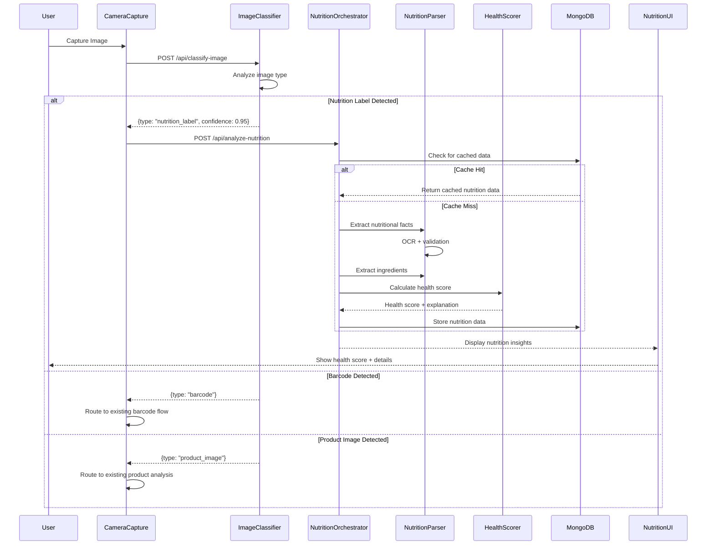

# Design Document: Nutritional Health Analysis

## Overview

The Nutritional Health Analysis feature extends the existing AI Grocery Scanner with specialized capabilities for analyzing nutritional facts labels and ingredient lists. This feature enables users to scan product packaging to receive comprehensive health assessments, nutritional data extraction, and ingredient analysis with allergen detection.

### Key Capabilities

- **Automatic Image Type Detection**: Classifies captured images as barcode, product image, or nutritional label
- **OCR-Based Data Extraction**: Extracts structured nutritional data from labels using Gemini Vision AI
- **Ingredient Analysis**: Parses ingredient lists with allergen and additive detection
- **Health Scoring**: Calculates 0-100 health scores based on nutritional content and ingredients
- **Seamless Integration**: Works within the existing scan workflow with unified UI/UX
- **Tier-Based Features**: Enhanced analysis for premium users with research-backed insights

### Design Principles

1. **Reuse Existing Infrastructure**: Leverage CameraCapture, Gemini AI, MongoDB caching, and orchestrator patterns
2. **Progressive Enhancement**: Free tier gets basic nutritional analysis, premium tier gets enhanced insights
3. **Cache-First Architecture**: Store parsed nutritional data to avoid redundant OCR processing
4. **User-Friendly Error Handling**: Clear feedback when OCR fails or data is uncertain
5. **Accessibility**: WCAG 2.1 Level AA compliance for all UI components

## Architecture

### High-Level Architecture

```mermaid
graph TB
    subgraph "Client Layer"
        Camera[CameraCapture]
        UI[Nutritional UI Components]
        Preview[ImagePreview]
    end
    
    subgraph "API Layer"
        ClassifyAPI[/api/classify-image]
        NutritionAPI[/api/analyze-nutrition]
        ScanAPI[/api/scan]
    end
    
    subgraph "Service Layer"
        Classifier[ImageClassifier]
        NutritionParser[NutritionParser]
        IngredientParser[IngredientParser]
        HealthScorer[HealthScorer]
        Orchestrator[NutritionOrchestrator]
    end
    
    subgraph "AI Layer"
        Gemini[Gemini 2.0 Flash Vision]
        Tavily[Tavily Search - Premium]
    end
    
    subgraph "Data Layer"
        MongoDB[(MongoDB Cache)]
        Supabase[(Supabase Products)]
    end
    
    Camera --> ClassifyAPI
    ClassifyAPI --> Classifier
    Classifier --> Gemini
    
    Classifier -->|nutrition_label| NutritionAPI
    Classifier -->|barcode| ScanAPI
    Classifier -->|product_image| ScanAPI
    
    NutritionAPI --> Orchestrator
    Orchestrator --> NutritionParser
    Orchestrator --> IngredientParser
    Orchestrator --> HealthScorer
    
    NutritionParser --> Gemini
    IngredientParser --> Gemini
    HealthScorer -->|Premium| Tavily
    
    Orchestrator --> MongoDB
    Orchestrator --> Supabase
    
    Orchestrator --> UI
    UI --> Preview
```

### Component Interaction Flow



### Data Flow Architecture

The system follows a cache-first architecture similar to the existing scan orchestrator:

1. **Image Classification**: First step determines routing
2. **Cache Check**: MongoDB lookup by image hash or product identifier
3. **OCR Processing**: Gemini Vision extracts text from nutritional labels
4. **Data Parsing**: Structured extraction of nutritional values and ingredients
5. **Health Scoring**: Algorithm calculates 0-100 score with explanations
6. **Cache Storage**: Results stored in MongoDB with 30-day TTL
7. **UI Rendering**: Color-coded display with expandable sections

## Components and Interfaces

### 1. ImageClassifier Service

**Purpose**: Determines the type of captured image to route to appropriate analysis pipeline.

**Location**: `src/lib/services/image-classifier.ts`

**Interface**:
```typescript
export interface ImageClassification {
  type: 'barcode' | 'product_image' | 'nutrition_label' | 'unknown';
  confidence: number; // 0.0 to 1.0
  metadata?: {
    hasNutritionalFacts?: boolean;
    hasIngredientList?: boolean;
    hasBarcodeVisible?: boolean;
  };
}

export class ImageClassifier {
  /**
   * Classifies an image to determine its type
   * @param imageData - Base64 encoded image
   * @returns Classification result with confidence score
   */
  async classify(imageData: string): Promise<ImageClassification>;
}
```

**Implementation Details**:
- Uses Gemini Vision API with specialized prompt for image classification
- Returns confidence score based on visual features detected
- Minimum confidence threshold: 0.6 (60%)
- Falls back to 'unknown' if confidence is below threshold
- Caches classification results by image hash to avoid redundant API calls

**Gemini Prompt Strategy**:
```
Analyze this image and classify it into ONE of these categories:
1. barcode - Image shows a barcode (UPC, EAN, QR code)
2. product_image - Image shows product packaging without visible nutrition label
3. nutrition_label - Image shows nutritional facts panel or ingredient list
4. unknown - Cannot determine image type

Return JSON: {"type": "...", "confidence": 0.0-1.0, "reasoning": "..."}
```

### 2. NutritionParser Service

**Purpose**: Extracts structured nutritional data from nutrition facts labels using OCR.

**Location**: `src/lib/services/nutrition-parser.ts`

**Interface**:
```typescript
export interface NutritionalFacts {
  servingSize: {
    amount: number;
    unit: string; // "g", "ml", "oz", "cup", etc.
    confidence: number;
  };
  servingsPerContainer?: number;
  calories: {
    value: number;
    confidence: number;
  };
  totalFat: {
    value: number; // grams
    confidence: number;
  };
  saturatedFat: {
    value: number; // grams
    confidence: number;
  };
  transFat: {
    value: number; // grams
    confidence: number;
  };
  cholesterol: {
    value: number; // milligrams
    confidence: number;
  };
  sodium: {
    value: number; // milligrams
    confidence: number;
  };
  totalCarbohydrates: {
    value: number; // grams
    confidence: number;
  };
  dietaryFiber: {
    value: number; // grams
    confidence: number;
  };
  totalSugars: {
    value: number; // grams
    confidence: number;
  };
  addedSugars?: {
    value: number; // grams
    confidence: number;
  };
  protein: {
    value: number; // grams
    confidence: number;
  };
  vitamins?: Record<string, {
    value: number; // % daily value
    confidence: number;
  }>;
  minerals?: Record<string, {
    value: number; // % daily value
    confidence: number;
  }>;
  validationStatus: 'valid' | 'uncertain' | 'invalid';
  validationErrors?: string[];
}

export class NutritionParser {
  /**
   * Extracts nutritional facts from a label image
   * @param imageData - Base64 encoded image
   * @returns Structured nutritional data
   */
  async parse(imageData: string): Promise<NutritionalFacts>;
  
  /**
   * Validates extracted nutritional data
   * @param facts - Extracted nutritional facts
   * @returns Validation result with errors if any
   */
  validate(facts: NutritionalFacts): {
    isValid: boolean;
    errors: string[];
  };
}
```

**Implementation Details**:
- Uses Gemini Vision API with structured output prompt
- Confidence threshold: 0.8 (80%) for critical fields
- Validates calorie calculation: (4×carbs + 4×protein + 9×fat) ≈ stated calories (±20%)
- Validates percentage daily values are within 0-200% range
- Flags uncertain fields for user review
- Returns partial data if some fields are unreadable

**OCR Prompt Strategy**:
```
Extract nutritional facts from this nutrition label image.
Return structured JSON with all visible values.
For each field, include the value and your confidence (0.0-1.0).
If a field is not visible or unclear, set confidence to 0.0.

Required fields: servingSize, calories, totalFat, saturatedFat, transFat,
cholesterol, sodium, totalCarbohydrates, dietaryFiber, totalSugars, protein

Optional fields: addedSugars, vitamins, minerals
```

### 3. IngredientParser Service

**Purpose**: Extracts and analyzes ingredient lists with allergen and additive detection.

**Location**: `src/lib/services/ingredient-parser.ts`

**Interface**:
```typescript
export interface ParsedIngredient {
  name: string;
  position: number; // Order in ingredient list (1-indexed)
  isAllergen: boolean;
  allergenType?: AllergenType;
  isPreservative: boolean;
  preservativeType?: PreservativeType;
  isSweetener: boolean;
  sweetenerType?: SweetenerType;
  isArtificialColor: boolean;
  colorType?: string; // e.g., "Red 40", "Yellow 5"
}

export type AllergenType = 
  | 'milk' | 'eggs' | 'fish' | 'shellfish' 
  | 'tree_nuts' | 'peanuts' | 'wheat' | 'soybeans';

export type PreservativeType = 
  | 'BHA' | 'BHT' | 'sodium_benzoate' 
  | 'potassium_sorbate' | 'TBHQ';

export type SweetenerType = 
  | 'aspartame' | 'sucralose' | 'saccharin' 
  | 'acesulfame_potassium';

export interface IngredientList {
  rawText: string;
  ingredients: ParsedIngredient[];
  allergens: ParsedIngredient[];
  preservatives: ParsedIngredient[];
  sweeteners: ParsedIngredient[];
  artificialColors: ParsedIngredient[];
  isComplete: boolean; // false if partially obscured
  confidence: number;
}

export class IngredientParser {
  /**
   * Extracts and parses ingredient list from image
   * @param imageData - Base64 encoded image
   * @returns Parsed ingredient list with flagged items
   */
  async parse(imageData: string): Promise<IngredientList>;
  
  /**
   * Identifies allergens in ingredient list
   * @param ingredients - List of ingredient names
   * @returns Allergens found with types
   */
  identifyAllergens(ingredients: string[]): ParsedIngredient[];
  
  /**
   * Identifies preservatives in ingredient list
   * @param ingredients - List of ingredient names
   * @returns Preservatives found with types
   */
  identifyPreservatives(ingredients: string[]): ParsedIngredient[];
  
  /**
   * Identifies artificial sweeteners in ingredient list
   * @param ingredients - List of ingredient names
   * @returns Sweeteners found with types
   */
  identifySweeteners(ingredients: string[]): ParsedIngredient[];
  
  /**
   * Identifies artificial colors in ingredient list
   * @param ingredients - List of ingredient names
   * @returns Colors found with identifiers
   */
  identifyArtificialColors(ingredients: string[]): ParsedIngredient[];
}
```

**Implementation Details**:
- Uses Gemini Vision for OCR of ingredient text
- Tokenizes ingredients by commas and semicolons
- Maintains ingredient order (first ingredient = highest quantity)
- Pattern matching for allergen detection (case-insensitive)
- Pattern matching for preservatives, sweeteners, and colors
- Handles parenthetical sub-ingredients (e.g., "flour (wheat, malted barley)")
- Returns partial list if text is partially obscured

**Allergen Detection Patterns**:
```typescript
const ALLERGEN_PATTERNS = {
  milk: /\b(milk|dairy|cream|butter|cheese|whey|casein|lactose)\b/i,
  eggs: /\b(egg|albumin|mayonnaise)\b/i,
  fish: /\b(fish|anchovy|bass|cod|salmon|tuna)\b/i,
  shellfish: /\b(shellfish|crab|lobster|shrimp|prawn)\b/i,
  tree_nuts: /\b(almond|cashew|walnut|pecan|pistachio|hazelnut)\b/i,
  peanuts: /\b(peanut|groundnut)\b/i,
  wheat: /\b(wheat|flour|gluten)\b/i,
  soybeans: /\b(soy|soybean|tofu|edamame)\b/i,
};
```

### 4. HealthScorer Service

**Purpose**: Calculates health assessment scores (0-100) based on nutritional data and ingredients.

**Location**: `src/lib/services/health-scorer.ts`

**Interface**:
```typescript
export interface HealthScore {
  overall: number; // 0-100
  category: 'excellent' | 'good' | 'fair' | 'poor' | 'very_poor';
  breakdown: {
    nutritionalScore: number; // 0-70 points
    ingredientScore: number; // 0-30 points
  };
  factors: HealthFactor[];
  explanation: string;
  recommendations?: string[]; // Premium tier only
}

export interface HealthFactor {
  category: string; // e.g., "High Sodium", "High Fiber"
  impact: 'positive' | 'negative';
  points: number; // Points added or subtracted
  description: string;
}

export class HealthScorer {
  /**
   * Calculates health score from nutritional data and ingredients
   * @param facts - Nutritional facts
   * @param ingredients - Parsed ingredient list
   * @param tier - User tier for enhanced analysis
   * @returns Health score with breakdown and explanation
   */
  async calculateScore(
    facts: NutritionalFacts,
    ingredients: IngredientList,
    tier: TierType
  ): Promise<HealthScore>;
  
  /**
   * Generates personalized recommendations (Premium only)
   * @param score - Health score result
   * @param facts - Nutritional facts
   * @returns Array of recommendations
   */
  async generateRecommendations(
    score: HealthScore,
    facts: NutritionalFacts
  ): Promise<string[]>;
}
```

**Scoring Algorithm**:

Base score starts at 100 points, with deductions and bonuses:

**Nutritional Penalties (max -70 points)**:
- High sodium (>400mg/serving): -10 points
- Very high sodium (>800mg/serving): -20 points
- High added sugars (>10g/serving): -15 points
- Very high added sugars (>20g/serving): -25 points
- High saturated fat (>5g/serving): -10 points
- Very high saturated fat (>10g/serving): -20 points
- Any trans fat (>0g): -15 points

**Nutritional Bonuses (max +20 points)**:
- High fiber (>3g/serving): +5 points
- Very high fiber (>5g/serving): +10 points
- High protein (>10g/serving): +5 points
- Very high protein (>20g/serving): +10 points

**Ingredient Penalties (max -30 points)**:
- Each artificial preservative: -5 points
- Each artificial sweetener: -5 points
- Each artificial color: -3 points

**Score Categories**:
- 80-100: Excellent (green)
- 60-79: Good (light green)
- 40-59: Fair (yellow)
- 20-39: Poor (orange)
- 0-19: Very Poor (red)

### 5. NutritionOrchestrator Service

**Purpose**: Coordinates the nutritional analysis workflow with caching and database operations.

**Location**: `src/lib/orchestrator/NutritionOrchestrator.ts`

**Interface**:
```typescript
export interface NutritionScanRequest {
  imageData: string;
  userId: string;
  tier: TierType;
  imageHash?: string;
}

export interface NutritionScanResult {
  fromCache: boolean;
  nutritionalFacts: NutritionalFacts;
  ingredients: IngredientList;
  healthScore: HealthScore;
  productName?: string;
  timestamp: Date;
}

export class NutritionOrchestrator {
  constructor(
    private nutritionParser: NutritionParser,
    private ingredientParser: IngredientParser,
    private healthScorer: HealthScorer,
    private cacheRepo: NutritionCacheRepository
  );
  
  /**
   * Processes a nutrition label scan with cache-first logic
   * @param request - Scan request with image and user info
   * @param progressEmitter - Optional progress tracking
   * @returns Nutrition scan result
   */
  async processScan(
    request: NutritionScanRequest,
    progressEmitter?: IProgressEmitter
  ): Promise<NutritionScanResult>;
}
```

**Orchestration Flow**:
1. Generate image hash for cache lookup
2. Check MongoDB for cached nutrition data
3. If cache hit: return cached data, update access timestamp
4. If cache miss:
   - Parse nutritional facts (parallel with ingredients)
   - Parse ingredient list (parallel with nutritional facts)
   - Calculate health score
   - Validate data consistency
   - Store in MongoDB cache (30-day TTL)
5. Emit progress events for real-time UI updates
6. Return complete nutrition analysis

### 6. API Endpoints

#### POST /api/classify-image

**Purpose**: Classifies captured image type for routing.

**Request**:
```typescript
{
  imageData: string; // base64 encoded
}
```

**Response**:
```typescript
{
  success: boolean;
  data?: ImageClassification;
  error?: string;
}
```

#### POST /api/analyze-nutrition

**Purpose**: Analyzes nutritional label and returns health assessment.

**Request**:
```typescript
{
  imageData: string; // base64 encoded
  userId: string;
  tier: TierType;
}
```

**Response**:
```typescript
{
  success: boolean;
  data?: NutritionScanResult;
  error?: string;
}
```

**Progress Events** (Server-Sent Events):
```typescript
{
  type: 'progress';
  stage: 'classification' | 'ocr' | 'parsing' | 'scoring' | 'complete';
  message: string;
  timestamp: number;
}
```

### 7. UI Components

#### NutritionInsightsDisplay

**Purpose**: Displays nutritional analysis results with health score.

**Location**: `src/components/NutritionInsightsDisplay.tsx`

**Props**:
```typescript
interface NutritionInsightsDisplayProps {
  result: NutritionScanResult;
  onRetake?: () => void;
  onCompare?: () => void;
}
```

**Features**:
- Color-coded health score badge (green/yellow/red)
- Key nutritional values summary card
- Expandable detailed nutritional breakdown
- Ingredient list with highlighted allergens/additives
- Allergen warnings (prominent display)
- Health score explanation
- Accessibility: ARIA labels, keyboard navigation, screen reader support

#### NutritionFactsTable

**Purpose**: Displays detailed nutritional facts in table format.

**Location**: `src/components/NutritionFactsTable.tsx`

**Props**:
```typescript
interface NutritionFactsTableProps {
  facts: NutritionalFacts;
  showConfidence?: boolean; // Show OCR confidence indicators
}
```

#### IngredientListDisplay

**Purpose**: Displays ingredient list with flagged items highlighted.

**Location**: `src/components/IngredientListDisplay.tsx`

**Props**:
```typescript
interface IngredientListDisplayProps {
  ingredients: IngredientList;
  highlightAllergens?: boolean;
  highlightAdditives?: boolean;
}
```

#### HealthScoreBadge

**Purpose**: Displays health score with color coding.

**Location**: `src/components/HealthScoreBadge.tsx`

**Props**:
```typescript
interface HealthScoreBadgeProps {
  score: HealthScore;
  size?: 'small' | 'medium' | 'large';
  showExplanation?: boolean;
}
```

## Data Models

### MongoDB Collections

#### nutrition_cache Collection

**Purpose**: Caches parsed nutritional data to avoid redundant OCR processing.

**Schema**:
```typescript
interface NutritionCacheDocument {
  _id: ObjectId;
  imageHash: string; // SHA-256 hash of image
  productName?: string; // Extracted from label if available
  nutritionalFacts: NutritionalFacts;
  ingredients: IngredientList;
  healthScore: HealthScore;
  tier: TierType; // Tier used for analysis
  createdAt: Date;
  lastAccessedAt: Date;
  accessCount: number;
  expiresAt: Date; // TTL index (30 days)
}
```

**Indexes**:
- `imageHash` (unique)
- `expiresAt` (TTL index, 30 days)
- `productName` (text index for search)
- `createdAt` (for history queries)

#### scan_history Collection (Extended)

**Purpose**: Stores user scan history including nutrition scans.

**Schema Extension**:
```typescript
interface ScanHistoryDocument {
  // ... existing fields ...
  scanType: 'barcode' | 'product' | 'nutrition'; // NEW
  nutritionData?: {
    healthScore: number;
    category: string;
    hasAllergens: boolean;
    allergenTypes: AllergenType[];
  }; // NEW
}
```

### Supabase Tables

#### products Table (Extended)

**Purpose**: Stores product metadata including nutritional information.

**Schema Extension**:
```sql
ALTER TABLE products ADD COLUMN nutrition_data JSONB;
ALTER TABLE products ADD COLUMN health_score INTEGER;
ALTER TABLE products ADD COLUMN has_allergens BOOLEAN DEFAULT FALSE;
ALTER TABLE products ADD COLUMN allergen_types TEXT[];
```

**nutrition_data JSONB Structure**:
```typescript
{
  servingSize: { amount: number, unit: string },
  calories: number,
  macros: {
    fat: number,
    saturatedFat: number,
    transFat: number,
    carbs: number,
    fiber: number,
    sugars: number,
    protein: number
  },
  sodium: number,
  lastUpdated: string // ISO timestamp
}
```

## Integration Points

### 1. CameraCapture Integration

The existing `CameraCapture` component requires no modifications. The integration happens at the scan workflow level:

**Current Flow**:
```
CameraCapture → onCapture(imageData) → Existing scan logic
```

**Enhanced Flow**:
```
CameraCapture → onCapture(imageData) → ImageClassifier → Route based on type
  ├─ barcode → Existing barcode flow
  ├─ product_image → Existing product analysis flow
  └─ nutrition_label → NEW nutrition analysis flow
```

**Implementation**:
```typescript
// In scan page or hook
const handleCapture = async (imageData: string) => {
  // Step 1: Classify image
  const classification = await classifyImage(imageData);
  
  // Step 2: Route based on classification
  switch (classification.type) {
    case 'nutrition_label':
      return await analyzeNutrition(imageData);
    case 'barcode':
      return await scanBarcode(imageData);
    case 'product_image':
      return await analyzeProduct(imageData);
    default:
      throw new Error('Unknown image type');
  }
};
```

### 2. Gemini AI Integration

Reuses the existing Gemini client (`src/lib/gemini.ts`) with new specialized prompts:

**New Prompt Functions**:
```typescript
// Add to src/lib/gemini.ts

export function constructNutritionPrompt(): string {
  return `Extract nutritional facts from this nutrition label...`;
}

export function constructIngredientPrompt(): string {
  return `Extract and parse the ingredient list from this label...`;
}

export function constructClassificationPrompt(): string {
  return `Classify this image as barcode, product, or nutrition label...`;
}
```

### 3. MongoDB Caching Integration

Extends the existing MongoDB cache service with nutrition-specific methods:

**New Repository**:
```typescript
// src/lib/mongodb/nutrition-cache.ts

export class NutritionCacheRepository {
  constructor(private client: MongoClient) {}
  
  async get(imageHash: string): Promise<NutritionCacheDocument | null>;
  async set(data: NutritionCacheDocument): Promise<void>;
  async incrementAccessCount(imageHash: string): Promise<void>;
}
```

### 4. Progress Tracking Integration

Reuses the existing `ProgressManager` with nutrition-specific stages:

**New Progress Stages**:
```typescript
export enum NutritionScanStage {
  IMAGE_CLASSIFICATION = 'image_classification',
  CACHE_CHECK = 'cache_check',
  OCR_PROCESSING = 'ocr_processing',
  NUTRITION_PARSING = 'nutrition_parsing',
  INGREDIENT_PARSING = 'ingredient_parsing',
  HEALTH_SCORING = 'health_scoring',
  COMPLETE = 'complete'
}
```

### 5. Tier System Integration

Leverages the existing `TierContext` for feature gating:

**Free Tier**:
- Basic nutritional facts extraction
- Basic ingredient list parsing
- Standard health scoring
- No ingredient research

**Premium Tier**:
- All free tier features
- Enhanced ingredient research (Tavily search)
- Detailed micronutrient analysis
- Personalized recommendations
- Research citations for health claims
- Product category comparisons

**Implementation**:
```typescript
// In HealthScorer
async calculateScore(facts, ingredients, tier) {
  const baseScore = this.calculateBaseScore(facts, ingredients);
  
  if (tier === 'premium') {
    // Enhanced analysis with research
    const research = await this.researchIngredients(ingredients);
    const recommendations = await this.generateRecommendations(facts);
    return { ...baseScore, research, recommendations };
  }
  
  return baseScore;
}
```

### 6. UI Integration

The nutrition UI components integrate into the existing scan results display:

**Conditional Rendering**:
```typescript
// In scan results page
{scanType === 'nutrition' ? (
  <NutritionInsightsDisplay result={nutritionResult} />
) : (
  <InsightsDisplay result={productResult} />
)}
```

**Unified History**:
```typescript
// Scan history shows all types
<ScanHistory>
  {scans.map(scan => (
    scan.type === 'nutrition' ? (
      <NutritionHistoryCard scan={scan} />
    ) : (
      <ProductHistoryCard scan={scan} />
    )
  ))}
</ScanHistory>
```


## Correctness Properties

*A property is a characteristic or behavior that should hold true across all valid executions of a system—essentially, a formal statement about what the system should do. Properties serve as the bridge between human-readable specifications and machine-verifiable correctness guarantees.*

### Property Reflection

After analyzing all acceptance criteria, I identified several opportunities to consolidate redundant properties:

**Consolidations Made**:
1. Properties 2.1-2.7 (individual field extraction) → Combined into Property 1 (all required fields extracted)
2. Properties 3.4-3.7 (individual additive detection) → Combined into Property 6 (all additives detected)
3. Properties 4.2-4.5 (individual penalties) → Combined into Property 8 (penalty rules applied)
4. Properties 4.6-4.7 (individual bonuses) → Combined into Property 9 (bonus rules applied)
5. Properties 4.8-4.10 (additive penalties) → Combined into Property 10 (additive scoring)
6. Properties 5.1-5.3 (routing by type) → Combined into Property 13 (routing correctness)
7. Properties 6.1-6.4 (storage fields) → Combined into Property 15 (complete storage)
8. Properties 7.2-7.5, 7.7 (UI display requirements) → Combined into Property 18 (complete UI rendering)
9. Properties 9.1-9.5 (premium features) → Combined into Property 23 (premium tier features)

This consolidation reduces 67 testable criteria to 28 comprehensive properties while maintaining complete coverage.

### Property 1: Required Nutritional Fields Extraction

*For any* valid nutrition label image, the parser should extract all required fields: serving size, calories, total fat, saturated fat, trans fat, cholesterol, sodium, total carbohydrates, dietary fiber, total sugars, and protein.

**Validates: Requirements 2.1, 2.2, 2.3, 2.4, 2.5, 2.6, 2.7**

### Property 2: Optional Fields Extraction When Present

*For any* nutrition label image containing vitamins or minerals, the parser should extract those values with their percentage daily values.

**Validates: Requirements 2.8**

### Property 3: Low Confidence Field Flagging

*For any* parsed nutritional field with OCR confidence below 0.8, that field should be flagged as "uncertain".

**Validates: Requirements 2.9**

### Property 4: Structured Output Format

*For any* nutrition parsing result, the output should be valid JSON containing all extracted nutritional values in the defined structure.

**Validates: Requirements 2.10**

### Property 5: Ingredient Text Extraction

*For any* nutrition label image containing an ingredient list, the parser should extract the complete ingredient text.

**Validates: Requirements 3.1**

### Property 6: Ingredient Tokenization

*For any* ingredient text string, tokenizing by commas and semicolons should produce individual ingredient items.

**Validates: Requirements 3.2**

### Property 7: Ingredient Order Preservation

*For any* ingredient list, parsing should preserve the original order of ingredients as they appear in the source text.

**Validates: Requirements 3.3**

### Property 8: Additive Detection Completeness

*For any* ingredient list containing known allergens, preservatives, sweeteners, or artificial colors, all such additives should be identified and flagged with their correct types.

**Validates: Requirements 3.4, 3.5, 3.6, 3.7**

### Property 9: Incomplete Data Flagging

*For any* ingredient list where OCR confidence is low or text is partially obscured, the result should be flagged as "incomplete" and return only the readable portion.

**Validates: Requirements 3.8**

### Property 10: Health Score Range

*For any* valid nutritional data and ingredient list, the calculated health score should be a number between 0 and 100 (inclusive).

**Validates: Requirements 4.1**

### Property 11: Sodium Penalty Application

*For any* product with sodium content above 400mg per serving, the health score should be lower than a product with identical nutrition except sodium below 400mg.

**Validates: Requirements 4.2**

### Property 12: Added Sugar Penalty Application

*For any* product with added sugars above 10g per serving, the health score should be lower than a product with identical nutrition except added sugars below 10g.

**Validates: Requirements 4.3**

### Property 13: Saturated Fat Penalty Application

*For any* product with saturated fat above 5g per serving, the health score should be lower than a product with identical nutrition except saturated fat below 5g.

**Validates: Requirements 4.4**

### Property 14: Trans Fat Penalty Application

*For any* product with trans fat above 0g, the health score should be lower than a product with identical nutrition except trans fat equal to 0g.

**Validates: Requirements 4.5**

### Property 15: Fiber Bonus Application

*For any* product with dietary fiber above 3g per serving, the health score should be higher than a product with identical nutrition except fiber below 3g.

**Validates: Requirements 4.6**

### Property 16: Protein Bonus Application

*For any* product with protein above 10g per serving, the health score should be higher than a product with identical nutrition except protein below 10g.

**Validates: Requirements 4.7**

### Property 17: Preservative Penalty Calculation

*For any* product containing N artificial preservatives, the health score should be reduced by exactly 5×N points from the base nutritional score.

**Validates: Requirements 4.8**

### Property 18: Sweetener Penalty Calculation

*For any* product containing N artificial sweeteners, the health score should be reduced by exactly 5×N points from the base nutritional score.

**Validates: Requirements 4.9**

### Property 19: Artificial Color Penalty Calculation

*For any* product containing N artificial colors, the health score should be reduced by exactly 3×N points from the base nutritional score.

**Validates: Requirements 4.10**

### Property 20: Score Category Classification

*For any* health score value, it should be classified into exactly one category: Excellent (80-100), Good (60-79), Fair (40-59), Poor (20-39), or Very Poor (0-19).

**Validates: Requirements 4.11**

### Property 21: Score Explanation Presence

*For any* health score result, there should be a non-empty explanation string highlighting the key factors that influenced the score.

**Validates: Requirements 4.12**

### Property 22: Image Classification Mutual Exclusivity

*For any* image, the classifier should return exactly one type from the set {barcode, product_image, nutrition_label, unknown}, never multiple types or no type.

**Validates: Requirements 1.2**

### Property 23: Low Confidence Unknown Classification

*For any* image classification result with confidence below 0.6, the type should be "unknown" regardless of the detected features.

**Validates: Requirements 1.7**

### Property 24: Routing Correctness

*For any* image classification result, the system should route to the correct pipeline: barcode → barcode identification, product_image → product analysis, nutrition_label → nutrition analysis.

**Validates: Requirements 5.1, 5.2, 5.3**

### Property 25: Scan History Persistence

*For any* completed scan of any type (barcode, product, nutrition), it should be stored in the scan history with a timestamp and scan type identifier.

**Validates: Requirements 5.6**

### Property 26: Complete Nutrition Data Storage

*For any* successfully parsed nutrition scan, the database should store all required fields: unique identifier, image reference, nutritional facts, ingredients, health score, and timestamp.

**Validates: Requirements 6.1, 6.2, 6.3, 6.4**

### Property 27: Cache TTL Enforcement

*For any* cached nutrition data, it should be retrievable if the scan occurred within 30 days, and should not be retrievable if the scan occurred more than 30 days ago.

**Validates: Requirements 6.6**

### Property 28: Scan History Date Sorting

*For any* user's scan history query, the results should be sortable by date in both ascending and descending order.

**Validates: Requirements 6.7**

### Property 29: Health Score Color Coding

*For any* health score displayed in the UI, the color should match the category: green for Excellent/Good, yellow for Fair, red for Poor/Very Poor.

**Validates: Requirements 7.1**

### Property 30: Complete Nutrition UI Rendering

*For any* nutrition scan result, the UI should display all required elements: health score, key nutritional values (calories, fat, sodium, sugar, protein, fiber), complete ingredient list with flagged items, allergen warnings (if present), and score explanation.

**Validates: Requirements 7.2, 7.3, 7.4, 7.5, 7.7**

### Property 31: Low Confidence Warning Display

*For any* nutritional field with confidence below 0.8, the UI should display a warning icon next to that value.

**Validates: Requirements 8.4**

### Property 32: Error Logging with User Message

*For any* error that occurs during parsing, the system should both log the error details for debugging and display a user-friendly message to the user.

**Validates: Requirements 8.5**

### Property 33: Premium Tier Feature Availability

*For any* user with premium tier subscription, the analysis should include all enhanced features: detailed micronutrient analysis, ingredient research with web search, product category comparison, research citations, and personalized recommendations.

**Validates: Requirements 9.1, 9.2, 9.3, 9.4, 9.5**

### Property 34: Free Tier Feature Restriction

*For any* user with free tier subscription, the analysis should include only basic features (nutritional facts and ingredient parsing) without ingredient research, and should display an upgrade prompt.

**Validates: Requirements 9.6, 9.7**

### Property 35: Calorie Validation

*For any* extracted nutritional data, the calculated calories (4×carbs + 4×protein + 9×fat) should be within 20% of the stated calories value.

**Validates: Requirements 10.1**

### Property 36: Calorie Discrepancy Flagging

*For any* nutritional data where the calculated calories differ from stated calories by more than 20%, the data should be flagged as "potentially inaccurate".

**Validates: Requirements 10.2**

### Property 37: Percentage Daily Value Range Validation

*For any* percentage daily value in the nutritional data, the value should be between 0% and 200% (inclusive).

**Validates: Requirements 10.3**

### Property 38: Serving Size Validation

*For any* serving size in the nutritional data, the amount should be a positive number and the unit should be one of the valid units (g, mg, ml, oz, cup, tbsp, tsp, etc.).

**Validates: Requirements 10.4**

### Property 39: Validation Failure User Prompt

*For any* nutritional data where validation fails for critical fields (calories, serving size, macronutrients), the system should prompt the user to verify the extracted data.

**Validates: Requirements 10.5**

### Property 40: User Correction Storage

*For any* user correction of extracted nutritional data, the database should store both the original OCR result and the user-corrected value.

**Validates: Requirements 10.7**

## Error Handling

### Error Categories

The system handles four categories of errors:

1. **Image Quality Errors**: Blurry, dark, or low-resolution images
2. **OCR Errors**: Text extraction failures or low confidence
3. **Validation Errors**: Extracted data fails consistency checks
4. **System Errors**: API failures, database errors, network issues

### Error Handling Strategy

```typescript
interface NutritionError {
  code: string;
  category: 'image_quality' | 'ocr' | 'validation' | 'system';
  message: string; // User-friendly message
  details?: string; // Technical details for logging
  recoverable: boolean;
  suggestedAction?: string;
}
```

### Error Responses

**Image Quality Errors**:
- Code: `IMAGE_TOO_BLURRY`
- Message: "Image too blurry - please recapture with better focus"
- Recoverable: Yes
- Action: Retake photo with better lighting and focus

**OCR Errors**:
- Code: `OCR_LOW_CONFIDENCE`
- Message: "Some information could not be read - results may be incomplete"
- Recoverable: Partial
- Action: Review uncertain fields, retake if needed

**Validation Errors**:
- Code: `VALIDATION_FAILED`
- Message: "Extracted data appears inconsistent - please verify values"
- Recoverable: Yes
- Action: Manual review and correction

**System Errors**:
- Code: `API_ERROR`, `DATABASE_ERROR`
- Message: "Unable to process scan - please try again"
- Recoverable: Yes (with retry)
- Action: Retry operation

### Retry Logic

Following the existing orchestrator pattern:

```typescript
async function withRetry<T>(
  operation: () => Promise<T>,
  maxRetries: number = 3,
  delayMs: number = 1000
): Promise<T> {
  for (let attempt = 1; attempt <= maxRetries; attempt++) {
    try {
      return await operation();
    } catch (error) {
      if (attempt === maxRetries || !isRetryable(error)) {
        throw error;
      }
      await delay(delayMs * Math.pow(2, attempt - 1)); // Exponential backoff
    }
  }
  throw new Error('Max retries exceeded');
}
```

### User Feedback

All errors include:
- Clear, non-technical message
- Specific guidance on how to resolve
- "Retake Photo" button for image-related errors
- "Try Again" button for system errors
- Helpful tips for better image capture

### Logging

All errors are logged with context:

```typescript
console.error('[NutritionOrchestrator] Error:', {
  code: error.code,
  category: error.category,
  userId: request.userId,
  imageHash: imageHash?.substring(0, 16),
  timestamp: new Date().toISOString(),
  details: error.details,
  stack: error.stack
});
```

## Testing Strategy

### Dual Testing Approach

The feature will be tested using both unit tests and property-based tests:

**Unit Tests**: Verify specific examples, edge cases, and error conditions
- Example nutrition labels with known values
- Edge cases: empty fields, unusual units, extreme values
- Error conditions: blurry images, missing data, invalid formats
- Integration points: API endpoints, database operations

**Property Tests**: Verify universal properties across all inputs
- Randomized nutrition data generation
- Comprehensive input coverage through randomization
- Validation of mathematical properties (scoring, calorie calculation)
- Invariant checking (order preservation, data completeness)

### Property-Based Testing Configuration

**Library**: `fast-check` (already in package.json)

**Configuration**:
```typescript
fc.assert(
  fc.property(
    // generators
  ),
  { numRuns: 100 } // Minimum 100 iterations per property
);
```

**Test Tagging**:
Each property test must reference its design document property:

```typescript
describe('Nutritional Health Analysis Properties', () => {
  it('Property 1: Required Nutritional Fields Extraction', () => {
    // Feature: nutritional-health-analysis, Property 1: For any valid nutrition label image, the parser should extract all required fields
    fc.assert(
      fc.property(
        nutritionLabelGenerator(),
        async (label) => {
          const result = await nutritionParser.parse(label);
          expect(result).toHaveProperty('servingSize');
          expect(result).toHaveProperty('calories');
          // ... all required fields
        }
      ),
      { numRuns: 100 }
    );
  });
});
```

### Test Data Generators

**Nutrition Label Generator**:
```typescript
const nutritionLabelGenerator = () => fc.record({
  servingSize: fc.record({
    amount: fc.integer({ min: 1, max: 500 }),
    unit: fc.constantFrom('g', 'ml', 'oz', 'cup')
  }),
  calories: fc.integer({ min: 0, max: 1000 }),
  totalFat: fc.integer({ min: 0, max: 100 }),
  saturatedFat: fc.integer({ min: 0, max: 50 }),
  transFat: fc.integer({ min: 0, max: 10 }),
  cholesterol: fc.integer({ min: 0, max: 500 }),
  sodium: fc.integer({ min: 0, max: 3000 }),
  totalCarbohydrates: fc.integer({ min: 0, max: 200 }),
  dietaryFiber: fc.integer({ min: 0, max: 50 }),
  totalSugars: fc.integer({ min: 0, max: 100 }),
  protein: fc.integer({ min: 0, max: 100 })
});
```

**Ingredient List Generator**:
```typescript
const ingredientListGenerator = () => fc.array(
  fc.constantFrom(
    'flour', 'sugar', 'salt', 'milk', 'eggs', 'wheat',
    'BHA', 'BHT', 'sodium benzoate', 'aspartame',
    'Red 40', 'Yellow 5', 'Blue 1'
  ),
  { minLength: 1, maxLength: 20 }
);
```

### Unit Test Coverage

**Critical Paths**:
- Image classification accuracy
- OCR extraction correctness
- Health scoring algorithm
- Cache hit/miss logic
- Error handling flows

**Edge Cases**:
- Empty or missing fields
- Extreme nutritional values
- Unusual serving size units
- Partially obscured labels
- Multiple allergens in one ingredient

**Integration Tests**:
- End-to-end scan workflow
- Database operations (MongoDB, Supabase)
- API endpoint responses
- Progress event emission
- Tier-based feature gating

### Test Organization

```
src/lib/services/__tests__/
  ├── image-classifier.test.ts
  ├── nutrition-parser.test.ts
  ├── ingredient-parser.test.ts
  ├── health-scorer.test.ts
  └── nutrition-parser.properties.test.ts

src/lib/orchestrator/__tests__/
  ├── nutrition-orchestrator.test.ts
  └── nutrition-orchestrator.properties.test.ts

src/components/__tests__/
  ├── NutritionInsightsDisplay.test.tsx
  ├── NutritionFactsTable.test.tsx
  └── IngredientListDisplay.test.tsx

src/app/api/__tests__/
  ├── classify-image.test.ts
  └── analyze-nutrition.test.ts
```

### Mocking Strategy

**Gemini AI Mocking**:
```typescript
jest.mock('@/lib/gemini', () => ({
  analyzeImage: jest.fn().mockResolvedValue({
    type: 'nutrition_label',
    confidence: 0.95
  })
}));
```

**MongoDB Mocking**:
```typescript
jest.mock('@/lib/mongodb/nutrition-cache', () => ({
  NutritionCacheRepository: jest.fn().mockImplementation(() => ({
    get: jest.fn().mockResolvedValue(null),
    set: jest.fn().mockResolvedValue(undefined)
  }))
}));
```

### Performance Testing

While not part of unit/property tests, performance benchmarks should be established:

- Image classification: < 2 seconds
- OCR processing: < 3 seconds
- Health scoring: < 100ms
- Cache lookup: < 50ms
- End-to-end scan: < 5 seconds

### Accessibility Testing

UI components must be tested for:
- ARIA labels and roles
- Keyboard navigation
- Screen reader compatibility
- Color contrast ratios (WCAG 2.1 Level AA)
- Focus management

**Testing Tools**:
- `@testing-library/react` for component testing
- `jest-axe` for automated accessibility checks
- Manual testing with screen readers (NVDA, JAWS, VoiceOver)


## Implementation Notes

### Phase 1: Core Infrastructure (Week 1)

**Priority**: High
**Dependencies**: None

1. **ImageClassifier Service**
   - Implement classification logic with Gemini Vision
   - Add confidence scoring
   - Create classification cache by image hash
   - Unit tests for classification accuracy

2. **NutritionParser Service**
   - Implement OCR extraction with Gemini Vision
   - Add structured output parsing
   - Implement validation logic
   - Unit tests with example labels

3. **IngredientParser Service**
   - Implement text extraction and tokenization
   - Add allergen/additive detection patterns
   - Implement order preservation
   - Unit tests with known ingredient lists

### Phase 2: Health Scoring (Week 2)

**Priority**: High
**Dependencies**: Phase 1

1. **HealthScorer Service**
   - Implement scoring algorithm
   - Add penalty/bonus calculations
   - Implement category classification
   - Generate explanations
   - Property tests for scoring rules

2. **NutritionOrchestrator**
   - Implement cache-first workflow
   - Add progress event emission
   - Integrate all parsers and scorer
   - Error handling and retry logic
   - Integration tests

### Phase 3: Data Layer (Week 2)

**Priority**: High
**Dependencies**: Phase 1, Phase 2

1. **MongoDB Integration**
   - Create `nutrition_cache` collection
   - Implement `NutritionCacheRepository`
   - Add TTL indexes
   - Cache hit/miss tests

2. **Supabase Integration**
   - Extend `products` table schema
   - Add nutrition data columns
   - Update product repository
   - Migration scripts

### Phase 4: API Layer (Week 3)

**Priority**: High
**Dependencies**: Phase 1, Phase 2, Phase 3

1. **API Endpoints**
   - `/api/classify-image` endpoint
   - `/api/analyze-nutrition` endpoint
   - Server-sent events for progress
   - API integration tests

2. **Routing Logic**
   - Integrate classification into scan workflow
   - Add routing based on image type
   - Update existing scan orchestrator
   - End-to-end tests

### Phase 5: UI Components (Week 3-4)

**Priority**: Medium
**Dependencies**: Phase 4

1. **Core Components**
   - `NutritionInsightsDisplay`
   - `NutritionFactsTable`
   - `IngredientListDisplay`
   - `HealthScoreBadge`
   - Component tests with React Testing Library

2. **Integration**
   - Update scan results page
   - Add nutrition scan history
   - Implement comparison view
   - Accessibility testing

### Phase 6: Premium Features (Week 4)

**Priority**: Low
**Dependencies**: Phase 5

1. **Enhanced Analysis**
   - Ingredient research with Tavily
   - Micronutrient analysis
   - Product category comparison
   - Personalized recommendations
   - Research citation display

2. **Tier Gating**
   - Feature flags based on tier
   - Upgrade prompts for free tier
   - Premium feature tests

### Phase 7: Polish & Optimization (Week 5)

**Priority**: Low
**Dependencies**: All previous phases

1. **Performance Optimization**
   - Image compression before OCR
   - Parallel parsing (nutrition + ingredients)
   - Cache warming strategies
   - Performance benchmarks

2. **Error Handling Enhancement**
   - Improved error messages
   - Better retry logic
   - User guidance tips
   - Error recovery tests

3. **Documentation**
   - API documentation
   - Component usage examples
   - User guide for nutrition scanning
   - Developer setup guide

### Technical Debt Considerations

1. **OCR Accuracy**: Gemini Vision may have limitations with certain label formats. Consider fallback to specialized OCR services (Tesseract, Google Cloud Vision) if accuracy is insufficient.

2. **Allergen Database**: Current implementation uses pattern matching. Consider integrating a comprehensive allergen database for better accuracy.

3. **Nutrition Database**: Consider integrating USDA FoodData Central or similar databases for validation and enrichment of extracted data.

4. **Image Preprocessing**: May need to add image preprocessing (contrast enhancement, rotation correction) to improve OCR accuracy.

5. **Caching Strategy**: Current 30-day TTL may need adjustment based on usage patterns and storage costs.

### Security Considerations

1. **Input Validation**: All image uploads must be validated for file type, size, and content
2. **Rate Limiting**: API endpoints should have rate limits to prevent abuse
3. **Data Privacy**: Nutritional data may be sensitive; ensure proper access controls
4. **Image Storage**: Consider privacy implications of storing nutrition label images
5. **SQL Injection**: Use parameterized queries for all database operations

### Scalability Considerations

1. **OCR Processing**: Gemini API calls are the bottleneck; implement request queuing if needed
2. **Cache Size**: MongoDB cache may grow large; implement cache eviction policies
3. **Image Storage**: Consider using object storage (S3) for images instead of base64 in database
4. **Concurrent Scans**: Progress manager limits concurrent scans per user; may need adjustment
5. **Database Indexes**: Ensure proper indexing for common query patterns

### Monitoring and Observability

1. **Metrics to Track**:
   - Classification accuracy by image type
   - OCR confidence scores distribution
   - Cache hit rate
   - Average scan duration
   - Error rates by category
   - API response times

2. **Logging**:
   - All API requests with user ID and timestamp
   - Classification results with confidence
   - OCR extraction results with confidence
   - Validation failures with details
   - Cache hits/misses
   - Error occurrences with stack traces

3. **Alerts**:
   - High error rate (> 5%)
   - Low cache hit rate (< 50%)
   - Slow API responses (> 10s)
   - Database connection failures
   - Gemini API quota exhaustion

### Migration Strategy

Since this is a new feature, no data migration is required. However:

1. **Database Schema Changes**:
   - Add new columns to `products` table (backward compatible)
   - Create new `nutrition_cache` collection
   - Add indexes without blocking existing operations

2. **API Versioning**:
   - New endpoints don't affect existing APIs
   - Existing scan workflow remains unchanged
   - Classification adds routing layer without breaking changes

3. **Rollout Plan**:
   - Phase 1: Deploy backend services (classification, parsing, scoring)
   - Phase 2: Deploy API endpoints with feature flag
   - Phase 3: Enable for internal testing
   - Phase 4: Enable for premium users
   - Phase 5: Enable for all users

### Future Enhancements

1. **Batch Scanning**: Allow users to scan multiple nutrition labels in one session
2. **Meal Planning**: Aggregate nutritional data across multiple products
3. **Dietary Goals**: Track nutrition against user-defined goals
4. **Nutrition Trends**: Show nutritional trends over time
5. **Recipe Analysis**: Extract nutrition from recipe images
6. **Barcode Integration**: Link nutrition data to barcode scans
7. **Export Functionality**: Export nutrition data to CSV/PDF
8. **Social Features**: Share and compare nutrition data with friends
9. **AI Recommendations**: Suggest healthier alternatives based on scanned products
10. **Offline Mode**: Cache nutrition data for offline access

## API Specifications

### POST /api/classify-image

Classifies an image to determine its type for routing.

**Request**:
```json
{
  "imageData": "data:image/jpeg;base64,/9j/4AAQSkZJRg..."
}
```

**Response (Success)**:
```json
{
  "success": true,
  "data": {
    "type": "nutrition_label",
    "confidence": 0.95,
    "metadata": {
      "hasNutritionalFacts": true,
      "hasIngredientList": true,
      "hasBarcodeVisible": false
    }
  }
}
```

**Response (Error)**:
```json
{
  "success": false,
  "error": "Invalid image format"
}
```

**Status Codes**:
- `200`: Success
- `400`: Invalid request (missing imageData, invalid format)
- `413`: Image too large (> 10MB)
- `429`: Rate limit exceeded
- `500`: Server error

**Rate Limits**:
- Free tier: 10 requests/minute
- Premium tier: 30 requests/minute

---

### POST /api/analyze-nutrition

Analyzes a nutrition label image and returns health assessment.

**Request**:
```json
{
  "imageData": "data:image/jpeg;base64,/9j/4AAQSkZJRg...",
  "userId": "user-123",
  "tier": "premium"
}
```

**Response (Success)**:
```json
{
  "success": true,
  "data": {
    "fromCache": false,
    "nutritionalFacts": {
      "servingSize": {
        "amount": 28,
        "unit": "g",
        "confidence": 0.95
      },
      "calories": {
        "value": 150,
        "confidence": 0.98
      },
      "totalFat": {
        "value": 8,
        "confidence": 0.96
      },
      "saturatedFat": {
        "value": 1,
        "confidence": 0.94
      },
      "transFat": {
        "value": 0,
        "confidence": 0.92
      },
      "cholesterol": {
        "value": 0,
        "confidence": 0.90
      },
      "sodium": {
        "value": 170,
        "confidence": 0.97
      },
      "totalCarbohydrates": {
        "value": 15,
        "confidence": 0.96
      },
      "dietaryFiber": {
        "value": 3,
        "confidence": 0.93
      },
      "totalSugars": {
        "value": 1,
        "confidence": 0.95
      },
      "protein": {
        "value": 6,
        "confidence": 0.97
      },
      "validationStatus": "valid"
    },
    "ingredients": {
      "rawText": "Whole grain oats, sugar, salt, natural flavor",
      "ingredients": [
        {
          "name": "Whole grain oats",
          "position": 1,
          "isAllergen": false,
          "isPreservative": false,
          "isSweetener": false,
          "isArtificialColor": false
        },
        {
          "name": "sugar",
          "position": 2,
          "isAllergen": false,
          "isPreservative": false,
          "isSweetener": false,
          "isArtificialColor": false
        }
      ],
      "allergens": [],
      "preservatives": [],
      "sweeteners": [],
      "artificialColors": [],
      "isComplete": true,
      "confidence": 0.96
    },
    "healthScore": {
      "overall": 72,
      "category": "good",
      "breakdown": {
        "nutritionalScore": 55,
        "ingredientScore": 17
      },
      "factors": [
        {
          "category": "High Fiber",
          "impact": "positive",
          "points": 5,
          "description": "Contains 3g of dietary fiber per serving"
        },
        {
          "category": "Moderate Sodium",
          "impact": "negative",
          "points": -5,
          "description": "Contains 170mg of sodium per serving"
        }
      ],
      "explanation": "This product scores in the 'Good' range primarily due to its high fiber content and whole grain ingredients. Sodium levels are moderate but acceptable."
    },
    "timestamp": "2024-01-15T10:30:00Z"
  }
}
```

**Response (Error - OCR Failed)**:
```json
{
  "success": false,
  "error": {
    "code": "OCR_LOW_CONFIDENCE",
    "category": "ocr",
    "message": "Some information could not be read - results may be incomplete",
    "recoverable": true,
    "suggestedAction": "Please retake the photo with better lighting and ensure the label is fully visible"
  }
}
```

**Response (Error - Validation Failed)**:
```json
{
  "success": false,
  "error": {
    "code": "VALIDATION_FAILED",
    "category": "validation",
    "message": "Extracted data appears inconsistent - please verify values",
    "details": "Calorie calculation differs from stated calories by 25%",
    "recoverable": true,
    "suggestedAction": "Please review the extracted values and correct any errors"
  }
}
```

**Status Codes**:
- `200`: Success (even with partial data)
- `400`: Invalid request
- `413`: Image too large
- `429`: Rate limit exceeded
- `500`: Server error

**Rate Limits**:
- Free tier: 5 requests/minute
- Premium tier: 20 requests/minute

**Progress Events** (Server-Sent Events):

When the request includes `Accept: text/event-stream`, the server will stream progress events:

```
data: {"type":"progress","stage":"classification","message":"Analyzing image type...","timestamp":1705315800000}

data: {"type":"progress","stage":"cache_check","message":"Checking for cached data...","timestamp":1705315801000}

data: {"type":"progress","stage":"ocr_processing","message":"Extracting text from label...","timestamp":1705315802000}

data: {"type":"progress","stage":"nutrition_parsing","message":"Parsing nutritional facts...","timestamp":1705315804000}

data: {"type":"progress","stage":"ingredient_parsing","message":"Analyzing ingredients...","timestamp":1705315805000}

data: {"type":"progress","stage":"health_scoring","message":"Calculating health score...","timestamp":1705315806000}

data: {"type":"complete","data":{...},"timestamp":1705315807000}
```

---

### GET /api/nutrition-history

Retrieves user's nutrition scan history.

**Query Parameters**:
- `userId` (required): User identifier
- `limit` (optional): Number of results (default: 20, max: 100)
- `offset` (optional): Pagination offset (default: 0)
- `sortBy` (optional): Sort field (default: "timestamp")
- `sortOrder` (optional): "asc" or "desc" (default: "desc")

**Response**:
```json
{
  "success": true,
  "data": {
    "scans": [
      {
        "id": "scan-123",
        "timestamp": "2024-01-15T10:30:00Z",
        "productName": "Whole Grain Oats",
        "healthScore": 72,
        "category": "good",
        "hasAllergens": false,
        "imageHash": "abc123..."
      }
    ],
    "total": 45,
    "limit": 20,
    "offset": 0
  }
}
```

**Status Codes**:
- `200`: Success
- `400`: Invalid parameters
- `401`: Unauthorized
- `500`: Server error

---

### DELETE /api/nutrition-cache/:imageHash

Clears cached nutrition data for a specific image.

**Parameters**:
- `imageHash` (required): SHA-256 hash of the image

**Response**:
```json
{
  "success": true,
  "message": "Cache entry deleted"
}
```

**Status Codes**:
- `200`: Success
- `404`: Cache entry not found
- `500`: Server error

## Conclusion

This design document provides a comprehensive blueprint for implementing the Nutritional Health Analysis feature. The design leverages existing infrastructure (CameraCapture, Gemini AI, MongoDB caching, orchestrator patterns) while adding specialized capabilities for nutrition label analysis.

Key design decisions:
1. **Cache-first architecture** minimizes redundant OCR processing
2. **Modular service design** allows independent testing and maintenance
3. **Progressive enhancement** provides value at both free and premium tiers
4. **Property-based testing** ensures correctness across all inputs
5. **Comprehensive error handling** provides clear user feedback

The implementation is structured in phases to deliver value incrementally while managing complexity. The feature integrates seamlessly with the existing scan workflow, providing a unified user experience across all scan types.

