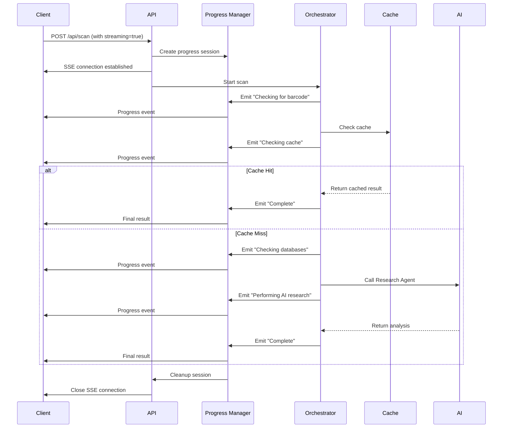
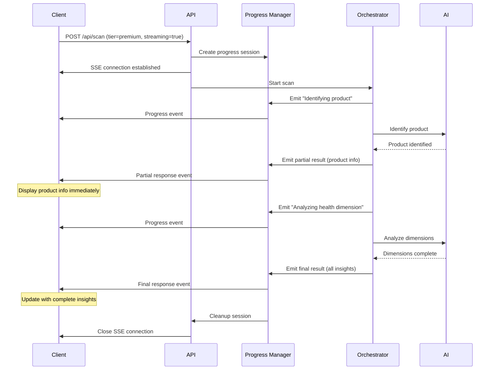

# Design Document: Real-Time Scan Progress

## Overview

This design implements a real-time progress feedback system for product scanning operations. The system provides users with visibility into backend processing stages and enables progressive result delivery when product identification completes before dimension analysis.

### Problem Statement

Currently, users see only a generic loading indicator during scans, with no visibility into what's happening in the backend. This creates uncertainty about whether the system is working, especially during longer scans. Additionally, when product identification completes quickly but dimension analysis takes longer, users must wait for the entire process to complete before seeing any results.

### Solution Approach

We will implement a streaming progress system using Server-Sent Events (SSE) with a polling fallback for environments where SSE is not supported. The backend orchestrators will emit progress events at key stages, and the frontend will display these events in real-time using an enhanced version of the existing ProgressTracker component.

The solution includes:
- SSE-based transport with polling fallback for Vercel serverless compatibility
- Progress event emission from ScanOrchestrator and ScanOrchestratorMultiTier
- Progressive result delivery when product identification completes before dimension analysis
- Enhanced frontend components to display progress and partial results
- Backward compatibility for clients that don't support progress streaming

### Key Design Decisions


1. **SSE over WebSocket**: SSE is simpler, unidirectional (server-to-client), and better suited for progress updates. WebSocket would be overkill for this use case.

2. **Polling Fallback**: Vercel serverless functions have execution time limits and connection handling constraints. A polling fallback ensures reliability across all deployment environments.

3. **Stateless Progress Tracking**: Progress state is maintained in-memory during scan execution and cleaned up immediately after completion. No persistent storage is needed for progress events.

4. **Progressive Response Pattern**: When product identification completes, we send a partial response immediately, then continue with dimension analysis and send the final response. This improves perceived performance.

5. **Backward Compatibility**: The system detects client capabilities via request headers/parameters. Clients that don't support streaming receive the traditional single-response behavior.

## Architecture

### System Components

```mermaid
graph TB
    subgraph Frontend
        A[Scan Component] --> B[useScanWithProgress Hook]
        B --> C[ProgressTracker Component]
    end
    
    subgraph Backend
        D[/api/scan Endpoint] --> E[Progress Manager]
        E --> F[ScanOrchestrator]
        E --> G[ScanOrchestratorMultiTier]
        F --> H[Progress Event Emitter]
        G --> H
    end
    
    subgraph Transport
        I[SSE Stream]
        J[Polling Endpoint]
    end
    
    B -->|SSE Connection| I
    B -->|Fallback| J
    I --> E
    J --> E
    H --> E
    E -->|Events| I
    E -->|Events| J

```

### Data Flow

#### Standard Scan Flow with Progress




#### Progressive Result Delivery Flow



### Transport Layer Design


#### Server-Sent Events (SSE)

SSE is the primary transport mechanism. The implementation uses the Web Streams API compatible with Next.js App Router:

```typescript
// SSE Response Structure
const stream = new ReadableStream({
  start(controller) {
    // Send progress events
    const encoder = new TextEncoder();
    controller.enqueue(encoder.encode(`data: ${JSON.stringify(event)}\n\n`));
  }
});

return new Response(stream, {
  headers: {
    'Content-Type': 'text/event-stream',
    'Cache-Control': 'no-cache',
    'Connection': 'keep-alive',
  },
});
```

**SSE Event Format:**
```typescript
interface ProgressEvent {
  type: 'progress' | 'partial' | 'complete' | 'error';
  stage?: string;
  message?: string;
  timestamp: number;
  data?: any; // For partial/complete events
}
```

#### Polling Fallback

For clients that cannot maintain SSE connections, a polling endpoint provides progress updates:

```
GET /api/scan/progress?sessionId={sessionId}
```

The polling endpoint returns the current progress state and any new events since the last poll.


#### Vercel Serverless Considerations

Vercel serverless functions have specific constraints:

1. **Execution Time Limits**: 10 seconds (Hobby), 60 seconds (Pro), 300 seconds (Enterprise)
2. **Connection Handling**: SSE connections work but must complete within execution limits
3. **Stateless Nature**: No shared memory between function invocations

**Mitigation Strategies:**
- Keep SSE connections alive only during active scan processing
- Close connections immediately after sending final result
- Use polling fallback for scans that might exceed time limits
- Implement connection health checks and automatic reconnection

## Components and Interfaces

### Backend Components

#### 1. Progress Manager

Manages progress sessions and event distribution.

```typescript
interface ProgressSession {
  sessionId: string;
  userId: string;
  startTime: number;
  events: ProgressEvent[];
  controller?: ReadableStreamDefaultController;
  status: 'active' | 'complete' | 'error';
}

class ProgressManager {
  private sessions: Map<string, ProgressSession>;
  
  createSession(userId: string): string;
  getSession(sessionId: string): ProgressSession | null;
  emitEvent(sessionId: string, event: ProgressEvent): void;
  completeSession(sessionId: string, result: any): void;
  errorSession(sessionId: string, error: Error): void;
  cleanup(sessionId: string): void;
}
```


#### 2. Progress Event Emitter

Interface for orchestrators to emit progress events.

```typescript
interface IProgressEmitter {
  emit(stage: string, message: string, metadata?: any): void;
  emitPartialResult(data: any): void;
  emitFinalResult(data: any): void;
  emitError(error: Error): void;
}

class ProgressEmitter implements IProgressEmitter {
  constructor(private sessionId: string, private manager: ProgressManager);
  
  emit(stage: string, message: string, metadata?: any): void {
    this.manager.emitEvent(this.sessionId, {
      type: 'progress',
      stage,
      message,
      timestamp: Date.now(),
      metadata,
    });
  }
  
  emitPartialResult(data: any): void {
    this.manager.emitEvent(this.sessionId, {
      type: 'partial',
      timestamp: Date.now(),
      data,
    });
  }
  
  emitFinalResult(data: any): void {
    this.manager.completeSession(this.sessionId, data);
  }
  
  emitError(error: Error): void {
    this.manager.errorSession(this.sessionId, error);
  }
}
```


#### 3. Enhanced Orchestrators

Both ScanOrchestrator and ScanOrchestratorMultiTier will be enhanced to accept an optional ProgressEmitter.

```typescript
// ScanOrchestrator modifications
class ScanOrchestrator {
  async processScan(
    request: ScanRequest,
    progressEmitter?: IProgressEmitter
  ): Promise<ScanResult> {
    progressEmitter?.emit('barcode_check', 'Checking for barcode');
    
    // Check cache
    progressEmitter?.emit('cache_check', 'Checking cache');
    const cached = await this.cacheRepo.get(request.barcode, imageHash);
    
    if (cached) {
      progressEmitter?.emitFinalResult({ fromCache: true, ...cached });
      return cached;
    }
    
    // Database check
    progressEmitter?.emit('database_check', 'Checking databases');
    
    // AI research
    progressEmitter?.emit('ai_research', 'Performing AI research');
    const result = await this.callResearchAgent(request);
    
    progressEmitter?.emitFinalResult(result);
    return result;
  }
}

// ScanOrchestratorMultiTier modifications
class ScanOrchestratorMultiTier {
  async scan(
    request: ScanRequest,
    progressEmitter?: IProgressEmitter
  ): Promise<ScanResponse> {
    // Tier 1
    progressEmitter?.emit('tier1', 'Checking barcode in cache', { tier: 1 });
    
    // Tier 2
    progressEmitter?.emit('tier2', 'Extracting text from image', { tier: 2 });
    
    // Tier 3
    progressEmitter?.emit('tier3', 'Discovering product via API', { tier: 3 });
    
    // Tier 4
    progressEmitter?.emit('tier4', 'Analyzing image with AI', { tier: 4 });
    
    // Progressive delivery for dimension analysis
    if (productIdentified && request.tier === 'premium') {
      progressEmitter?.emitPartialResult({ product: productData });
      
      progressEmitter?.emit('dimension_health', 'Analyzing health dimension');
      // ... analyze dimensions
      
      progressEmitter?.emitFinalResult({ product: productData, insights });
    }
  }
}
```


#### 4. API Route Modifications

```typescript
// /api/scan/route.ts modifications
export async function POST(request: NextRequest) {
  const body = await request.json();
  const { streaming = false } = body;
  
  if (!streaming) {
    // Traditional non-streaming response
    const result = await scanOrchestrator.processScan(scanRequest);
    return NextResponse.json({ success: true, data: result });
  }
  
  // Streaming response
  const sessionId = progressManager.createSession(userId);
  const progressEmitter = new ProgressEmitter(sessionId, progressManager);
  
  const stream = new ReadableStream({
    async start(controller) {
      const session = progressManager.getSession(sessionId);
      if (!session) return;
      
      session.controller = controller;
      
      try {
        await scanOrchestrator.processScan(scanRequest, progressEmitter);
      } catch (error) {
        progressEmitter.emitError(error);
      } finally {
        progressManager.cleanup(sessionId);
        controller.close();
      }
    },
  });
  
  return new Response(stream, {
    headers: {
      'Content-Type': 'text/event-stream',
      'Cache-Control': 'no-cache',
      'Connection': 'keep-alive',
    },
  });
}
```


#### 5. Polling Endpoint

```typescript
// /api/scan/progress/route.ts
export async function GET(request: NextRequest) {
  const { searchParams } = new URL(request.url);
  const sessionId = searchParams.get('sessionId');
  
  if (!sessionId) {
    return NextResponse.json({ error: 'Session ID required' }, { status: 400 });
  }
  
  const session = progressManager.getSession(sessionId);
  
  if (!session) {
    return NextResponse.json({ error: 'Session not found' }, { status: 404 });
  }
  
  return NextResponse.json({
    status: session.status,
    events: session.events,
    complete: session.status !== 'active',
  });
}
```

### Frontend Components

#### 1. useScanWithProgress Hook

Enhanced version of useScan that supports progress streaming.

```typescript
interface UseScanWithProgressReturn {
  scanProduct: (params: ScanParams) => Promise<AnalysisResult>;
  isLoading: boolean;
  error: string | null;
  fromCache: boolean | null;
  progress: ProgressStep[];
  partialResult: Partial<AnalysisResult> | null;
}

export function useScanWithProgress(): UseScanWithProgressReturn {
  const [progress, setProgress] = useState<ProgressStep[]>([]);
  const [partialResult, setPartialResult] = useState<Partial<AnalysisResult> | null>(null);
  const { session } = useAuth();
  
  const scanProduct = useCallback(async (params: ScanParams) => {
    // Check if SSE is supported
    const supportsSSE = typeof EventSource !== 'undefined';
    
    if (supportsSSE) {
      return scanWithSSE(params);
    } else {
      return scanWithPolling(params);
    }
  }, [session]);
  
  const scanWithSSE = async (params: ScanParams) => {
    // Implementation using EventSource
  };
  
  const scanWithPolling = async (params: ScanParams) => {
    // Implementation using polling
  };
  
  return { scanProduct, isLoading, error, fromCache, progress, partialResult };
}
```


#### 2. Enhanced ProgressTracker Component

Extend the existing ProgressTracker to support scan-specific progress stages.

```typescript
interface ScanProgressTrackerProps {
  steps: ProgressStep[];
  isActive: boolean;
  partialResult?: Partial<AnalysisResult>;
  onRetry?: () => void;
}

// Step mapping for scan stages
const SCAN_STEP_INFO: Record<string, { icon: string; color: string; bgColor: string }> = {
  barcode_check: {
    icon: '🔍',
    color: 'text-blue-700',
    bgColor: 'bg-blue-50 border-blue-200',
  },
  cache_check: {
    icon: '💾',
    color: 'text-purple-700',
    bgColor: 'bg-purple-50 border-purple-200',
  },
  database_check: {
    icon: '🗄️',
    color: 'text-green-700',
    bgColor: 'bg-green-50 border-green-200',
  },
  ai_research: {
    icon: '🤖',
    color: 'text-orange-700',
    bgColor: 'bg-orange-50 border-orange-200',
  },
  tier1: {
    icon: '⚡',
    color: 'text-blue-700',
    bgColor: 'bg-blue-50 border-blue-200',
  },
  tier2: {
    icon: '📝',
    color: 'text-purple-700',
    bgColor: 'bg-purple-50 border-purple-200',
  },
  tier3: {
    icon: '🔎',
    color: 'text-green-700',
    bgColor: 'bg-green-50 border-green-200',
  },
  tier4: {
    icon: '🤖',
    color: 'text-orange-700',
    bgColor: 'bg-orange-50 border-orange-200',
  },
  dimension_health: {
    icon: '🏥',
    color: 'text-red-700',
    bgColor: 'bg-red-50 border-red-200',
  },
  // ... other dimensions
};

export default function ScanProgressTracker({ 
  steps, 
  isActive, 
  partialResult,
  onRetry 
}: ScanProgressTrackerProps) {
  // Render progress with partial results if available
  // Show retry button on error
}
```


## Data Models

### Progress Event Types

```typescript
type ProgressEventType = 'progress' | 'partial' | 'complete' | 'error';

interface BaseProgressEvent {
  type: ProgressEventType;
  timestamp: number;
}

interface ProgressUpdateEvent extends BaseProgressEvent {
  type: 'progress';
  stage: string;
  message: string;
  metadata?: {
    tier?: number;
    cached?: boolean;
    [key: string]: any;
  };
}

interface PartialResultEvent extends BaseProgressEvent {
  type: 'partial';
  data: {
    product: {
      id: string;
      name: string;
      brand: string;
      barcode?: string;
    };
  };
}

interface CompleteResultEvent extends BaseProgressEvent {
  type: 'complete';
  data: ScanResult | ScanResponse;
}

interface ErrorEvent extends BaseProgressEvent {
  type: 'error';
  error: {
    code: string;
    message: string;
    retryable: boolean;
  };
}

type ProgressEvent = ProgressUpdateEvent | PartialResultEvent | CompleteResultEvent | ErrorEvent;
```


### Progress Session State

```typescript
interface ProgressSession {
  sessionId: string;
  userId: string;
  startTime: number;
  lastEventTime: number;
  events: ProgressEvent[];
  controller?: ReadableStreamDefaultController;
  status: 'active' | 'complete' | 'error';
  result?: any;
  error?: Error;
}
```

### Stage Definitions

```typescript
// Standard scan stages (ScanOrchestrator)
enum ScanStage {
  BARCODE_CHECK = 'barcode_check',
  CACHE_CHECK = 'cache_check',
  DATABASE_CHECK = 'database_check',
  AI_RESEARCH = 'ai_research',
  COMPLETE = 'complete',
}

// Multi-tier scan stages (ScanOrchestratorMultiTier)
enum MultiTierStage {
  TIER1_CACHE = 'tier1',
  TIER2_EXTRACT = 'tier2',
  TIER3_DISCOVER = 'tier3',
  TIER4_ANALYZE = 'tier4',
  DIMENSION_HEALTH = 'dimension_health',
  DIMENSION_PRESERVATIVES = 'dimension_preservatives',
  DIMENSION_ALLERGIES = 'dimension_allergies',
  DIMENSION_SUSTAINABILITY = 'dimension_sustainability',
  DIMENSION_CARBON = 'dimension_carbon',
  COMPLETE = 'complete',
}

// User-friendly stage messages
const STAGE_MESSAGES: Record<string, string> = {
  [ScanStage.BARCODE_CHECK]: 'Checking for barcode',
  [ScanStage.CACHE_CHECK]: 'Checking cache',
  [ScanStage.DATABASE_CHECK]: 'Checking databases',
  [ScanStage.AI_RESEARCH]: 'Performing AI research',
  [MultiTierStage.TIER1_CACHE]: 'Checking barcode in cache',
  [MultiTierStage.TIER2_EXTRACT]: 'Extracting text from image',
  [MultiTierStage.TIER3_DISCOVER]: 'Discovering product via API',
  [MultiTierStage.TIER4_ANALYZE]: 'Analyzing image with AI',
  [MultiTierStage.DIMENSION_HEALTH]: 'Analyzing health insights',
  [MultiTierStage.DIMENSION_PRESERVATIVES]: 'Analyzing preservatives',
  [MultiTierStage.DIMENSION_ALLERGIES]: 'Checking for allergens',
  [MultiTierStage.DIMENSION_SUSTAINABILITY]: 'Evaluating sustainability',
  [MultiTierStage.DIMENSION_CARBON]: 'Calculating carbon footprint',
};
```


## Correctness Properties

A property is a characteristic or behavior that should hold true across all valid executions of a system—essentially, a formal statement about what the system should do. Properties serve as the bridge between human-readable specifications and machine-verifiable correctness guarantees.

### Property Reflection

After analyzing all acceptance criteria, I identified several areas of redundancy:

1. **Event emission properties (1.1-1.6, 8.1-8.4)**: These can be consolidated into a single property about stage-specific event emission
2. **Event ordering (1.8, 10.4)**: These are duplicate - one property covers both
3. **Logging properties (9.1-9.6)**: These can be consolidated into properties about logging completeness
4. **UI update properties (4.2, 4.3, 4.7)**: These can be combined into a property about UI state synchronization

After consolidation, here are the unique correctness properties:

### Property 1: Stage Event Emission

For any scan request and any defined stage in the scan flow, when the orchestrator reaches that stage, a progress event with the correct stage identifier and message must be emitted.

**Validates: Requirements 1.1, 1.2, 1.3, 1.4, 1.5, 1.6, 8.1, 8.2, 8.3, 8.4, 10.3**

### Property 2: Event Structure Completeness

For any progress event emitted by the backend, the event must include both a timestamp and a stage identifier.

**Validates: Requirements 1.7**

### Property 3: Event Chronological Ordering

For any sequence of progress events in a scan session, the events must be ordered chronologically with monotonically increasing timestamps and stages following the expected processing sequence.

**Validates: Requirements 1.8, 10.4**


### Property 4: Connection Interruption Handling

For any SSE connection that is interrupted during a scan, the backend must handle the disconnection gracefully without crashing or leaving resources unreleased.

**Validates: Requirements 2.4**

### Property 5: Frontend Reconnection Behavior

For any connection loss during an active scan, the frontend client must attempt to reconnect and resume receiving progress updates.

**Validates: Requirements 2.5**

### Property 6: Resource Cleanup on Disconnect

For any client disconnection, the backend must clean up the associated progress session and release all resources within 5 seconds.

**Validates: Requirements 2.6, 7.5**

### Property 7: Progressive Delivery Trigger

For any premium tier scan where product identification completes before dimension analysis, the backend must send a partial response containing product information before continuing with dimension analysis.

**Validates: Requirements 3.1**

### Property 8: Final Response Completeness

For any scan that completes successfully, the final response must contain all required data including product information and all applicable insights.

**Validates: Requirements 3.2**

### Property 9: UI State Synchronization

For any progress event or result event received by the frontend, the UI must update to reflect the new state with user-friendly messages.

**Validates: Requirements 4.2, 4.3, 4.7**


### Property 10: Partial vs Complete Response Indication

For any response sent by the backend (partial or complete), the response must include a type indicator that clearly identifies whether it is partial or complete.

**Validates: Requirements 3.6**

### Property 11: Non-Progressive Fallback

For any scan where progressive delivery is not applicable (free tier, cache hit, or single-stage completion), the backend must send a single complete response.

**Validates: Requirements 3.5**

### Property 12: Error Event Emission

For any scan that fails at any stage, the backend must emit an error event containing the failure reason and error code.

**Validates: Requirements 5.2**

### Property 13: Error Display

For any error event received by the frontend, the error message must be displayed to the user.

**Validates: Requirements 5.3**

### Property 14: Backend Processing Continuation

For any scan where the client disconnects before completion, the backend must continue processing to completion to enable result caching.

**Validates: Requirements 5.6**

### Property 15: Backward Compatibility for Non-Streaming Clients

For any client that does not support or request progress streaming, the backend must process the scan normally and return a complete response in the existing format.

**Validates: Requirements 6.1, 6.3, 6.5**


### Property 16: Client Capability Detection

For any incoming scan request, the backend must correctly detect whether the client supports progress streaming based on request headers or parameters.

**Validates: Requirements 6.2**

### Property 17: Progress State Availability

For any scan initiated with progress streaming enabled, the frontend hook must provide access to progress state and events.

**Validates: Requirements 6.4**

### Property 18: Non-Blocking Event Emission

For any progress event emission, the emission must not block or delay the scan processing pipeline.

**Validates: Requirements 7.1**

### Property 19: Event Rate Limiting

For any client receiving progress events, the backend must limit event frequency to at most one event per 100ms per client.

**Validates: Requirements 7.2**

### Property 20: Concurrent Session Isolation

For any set of concurrent scan sessions, each session's progress stream must be independent and not interfere with other sessions.

**Validates: Requirements 7.3**

### Property 21: Tier Transition Event Emission

For any multi-tier scan where a tier fails and fallback occurs, the backend must emit an event indicating the tier transition.

**Validates: Requirements 8.5**


### Property 22: Tier Metadata Inclusion

For any progress event emitted during a multi-tier scan, the event must include the tier number in its metadata.

**Validates: Requirements 8.6**

### Property 23: Progress Event Logging

For any progress event emitted, the backend must log the event with timestamp and stage identifier.

**Validates: Requirements 9.1**

### Property 24: Connection Lifecycle Logging

For any client connection to the progress stream, the backend must log both the connection establishment and disconnection events.

**Validates: Requirements 9.2, 9.3**

### Property 25: Scan Duration Logging

For any completed scan session, the backend must log the total duration from first to last progress event.

**Validates: Requirements 9.4**

### Property 26: Success Sequence Logging

For any scan that completes without errors, the backend must log the complete progress event sequence.

**Validates: Requirements 9.5**

### Property 27: Failure Detail Logging

For any scan that fails, the backend must log the failure stage and complete error details.

**Validates: Requirements 9.6**


## Error Handling

### Error Categories

#### 1. Connection Errors

**Scenarios:**
- Client disconnects during scan
- SSE connection fails to establish
- Network interruption during streaming

**Handling:**
- Backend continues processing to enable caching (Property 14)
- Frontend attempts automatic reconnection (Property 5)
- Fallback to polling if SSE fails repeatedly
- Display connection error message to user
- Provide manual retry option

**Implementation:**
```typescript
class ProgressManager {
  handleConnectionError(sessionId: string, error: Error): void {
    console.error(`[ProgressManager] Connection error for session ${sessionId}:`, error);
    
    const session = this.sessions.get(sessionId);
    if (!session) return;
    
    // Mark session as having connection issues but don't stop processing
    session.connectionError = error;
    
    // Continue processing in background
    // Results will be cached for later retrieval
  }
}
```


#### 2. Scan Processing Errors

**Scenarios:**
- Cache lookup fails
- Database query fails
- AI service returns error
- Tier fallback exhausted

**Handling:**
- Emit error event with specific error code (Property 12)
- Include retryable flag in error event
- Log error details for debugging (Property 27)
- Display user-friendly error message
- Provide retry option for retryable errors

**Error Event Structure:**
```typescript
interface ErrorEvent {
  type: 'error';
  timestamp: number;
  error: {
    code: string;
    message: string;
    stage: string;
    retryable: boolean;
    details?: any;
  };
}
```

#### 3. Timeout Errors

**Scenarios:**
- Scan exceeds 30 seconds without completion
- Vercel function approaching execution limit
- AI service taking too long

**Handling:**
- Display timeout warning at 30 seconds (Requirement 5.1)
- Continue processing if possible
- Emit timeout event to frontend
- Suggest retry or alternative approach

**Implementation:**
```typescript
// Frontend timeout handling
useEffect(() => {
  if (!isLoading) return;
  
  const timeoutId = setTimeout(() => {
    setTimeoutWarning('Scan is taking longer than expected. Please wait...');
  }, 30000);
  
  return () => clearTimeout(timeoutId);
}, [isLoading]);
```


#### 4. Resource Exhaustion

**Scenarios:**
- Too many concurrent sessions
- Memory pressure from large event buffers
- Stream controller errors

**Handling:**
- Implement session limits per user
- Clean up old sessions aggressively (Property 6)
- Rate limit event emission (Property 19)
- Monitor memory usage and trigger cleanup

**Implementation:**
```typescript
class ProgressManager {
  private readonly MAX_SESSIONS_PER_USER = 3;
  private readonly SESSION_TIMEOUT_MS = 60000;
  
  createSession(userId: string): string {
    // Clean up old sessions for this user
    this.cleanupUserSessions(userId);
    
    // Check session limit
    const userSessions = Array.from(this.sessions.values())
      .filter(s => s.userId === userId && s.status === 'active');
    
    if (userSessions.length >= this.MAX_SESSIONS_PER_USER) {
      throw new Error('Too many concurrent scans. Please wait for existing scans to complete.');
    }
    
    // Create new session
    const sessionId = crypto.randomUUID();
    this.sessions.set(sessionId, {
      sessionId,
      userId,
      startTime: Date.now(),
      lastEventTime: Date.now(),
      events: [],
      status: 'active',
    });
    
    return sessionId;
  }
  
  private cleanupUserSessions(userId: string): void {
    const now = Date.now();
    for (const [sessionId, session] of this.sessions.entries()) {
      if (session.userId === userId && 
          (session.status !== 'active' || now - session.lastEventTime > this.SESSION_TIMEOUT_MS)) {
        this.cleanup(sessionId);
      }
    }
  }
}
```


#### 5. Backward Compatibility Errors

**Scenarios:**
- Old client sends request without streaming parameter
- Client doesn't support EventSource
- Polling endpoint unavailable

**Handling:**
- Detect client capabilities automatically (Property 16)
- Fall back to traditional response format (Property 15)
- Maintain existing error handling for non-streaming clients
- No breaking changes to existing API contracts

### Error Recovery Strategies

#### Automatic Retry

```typescript
class ProgressEmitter {
  private retryCount = 0;
  private readonly MAX_RETRIES = 3;
  
  async emitWithRetry(event: ProgressEvent): Promise<void> {
    try {
      await this.emit(event);
      this.retryCount = 0; // Reset on success
    } catch (error) {
      if (this.retryCount < this.MAX_RETRIES) {
        this.retryCount++;
        await new Promise(resolve => setTimeout(resolve, 1000 * this.retryCount));
        return this.emitWithRetry(event);
      }
      throw error;
    }
  }
}
```

#### Graceful Degradation

```typescript
// Frontend fallback chain
async function scanWithProgress(params: ScanParams): Promise<AnalysisResult> {
  try {
    // Try SSE first
    return await scanWithSSE(params);
  } catch (sseError) {
    console.warn('SSE failed, falling back to polling:', sseError);
    try {
      // Fall back to polling
      return await scanWithPolling(params);
    } catch (pollingError) {
      console.warn('Polling failed, falling back to traditional:', pollingError);
      // Fall back to traditional non-streaming scan
      return await scanTraditional(params);
    }
  }
}
```


## Testing Strategy

### Dual Testing Approach

This feature requires both unit tests and property-based tests to ensure comprehensive coverage:

- **Unit tests**: Verify specific examples, edge cases, error conditions, and integration points
- **Property tests**: Verify universal properties across all inputs using randomized testing

Both approaches are complementary and necessary for complete validation.

### Property-Based Testing

We will use **fast-check** (for TypeScript/JavaScript) as our property-based testing library. Each correctness property will be implemented as a property-based test with a minimum of 100 iterations.

#### Property Test Configuration

```typescript
import fc from 'fast-check';

// Example property test
describe('Property 1: Stage Event Emission', () => {
  it('should emit correct events for all scan stages', () => {
    fc.assert(
      fc.property(
        fc.record({
          barcode: fc.option(fc.string(), { nil: undefined }),
          imageData: fc.base64String(),
          tier: fc.constantFrom('free', 'premium'),
          dimension: fc.option(fc.constantFrom('health', 'preservatives', 'allergies', 'sustainability', 'carbon')),
        }),
        async (scanRequest) => {
          const events: ProgressEvent[] = [];
          const emitter = new MockProgressEmitter((event) => events.push(event));
          
          await orchestrator.processScan(scanRequest, emitter);
          
          // Verify all expected stages emitted events
          const expectedStages = getExpectedStages(scanRequest);
          const emittedStages = events.map(e => e.stage);
          
          expectedStages.forEach(stage => {
            expect(emittedStages).toContain(stage);
          });
        }
      ),
      { numRuns: 100 }
    );
  });
});
```

**Tag Format**: Each property test must include a comment tag:
```typescript
// Feature: real-time-scan-progress, Property 1: For any scan request and any defined stage in the scan flow, when the orchestrator reaches that stage, a progress event with the correct stage identifier and message must be emitted.
```


### Unit Testing Strategy

#### Backend Unit Tests

**ProgressManager Tests:**
- Session creation and cleanup
- Event emission and buffering
- Concurrent session handling
- Resource cleanup timing
- Error handling

**ProgressEmitter Tests:**
- Event formatting
- Retry logic
- Error propagation
- Rate limiting

**Orchestrator Integration Tests:**
- Event emission at correct stages
- Progressive delivery triggering
- Error event emission
- Backward compatibility

**API Route Tests:**
- SSE stream creation
- Polling endpoint responses
- Client capability detection
- Authentication and authorization
- Error responses

#### Frontend Unit Tests

**useScanWithProgress Hook Tests:**
- SSE connection establishment
- Event parsing and state updates
- Polling fallback
- Reconnection logic
- Error handling
- Backward compatibility with useScan

**ScanProgressTracker Component Tests:**
- Progress display updates
- Partial result rendering
- Error message display
- Retry button functionality
- Timeout warning display
- Smooth transitions


### Integration Testing

**End-to-End Flow Tests:**
1. Complete scan with progress streaming (SSE)
2. Complete scan with polling fallback
3. Progressive delivery with partial results
4. Multi-tier scan with tier transitions
5. Error scenarios with retry
6. Connection interruption and recovery
7. Backward compatibility with non-streaming clients
8. Concurrent scans from multiple users

**Performance Tests:**
- Event emission doesn't block processing (Property 18)
- Resource cleanup within 5 seconds (Property 6)
- Event rate limiting at 100ms (Property 19)
- Concurrent session isolation (Property 20)

**Vercel Deployment Tests:**
- SSE streaming within execution limits
- Connection handling in serverless environment
- Memory usage and cleanup
- Cold start performance

### Test Data Generators

```typescript
// Generators for property-based tests
const scanRequestArbitrary = fc.record({
  barcode: fc.option(fc.string({ minLength: 12, maxLength: 13 })),
  imageData: fc.base64String({ minLength: 100, maxLength: 1000 }),
  userId: fc.uuid(),
  tier: fc.constantFrom('free', 'premium'),
  dimension: fc.option(fc.constantFrom('health', 'preservatives', 'allergies', 'sustainability', 'carbon')),
  location: fc.option(fc.record({
    latitude: fc.double({ min: -90, max: 90 }),
    longitude: fc.double({ min: -180, max: 180 }),
  })),
});

const progressEventArbitrary = fc.record({
  type: fc.constantFrom('progress', 'partial', 'complete', 'error'),
  timestamp: fc.integer({ min: Date.now() - 60000, max: Date.now() }),
  stage: fc.constantFrom(...Object.values(ScanStage)),
  message: fc.string(),
});
```


### Mock Implementations

**Mock Progress Manager:**
```typescript
class MockProgressManager implements ProgressManager {
  public sessions = new Map<string, ProgressSession>();
  public emittedEvents: ProgressEvent[] = [];
  
  createSession(userId: string): string {
    const sessionId = `mock-${Date.now()}`;
    this.sessions.set(sessionId, {
      sessionId,
      userId,
      startTime: Date.now(),
      lastEventTime: Date.now(),
      events: [],
      status: 'active',
    });
    return sessionId;
  }
  
  emitEvent(sessionId: string, event: ProgressEvent): void {
    this.emittedEvents.push(event);
    const session = this.sessions.get(sessionId);
    if (session) {
      session.events.push(event);
      session.lastEventTime = Date.now();
    }
  }
  
  // ... other methods
}
```

**Mock SSE Connection:**
```typescript
class MockEventSource {
  public listeners: Map<string, Function[]> = new Map();
  
  addEventListener(event: string, handler: Function): void {
    if (!this.listeners.has(event)) {
      this.listeners.set(event, []);
    }
    this.listeners.get(event)!.push(handler);
  }
  
  simulateEvent(event: string, data: any): void {
    const handlers = this.listeners.get(event) || [];
    handlers.forEach(handler => handler({ data: JSON.stringify(data) }));
  }
  
  close(): void {
    this.listeners.clear();
  }
}
```


### Test Coverage Goals

- **Backend**: 90% code coverage for progress-related components
- **Frontend**: 85% code coverage for progress hooks and components
- **Property Tests**: All 27 correctness properties implemented
- **Integration Tests**: All 8 end-to-end flows covered
- **Error Scenarios**: All 5 error categories tested

### Continuous Testing

**Pre-commit Hooks:**
- Run unit tests for modified files
- Run property tests for affected properties
- Lint and type check

**CI/CD Pipeline:**
- Run full test suite on pull requests
- Run integration tests on staging deployment
- Performance benchmarks on production-like environment
- Vercel deployment tests

**Monitoring in Production:**
- Track progress event emission rates
- Monitor session cleanup timing
- Alert on error event frequency
- Track SSE vs polling usage ratio
- Monitor resource usage and memory leaks

## Implementation Notes

### Phase 1: Core Infrastructure
1. Implement ProgressManager and ProgressEmitter
2. Add SSE streaming to /api/scan endpoint
3. Implement basic event emission in orchestrators
4. Add unit tests for core components

### Phase 2: Frontend Integration
1. Create useScanWithProgress hook with SSE support
2. Enhance ProgressTracker component
3. Add polling fallback implementation
4. Add frontend unit tests

### Phase 3: Progressive Delivery
1. Implement partial result emission
2. Add dimension-specific progress events
3. Update frontend to handle partial results
4. Add integration tests

### Phase 4: Error Handling & Polish
1. Implement all error scenarios
2. Add timeout warnings
3. Implement reconnection logic
4. Add comprehensive error tests

### Phase 5: Testing & Optimization
1. Implement all property-based tests
2. Performance optimization
3. Vercel deployment testing
4. Documentation and examples

